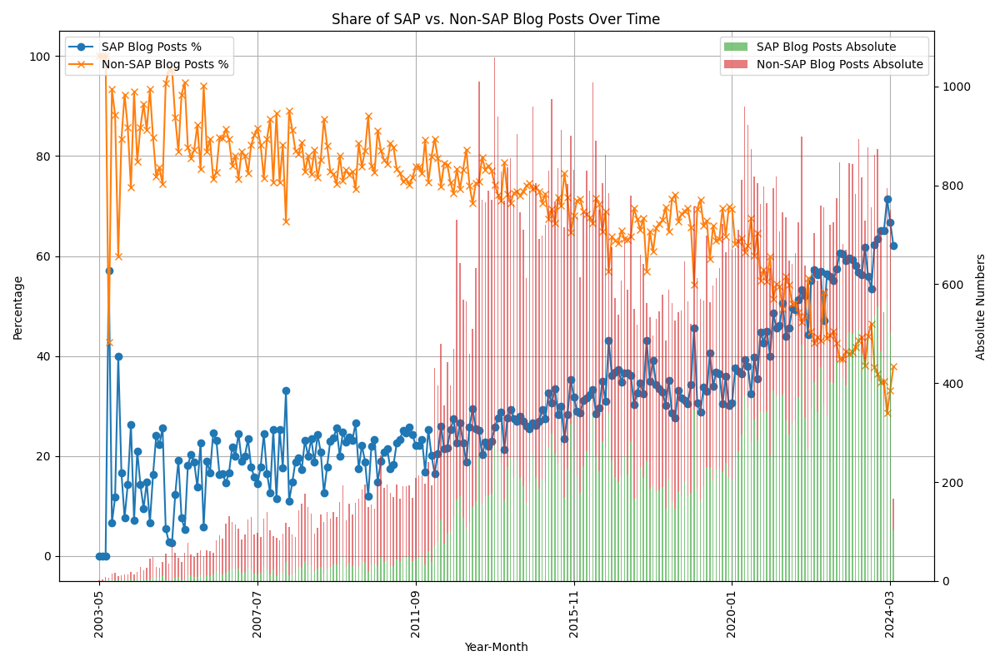
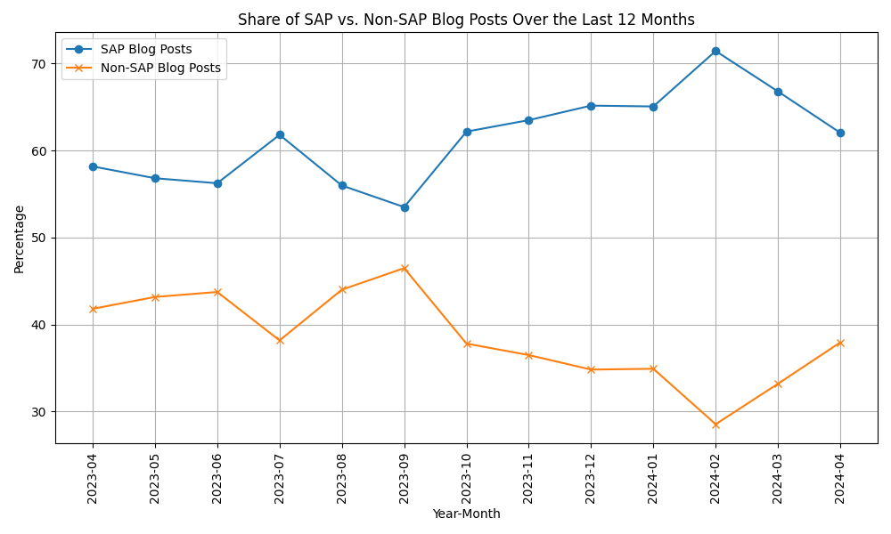
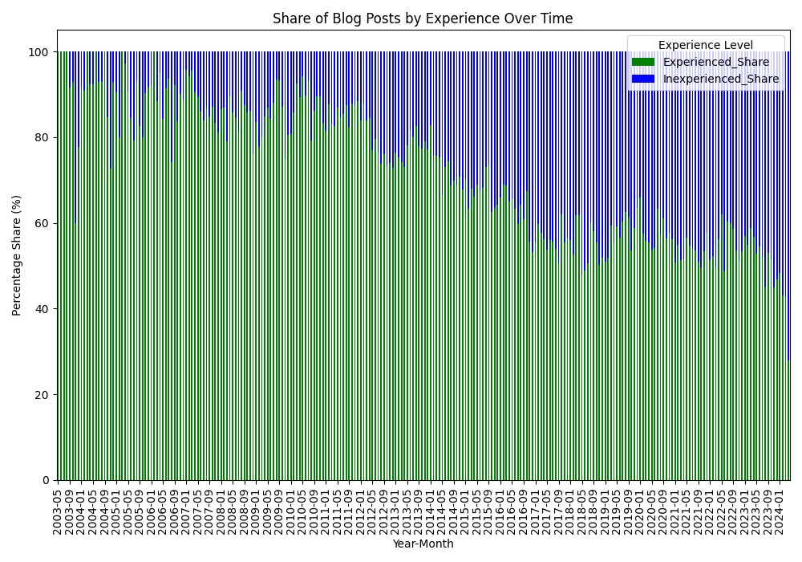

This post is a mirrored copy of my LinkedIn article, kept here so it remains searchable and independent from external platforms.
You can still find the original on LinkedIn: [LinkedIn Pulse article](https://www.linkedin.com/pulse/from-open-exchange-corporate-monologue-transformation-marian-zeis-zu6xf/).

---

The SAP community has had to overcome many challenges recently. The central exchange, especially for developers, Twitter has become an increasingly toxic platform and many long-time members have stopped using it or have switched to alternatives. Twitter was also one of my first ports of call and helped me a lot. There are still some, but it's getting noticeably less.

Most important was the change of platform for the SAP Community Network for Q&A and blog posts. They now use Khoros, which has fundamentally changed a lot of things. There are still a lot of criticisms of the platform. However, as with so many changes, this one is particularly difficult.

If the company switches from SAP GUI to Fiori, then ideally this is accompanied by support and training and you have time to get used to it. In the SAP Community Network, non-SAP users are usually active in their free time to answer questions or write helpful blog posts. If fundamental things change here, you have to invest your valuable time to adapt your own workflow. If the change is too big, these valuable members may no longer be active.

The valuable blog posts from the community become rarer and marketing posts from SAP become more frequent.

Thanks to Khoros' API, I can now support this feeling with data.

I analyzed 150,000 blog posts dating back to 2005 and the status of over 720,000 users.

## Share of SAP vs. Non-SAP blog posts over time in the SCN

First, the percentage of blog posts written by SAP employees.

The graph clearly shows that the proportion has risen sharply, especially in recent years towards SAP blog posts.

_Share of SAP vs. non-SAP blog posts over time (share and absolute numbers)_

About 10 years ago, less than a third of blog posts were written by SAP employees. Today, two-thirds of blog posts are written by SAP employees.

Especially in the last year, this distribution has shifted strongly towards SAP.

Here is a detailed overview of the last 12 months.

_Share of SAP vs. non-SAP blog posts over the last 12 months_

The sad peak was reached when over 70 percent of all blog posts in February 2024 were written by SAP employees.

## Proportion of blog posts from non-SAP by experience

Another point I have noticed is that it feels like fewer and fewer veteran non-SAP employees are publishing blog posts.

Thanks to the rankings that have been introduced, it is also possible to investigate this.

The more active a community member was, the higher the rank. Jerry has explained this in this blog post: [Let the gamification begin](https://community.sap.com/t5/what-s-new/let-the-gamification-begin/ba-p/311892)

There are the following rankings for non-SAP employees:

Member, Newcomer, Discoverer, Explorer, Participant, Active Participant, Contributor, Active Contributor, Collaborator, Active Collaborator, Advocate

I have classified Member, Newcomer, Discoverer, Explorer as inexperienced and all others as experienced.

Even if the rank does not necessarily say anything about the quality of the blog post, there is a strong causality according to my observations.

_Share of blog posts by experience over time_

Here, too, we have seen a significant decline in "Experienced" blog posts over the years since 2014.

_Share of blog posts by experience in the last 12 months_

Also in the last 12 months, less than a third of blog posts came from community members with the rank Participant or higher.

This analysis confirms the feeling in the SAP community as a whole. Even if SAP cannot be blamed for everything, the large proportion of support must come from SAP. A strong community benefits all sides and has a very good ROI.

The community is more important than ever, especially in today's world where you have to be happy for every person who works with SAP after their studies.

**SAP can only be successful with a strong community!**

---

**Update**: I removed the blog posts written by `former_member` and updated the graphics. In total 153.655 posts. There are 421.213 members where the login name starts with `former_member`.
