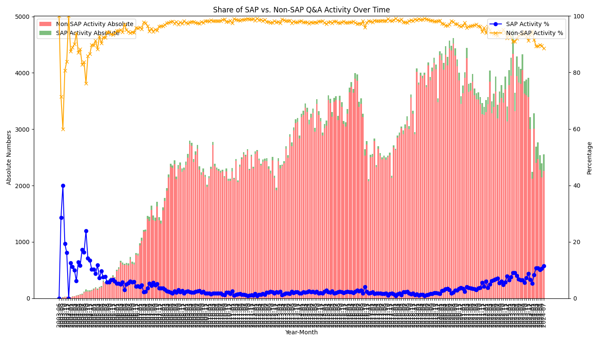
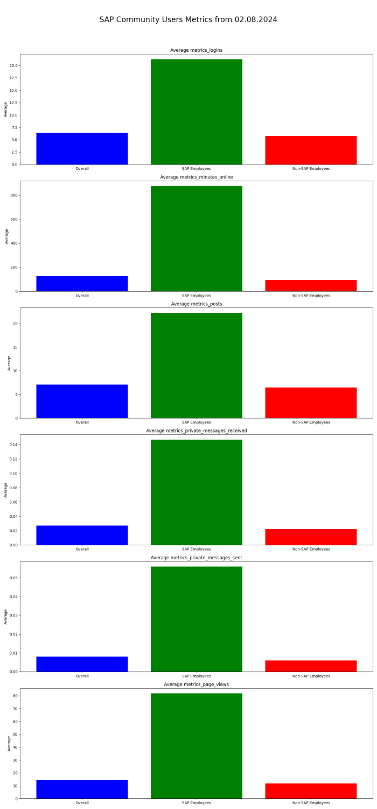

This post is a mirrored copy of my LinkedIn article, kept here so it remains searchable and independent from external platforms.
You can still find the original on LinkedIn: [LinkedIn Pulse article](https://www.linkedin.com/pulse/sap-community-decline-engagement-continues-fall-little-marian-zeis-1wvif/).

---

Half a year after the major migration, it's time to publish the latest figures and uncover any hidden insights in the data.

So, what's new? The trend from the past few months (or even years) has continued.
More significant members of the community are moving away from Twitter, which was once a vital medium of exchange (and where I got my start).

Even on the SAP Community site, good posts from non-SAP employees are rare.
I wanted to link to a good blog post, but since they are not sorted by publication date, I couldn't find it.
However, there are quite a few LLM-generated posts:
[The Future of Application Lifecycle Management in SAP After 2027](https://community.sap.com/t5/technology-blogs-by-members/the-future-of-application-lifecycle-management-in-sap-after-2027/ba-p/13742196)

Meanwhile, some community members are trying to bridge the gap by offering their own search:
[Software Heroes - SAP Technology Blog](https://software-heroes.com/en/sap-technology-blog)
It's disappointing that SAP hasn't addressed this issue after six months.

After six months, there's an update with some fixes, but the results are underwhelming:
[Update about Enhancements to SAP Community](https://community.sap.com/t5/what-s-new/update-about-enhancements-to-sap-community/ba-p/13755862)

Views are displayed again for blog posts (though their accuracy is questionable), replies are automatically expanded, notifications have slightly more information, you can see if you've created a post or question, and a rotating carousel has been added to the homepage.
These are the highlights of the update after six months.

SAP has clearly invested neither time nor money into the main page of the SAP Community to retain and attract users.
This will have consequences that will be evident in the following evaluations.

Here is the update of the latest major graphic.
The absolute number of blog posts in green (SAP) and red (non-SAP) and the percentage in blue (SAP) and yellow (non-SAP).

## Blog Posts


*Share in percent and absolute of SAP and Non-SAP Blog Post over time*

For better representation, here is the development over the last twelve months.
Both metrics are moving in the wrong direction.
The number of blog posts is falling, mainly due to the decline in non-SAP blog posts, which automatically increases the share of SAP blog posts to 70%.


*Share in percent and absolute of SAP and Non-SAP Blog Post over the last 12 months*

## Question and Answers

In addition to blog posts, the exchange of questions and answers is crucial.
This is where community members help each other, and unfortunately, SAP has been too inactive here in recent years.
On the other hand, many individuals have contributed significantly and well.
It is not surprising that the same trend observed with blog posts is occurring here.

Here is a look at the entire timeline of the last few years in the Q&A section.
Overall, there is an increase that has remained steady, with SAP making a very small contribution.
As above, the chart shows the absolute figures in green (SAP) and red (non-SAP) and the relative figures as a percentage in blue (SAP) and yellow (non-SAP).



*Share in percent and absolute of SAP and Non-SAP Q&A Post over time*

It gets more interesting when you look at the last seven years.
The greater participation of SAP employees in the discourse is encouraging, as seen from the large absolute figures and the increasing relative share.
However, it is clear that there has been a drop from around 4,000 posts per month to around 2,500 posts per month in 2024.


*Share in percent and absolute of SAP and Non-SAP Q&A Post over the last 12 months*

I suspected such a decline, but I didn't expect it to be so sharp.
Personally, I haven't answered any questions since the migration because I haven't found a good way to filter and sort as I could with the old platform.

## User Activity

Fortunately, there is also a way to read user activity.
While this is just a snapshot and not a development, it still provides good insight.
As always, the figures should be taken with a pinch of salt, but they still provide an insight into user activity.



*Graphic Metric for User Participation*

**Logins**: Two SAP employees have never logged in. 60% of users have never logged in.

**Minutes Online**: 75% of users have no minutes online. This metric likely came later, hence the discrepancy.

**Posts**: 70% of users have never made a post (including Q&A, blog posts, etc.). It's amazing that 30% of users have written a post, totaling over 236,000.

**Private Messages**: Interestingly, this statistic still exists. It's not surprising that only 2,723 users (0.32% of total users) use this feature.

**Full data is at the end of the post**

## Views

Since the last update, views on blog posts are displayed again.
I did a small sample to see how reliable these views are.
Here is a small overview of the results: Total number of views:

**10.04.2024:** 2,615,955,557

**03.06.2024**: 3,318,366,233

**02.08.2024**: 4,062,134,925

That's a sharp increase in just four months.
Let's see how the views of blog posts behave.
One post that gained the most views is this one:
[List of Object Types SAP Business One.](https://community.sap.com/t5/enterprise-resource-planning-blogs-by-members/list-of-object-types-sap-business-one/ba-p/13336072)

It received 480,408 views within two months.
While it's an important post with a good overview, that's much more than the second post with the most views gained:
[ABAP 7.40 Quick Reference](https://community.sap.com/t5/technology-blogs-by-members/abap-7-40-quick-reference/ba-p/13287523)

This one gained 47,892 views in the same time.
How can this be explained?
I suspect an automatic fetch.
But why repeatedly, when the post does not change as seen in the history:
[Post History](https://community.sap.com/t5/forums/messagehistorypage/board-id/erp-blog-members/message-id/49443)

Or why does this question have more than 5 million views?
[SAP Crystal Reports Developer Version for Microsoft Visual Studio Updates](https://community.sap.com/t5/technology-blogs-by-members/sap-crystal-reports-developer-version-for-microsoft-visual-studio-updates/ba-p/13232432)

I wouldn't put much faith in these view numbers, even though most of them are probably correct, use them as a reference point.

## Conclusion

Now what?
What I observe is the widespread use of LinkedIn articles (which I use a lot too).
I often shared SAP Community blog posts on LinkedIn and received more feedback there.
Why not write directly on LinkedIn, also because the UX is very good?
Social media diversification is definitely progressing, and the SAP Community page should actually be the bedrock.

For me personally, the exchange on Twitter is still the most important, as there are still many active people, including SAP employees.
LinkedIn is more important for a broader exchange, even if gems are rarer, but the audience is definitely larger.
After that, there's a long gap, and then Mastodon, unfortunately.

I don't see any increased investment from SAP for the SAP Community page.
This is why it is increasingly becoming a marketing tool for SAP in terms of blog posts and is being used less and less.

In which direction do you see the SAP community heading?
Where will the discourse take place?
Could something be done for the community?

You can comment your reason why are you not using the SAP Community site anymore?
Is it the lack of content?
The missing functions?
Universal ID?

Here is the full data of user metrics:

```text
Statistics for metrics_logins:
  Overall:
    Average: 6.35
    Total: 5,156,904.00
  Sap_employees:
    Average: 21.25
    Total: 678,326.00
  Non_sap_employees:
    Average: 5.74
    Total: 4,478,578.00

Statistics for metrics_minutes_online:
  Overall:
    Average: 124.68
    Total: 101,224,309.00
  Sap_employees:
    Average: 875.17
    Total: 27,930,276.00
  Non_sap_employees:
    Average: 93.97
    Total: 73,294,033.00

Statistics for metrics_posts:
  Overall:
    Average: 7.07
    Total: 5,743,538.00
  Sap_employees:
    Average: 22.22
    Total: 709,070.00
  Non_sap_employees:
    Average: 6.45
    Total: 5,034,468.00

Statistics for metrics_private_messages_received:
  Overall:
    Average: 0.03
    Total: 22,019.00
  Sap_employees:
    Average: 0.15
    Total: 4,685.00
  Non_sap_employees:
    Average: 0.02
    Total: 17,334.00

Statistics for metrics_private_messages_sent:
  Overall:
    Average: 0.01
    Total: 6,533.00
  Sap_employees:
    Average: 0.06
    Total: 1,785.00
  Non_sap_employees:
    Average: 0.01
    Total: 4,748.00

Statistics for metrics_page_views:
  Overall:
    Average: 14.54
    Total: 11,801,736.00
  Sap_employees:
    Average: 81.73
    Total: 2,608,425.00
  Non_sap_employees:
    Average: 11.79
    Total: 9,193,311.00

Additional statistics for metrics_logins:
  Total users: 811,878
  Users with metrics_logins == 0:
    Overall: 486,940
    SAP Employees: 2 (0.00%)
    Non-SAP Employees: 486,938 (59.98%)
  Users with metrics_logins > 0:
    Overall: 324,938
    SAP Employees: 31,912 (3.93%)
    Non-SAP Employees: 293,026 (36.09%)

Additional statistics for metrics_minutes_online:
  Total users: 811,878
  Users with metrics_minutes_online == 0:
    Overall: 619,061
    SAP Employees: 7,700 (0.95%)
    Non-SAP Employees: 611,361 (75.30%)
  Users with metrics_minutes_online > 0:
    Overall: 192,817
    SAP Employees: 24,214 (2.98%)
    Non-SAP Employees: 168,603 (20.77%)

Additional statistics for metrics_posts:
  Total users: 811,878
  Users with metrics_posts == 0:
    Overall: 574,782
    SAP Employees: 17,342 (2.14%)
    Non-SAP Employees: 557,440 (68.66%)
  Users with metrics_posts > 0:
    Overall: 237,096
    SAP Employees: 14,572 (1.79%)
    Non-SAP Employees: 222,524 (27.41%)

Additional statistics for metrics_private_messages_received:
  Total users: 811,878
  Users with metrics_private_messages_received == 0:
    Overall: 810,309
    SAP Employees: 31,608 (3.89%)
    Non-SAP Employees: 778,701 (95.91%)
  Users with metrics_private_messages_received > 0:
    Overall: 1,569
    SAP Employees: 306 (0.04%)
    Non-SAP Employees: 1,263 (0.16%)

Additional statistics for metrics_private_messages_sent:
  Total users: 811,878
  Users with metrics_private_messages_sent == 0:
    Overall: 809,155
    SAP Employees: 31,481 (3.88%)
    Non-SAP Employees: 777,674 (95.79%)
  Users with metrics_private_messages_sent > 0:
    Overall: 2,723
    SAP Employees: 433 (0.05%)
    Non-SAP Employees: 2,290 (0.28%)

Additional statistics for metrics_page_views:
  Total users: 811,878
  Users with metrics_page_views == 0:
    Overall: 550,345
    SAP Employees: 40 (0.00%)
    Non-SAP Employees: 550,305 (67.78%)
  Users with metrics_page_views > 0:
    Overall: 261,533
    SAP Employees: 31,874 (3.93%)
```

