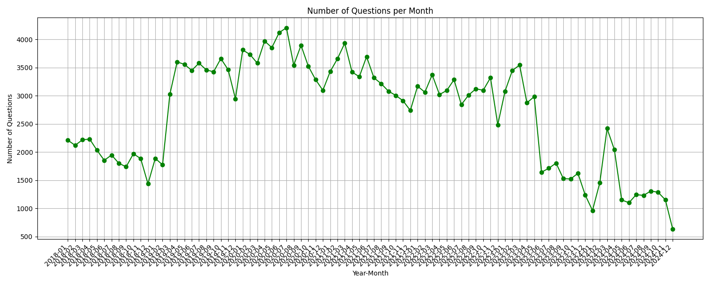
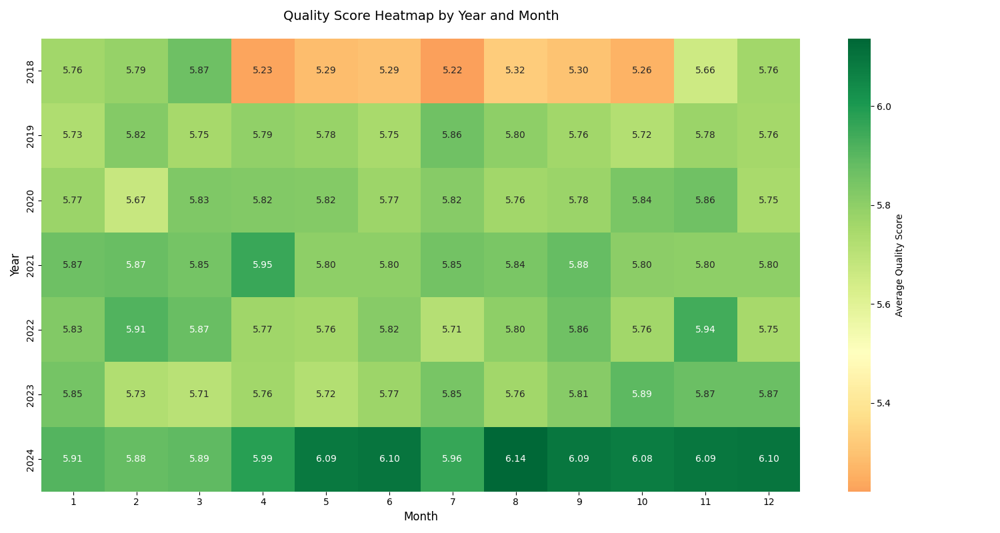

This post is a mirrored copy of my LinkedIn article, kept here so it remains searchable and independent from external platforms.
You can still find the original on LinkedIn: [LinkedIn Pulse article](https://www.linkedin.com/pulse/has-quality-sap-community-questions-gotten-worse-data-driven-zeis-bdyjf/).

---

The SAP Community is and will remain the central point of entry for all issues and discussions relating to SAP.

Over the past few years (and since the migration at the beginning of the year) I have had a feeling that the quality of questions in the technology area (the area I follow most closely) has gradually declined.

I wanted to see if I could somehow verify or disprove this feeling.

This blog post describes my approach and the results.

## Methodology

The analysis was based on historical question data, including:

- Question metadata (timestamps, authors, conversation details)
- Quality scores (rated by GPT-4o, ranging from 1 to 10)
- Additional metrics, such as the number of messages per conversation and whether the question was solved

Since the prices for tokens at OpenAI have fallen, I have simply decided to analyse the questions from the last six years in the technology section with an LLM.

To do this, I downloaded all the questions and packed them into a prompt that looks like this:

```text
You are an expert who will rate the quality of a question from an online forum. The quality of a question depends on:
- How well the user describes the problem
- How much contextual detail is given
- How well-formatted the question is (images, code formatting, clarity)
- Length (but not too long just for fluff)
- Overall clarity

Please return a single integer between 0 and 10 (no text, no explanation), where 10 means it's an extremely well-asked, clear question with all necessary details, and 0 means it's very poor, unclear, and low quality.
```

Thanks to the [Batch API](https://help.openai.com/en/articles/9197833-batch-api-faq) from OpenAI, we got another 50% discount for the prompt and paid $6.82 for the analysis of approximately 200,000 questions.

Data was processed using Python, and visualizations were created using Matplotlib and Seaborn.

## Key Findings

### 1. Monthly Quality Scores: Trends Over Time


The chart shows a notable dip in average quality around 2018-2019, followed by a gradual recovery. Interestingly, the quality scores have stabilized since 2020, with improvements starting end of 2023.

**Insight:** The dip could coincide with community policy changes, increased user activity, or other external factors. A deeper look into this period might reveal actionable insights.

### 2. Monthly Question Volume



The number of questions peaked between 2019 and 2021, followed by a steady decline. The recent decline might reflect a shift in community activity or a move to alternative platforms for technical discussions.

**Insight:** High activity in earlier years might have diluted quality, as seen in the overlapping periods of low scores and high question counts.

### 3. Quality Score Heatmap



The heatmap visualizes average quality scores by year and month. It confirms the dip in 2018 and highlights gradual improvements over time. Notably, 2024 have seen some of the highest average scores.

**Insight:** Certain months, such as mid-2018, had consistently lower scores. Investigating these periods could help address specific quality issues.

### 4. Messages in Conversations vs. Quality


The scatterplot shows no strong correlation between the number of messages in a conversation and the question’s quality score. However, higher-quality questions tend to lead to slightly longer discussions.

**Insight:** High-quality questions often attract deeper engagement, which benefits the community overall.

### 5. Combined Trends: Questions and Quality


Overlaying question volume and quality scores highlights the inverse relationship: as the number of questions surged, quality declined. This pattern reversed as activity decreased.

**Insight:** Moderating activity levels and encouraging thoughtful participation could help sustain or improve quality.

## Conclusions

### What the Data Tells Us

I can't explain the dip in 2018 to myself, and I don't have the time to investigate it further.

But at least the LLM rates that the quality has not dropped. That means there have always been very good and very bad questions. The average of the questions was always the same.

According to the LLM, the quality in 2024 even increased while the number of questions decreased, which did not feel like my experience.

What do you think about these insights? Are there specific periods or trends that resonate with your experience in the SAP Community?

## More stats

Here is a snippet of the data results:

https://gist.githubusercontent.com/marianfoo/9512f43ec4c536189906d35e6e023605/raw/c1a4ed715f7c56b348f0915820b7e5a4cffecebd/gistfile1.txt

**Quality Score Distribution:**

```text
quality_score
1.0        42
2.0      2661
3.0     11843
4.0     37171
5.0     34140
6.0     54559
7.0     45242
8.0     30511
9.0      1278
10.0        2
```

Here are the two 10 rated questions:

- [Optimizing Multithreaded Data Insertion into SAP Data Lake: Seeking Guidance and Best Practices](https://community.sap.com/t5/technology-q-a/optimizing-multithreaded-data-insertion-into-sap-data-lake-seeking-guidance/qaq-p/13809681)
- [How to Install SAP Cloud Connector on a Mac M2 Processor](https://community.sap.com/t5/technology-q-a/how-to-install-sap-cloud-connector-on-a-mac-m2-processor/qaq-p/13697727) (was a blog post)

**Monthly Statistics (all months):**

```text
 mean    std  min  max  count
year_month                               
2018-01     5.758  1.468  1.0  9.0   1430
2018-02     5.789  1.513  1.0  8.0    696
2018-03     5.866  1.431  2.0  9.0    666
2018-04     5.231  1.549  2.0  9.0    571
2018-05     5.287  1.478  2.0  8.0    550
2018-06     5.293  1.423  2.0  9.0    752
2018-07     5.221  1.441  2.0  8.0   1948
2018-08     5.325  1.512  2.0  9.0   1802
2018-09     5.301  1.507  2.0  9.0   1738
2018-10     5.262  1.483  2.0  9.0   1971
2018-11     5.659  1.495  2.0  9.0   1884
2018-12     5.761  1.489  2.0  9.0   1437
2019-01     5.731  1.465  2.0  9.0   1888
2019-02     5.821  1.473  2.0  9.0   1773
2019-03     5.754  1.433  2.0  9.0   3024
2019-04     5.794  1.475  2.0  9.0   3599
2019-05     5.781  1.492  2.0  9.0   3558
2019-06     5.746  1.453  2.0  9.0   3451
2019-07     5.860  1.462  2.0  9.0   3579
2019-08     5.803  1.468  1.0  9.0   3460
2019-09     5.760  1.500  2.0  9.0   3423
2019-10     5.725  1.481  2.0  9.0   3660
2019-11     5.777  1.492  1.0  9.0   3461
2019-12     5.755  1.523  1.0  9.0   2946
2020-01     5.773  1.497  2.0  9.0   3814
2020-02     5.669  1.514  2.0  9.0   3732
2020-03     5.830  1.495  2.0  9.0   3579
2020-04     5.823  1.470  2.0  9.0   3972
2020-05     5.822  1.474  2.0  9.0   3855
2020-06     5.770  1.430  2.0  9.0   4121
2020-07     5.816  1.459  2.0  9.0   4208
2020-08     5.761  1.494  2.0  9.0   3540
2020-09     5.775  1.479  2.0  9.0   3894
2020-10     5.843  1.489  2.0  9.0   3519
2020-11     5.858  1.495  2.0  9.0   3286
2020-12     5.746  1.513  1.0  9.0   3097
2021-01     5.866  1.515  1.0  9.0   3429
2021-02     5.872  1.514  2.0  9.0   3657
2021-03     5.849  1.492  2.0  9.0   3934
2021-04     5.953  1.513  1.0  9.0   3422
2021-05     5.798  1.544  2.0  9.0   3338
2021-06     5.801  1.535  2.0  9.0   3695
2021-07     5.855  1.544  1.0  9.0         3320
2021-08     5.838  1.514  2.0  9.0         3215
2021-09     5.879  1.518  2.0  9.0         3082
2021-10     5.805  1.492  2.0  9.0         3004
2021-11     5.802  1.510  2.0  9.0         2908
2021-12     5.800  1.536  2.0  9.0         2737
2022-01     5.827  1.479  1.0  9.0         3170
2022-02     5.913  1.485  2.0  9.0         3063
2022-03     5.875  1.494  2.0  9.0         3373
2022-04     5.766  1.534  2.0  9.0         3022
2022-05     5.757  1.511  2.0  9.0         3094
2022-06     5.816  1.503  2.0  9.0         3284
2022-07     5.715  1.560  2.0  9.0         2842
2022-08     5.800  1.510  2.0  9.0         3013
2022-09     5.859  1.507  2.0  9.0         3124
2022-10     5.765  1.566  1.0  9.0         3096
2022-11     5.937  1.498  1.0  9.0         3320
2022-12     5.748  1.571  1.0  9.0         2484
2023-01     5.851  1.543  2.0  9.0         3080
2023-02     5.728  1.579  1.0  9.0         3447
2023-03     5.707  1.558  1.0  9.0         3546
2023-04     5.761  1.594  2.0  9.0         2874
2023-05     5.719  1.530  2.0  9.0         2985
2023-06     5.772  1.575  1.0  9.0         1642
2023-07     5.846  1.585  2.0  9.0         1711
2023-08     5.763  1.566  1.0  9.0         1805
2023-09     5.813  1.560  1.0  9.0         1529
2023-10     5.894  1.564  2.0  9.0         1523
2023-11     5.871  1.576  1.0  9.0         1624
2023-12     5.871  1.534  2.0  9.0         1237
2024-01     5.910  1.502  1.0   9.0    964
2024-02     5.877  1.627  2.0   9.0   1448
2024-03     5.887  1.644  1.0   9.0   2409
2024-04     5.986  1.589  2.0   9.0   2035
2024-05     6.088  1.595  1.0  10.0   1144
2024-06     6.097  1.572  1.0   9.0   1096
2024-07     5.961  1.693  2.0   9.0   1241
2024-08     6.137  1.595  1.0  10.0   1227
2024-09     6.090  1.639  2.0   9.0   1305
2024-10     6.077  1.587  1.0   9.0   1283
2024-11     6.092  1.624  2.0   9.0   1148
2024-12     6.097  1.719  2.0   9.0    636
```

