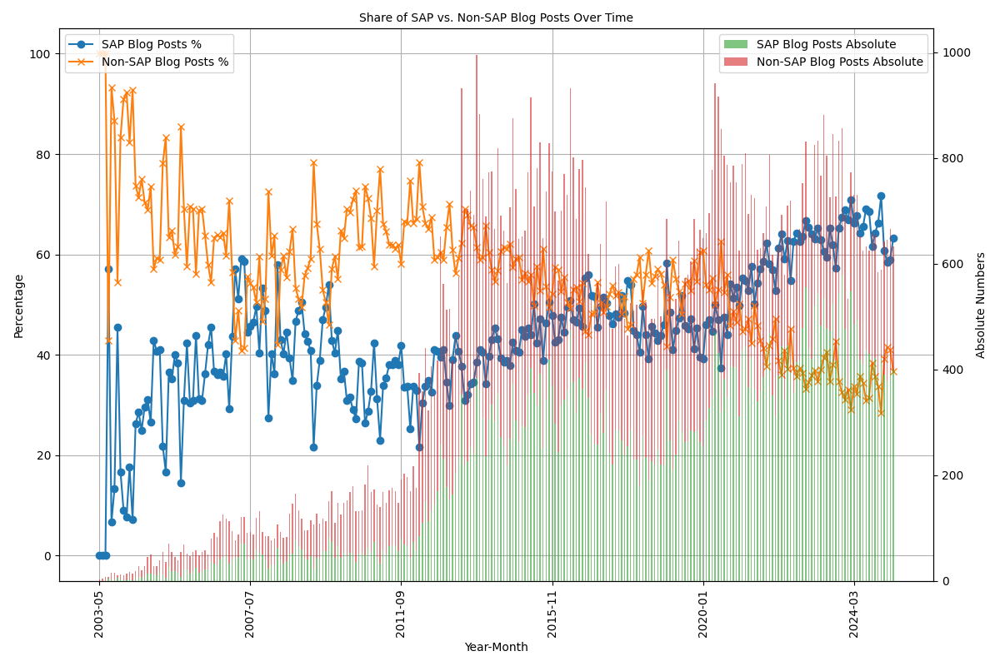
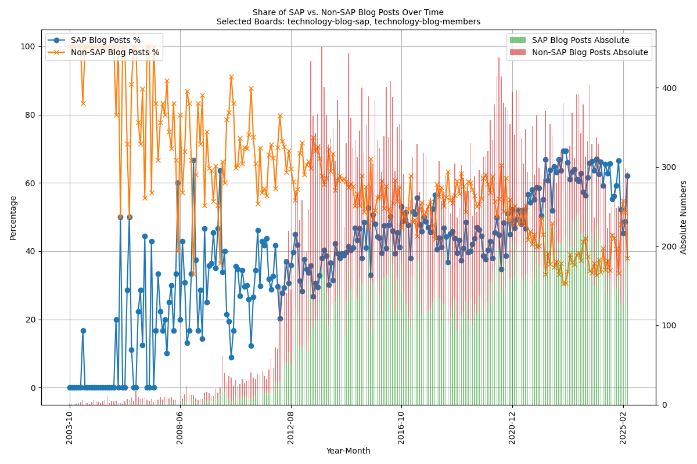
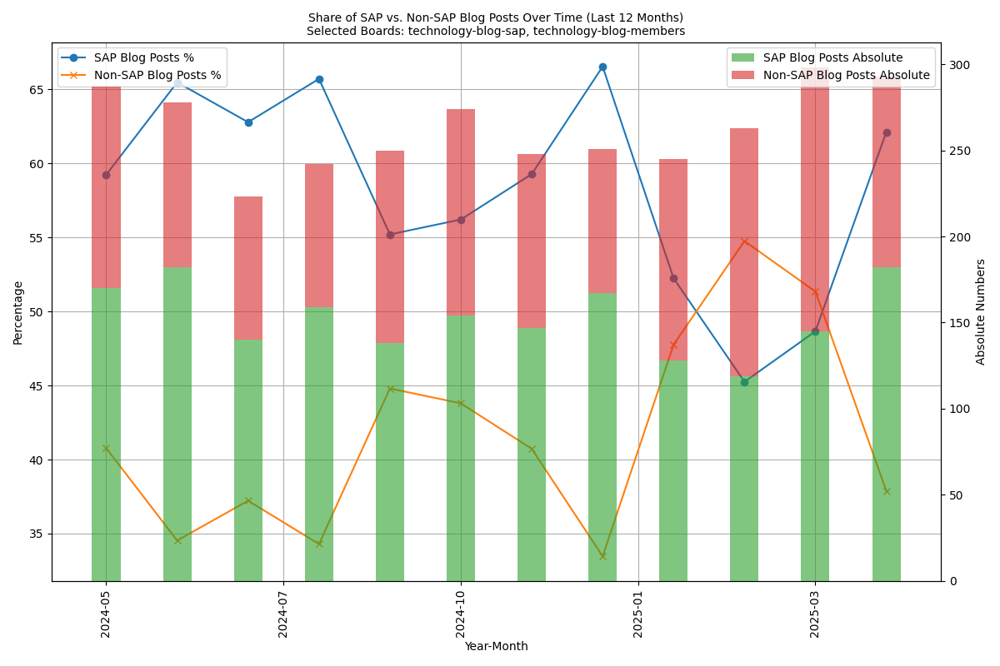
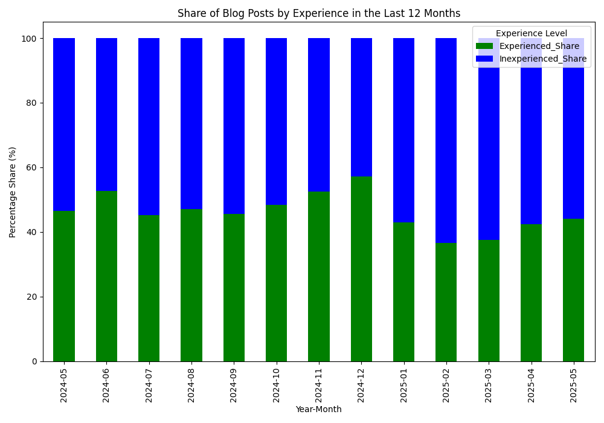
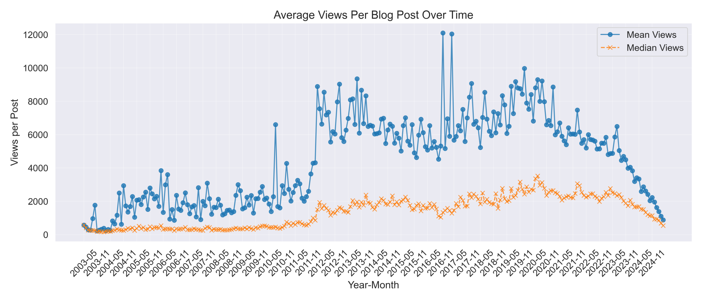

This post is a mirrored copy of my LinkedIn article, kept here so it remains searchable and independent from external platforms.
You can still find the original on LinkedIn: [LinkedIn Pulse article](https://www.linkedin.com/pulse/engagement-free-fall-why-sap-community-blogs-struggle-marian-zeis-z4otf/).

---

Back in April 2024 I opened this little series with [_From Open Exchange to Corporate Monologue_](https://www.linkedin.com/pulse/from-open-exchange-corporate-monologue-transformation-marian-zeis-zu6xf/), followed in August by [_SAP Community in Decline_](https://www.linkedin.com/pulse/sap-community-decline-engagement-continues-fall-little-marian-zeis-1wvif/) and, just before Christmas, the GPT-assisted look at [question quality](https://www.linkedin.com/pulse/has-quality-sap-community-questions-gotten-worse-data-driven-zeis-bdyjf/).

Twelve months, two platform releases and several batch-downloads later it is time for round four - this time with a split focus:

- **Who is writing the blog posts today?**
- **Does anybody still read them?**

---

## 1 | Share of SAP vs. Non-SAP Blog Posts - Little News on the Macro Level

"Nothing has changed" was my gut feeling - and the long-range chart confirms it. Since the second half of 2023 the SAP share hovers stubbornly between **60% and 70%**; no new record highs, but also no real retreat.

_Share and absolute numbers of all blog posts, 2003-05 to 2025-05_

### Does the plateau invalidate my earlier alarm?

Not really. The community never bounced back to the sub-40% employee share we enjoyed a decade ago - the _status-quo_ is simply frozen at a two-thirds "corporate voice".

_Assumption check:_ My earlier claim of **"no further change" holds for percentages**, but the green bars (absolute SAP posts) are still inching up. The non-SAP bars are mostly flat. So the balance only stays constant because both lines move in parallel.

---

## 2 | Tech-Blog Boards - A Very Different Story

Drill down to the two technology boards (`technology-blog-sap`, `technology-blog-members`) and you get a much livelier picture.

_Figure 2 - Share and absolute numbers in the tech blogs, entire history_

_Figure 3 - Same data, last 12 months_

Key observations:

1. **Member posts are growing** - up by ~25% year-on-year.
2. **SAP posts are shrinking** - down by ~15% in the same period (especially 2025-01 to 2025-03).

_Assumption:_ The main reason for this change is the lower number of SAP blog posts. One possible explanation is that the personal target number of blog posts required to achieve a possible bonus has been reached. This also explains the high number of SAP blog posts in December.

There was also an increase in blog posts from non-SAP members and new members of the SAP community (see next point).

---

## 3 | Who Are Those Members? - Rank Distribution

_Figure 4 - Experienced vs. inexperienced share in the tech blogs, last 12 months_

The green bars (Participant+) show a **drop to barely 40%** in February before recovering to the mid-40s. Net-net the fresh content boom is fuelled primarily by _new_ contributors.

_Additional assumption:_ A steady inflow of first-time authors is great - **if** their pieces are curated and converted into repeat contributions. Otherwise we risk a "drive-by blogging" pattern that never matures (see next point about views).

---

## 4 | Views - The Elephant in the Room

When SAP switched the platform to Khoros I planned to ignore the view counter - until the time-series smacked me in the face:

_Figure 5 - Mean and median views and engagement quality_

The trajectory is crystal-clear:

- **Sharp decline since 2020**, long before the migration.
- Mean > median: a few viral posts keep the average alive; the _typical_ post is doing much worse.

### Are the counters reliable?

I have already written that I do not consider the view parameters to be reliable. However, I cannot ignore this chart because the trend is quite clear. I trust the trend because it reflects my personal feeling.

I strongly suspect that the curve is not so extreme in real numbers, but only SAP itself can answer this question with its own analytics data.

But if you look at the number of posts here, there is no downward trend. This confirms my impression that a lot of blog posts are written by non-SAP members and that SAP employees are encouraged to write blog posts.

This combination automatically leads to a decline in quality and therefore in engagement, which confirms my impression that blog posts that are really worth reading are becoming rarer.

---

## 6 | What Could SAP (and We) Do?

This is a difficult question to answer because there is no simple answer. Platform migration is only part of the answer, because engagement was already declining before that, but it definitely plays a big role.

If you look at the latest ['What's New'](https://community.sap.com/t5/what-s-new/enhancements-for-sap-community-march-2025/ba-p/14037208) post from the SAP community, the bug fixes are ones that shouldn't have been there in the first place and are just minor cosmetic changes. It doesn't change the big picture. And now, years after the migration, I don't see any quick changes and we have to deal with the current situation.

As a community, there's nothing we can do about it, because you can't build a community of this size overnight. There are legal requirements that can't be met with a small team.

Björn Schulz is doing a great job with his website and excellent content: https://software-heroes.com/

As Twitter is dying and [Bluesky](https://go.bsky.app/M3Q7Nng) can't take its place, the only alternative so far is (unfortunately) LinkedIn. There's a lot of (at best) bad content there, but also a lot of untruths, and it's also flooded with AI content.

At the moment, my optimism about the SAP community has faded a bit. If anyone has any suggestions on how to reunite the community, I'm all ears!

