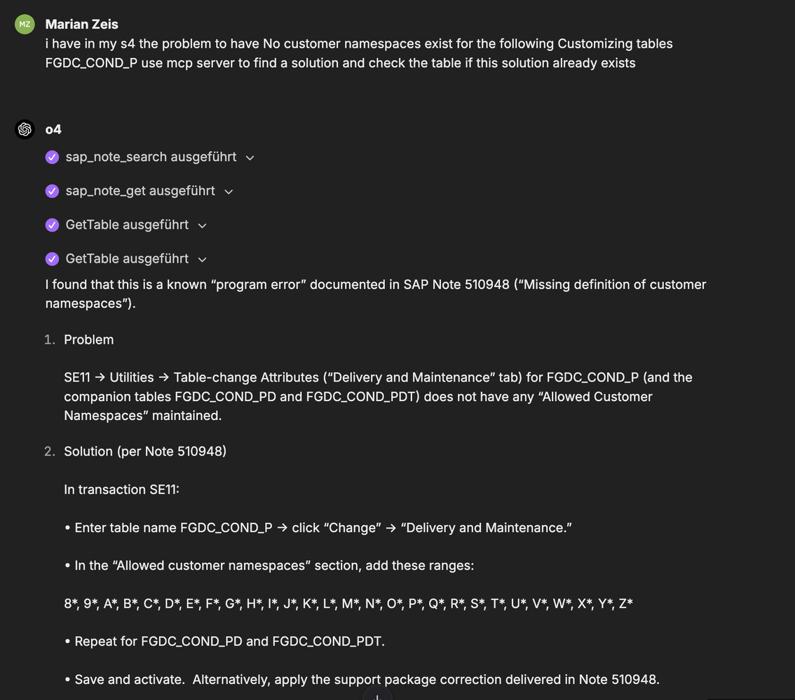
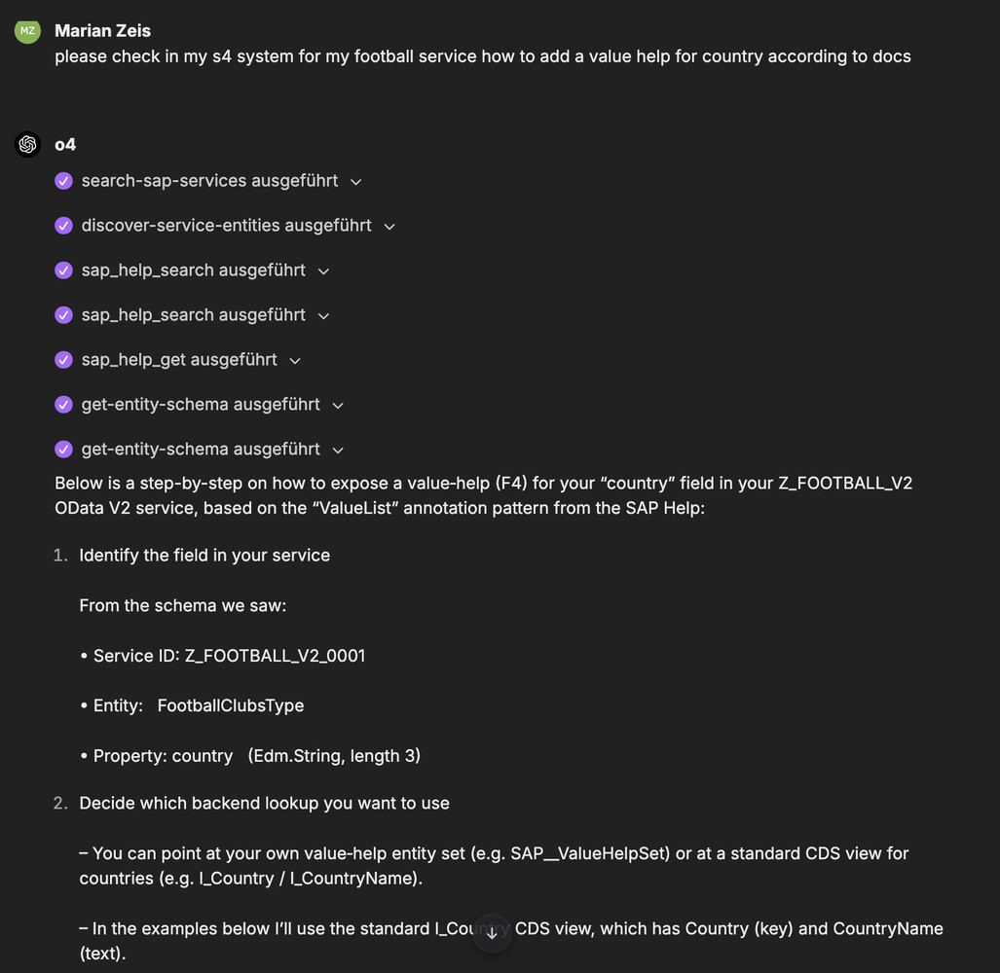
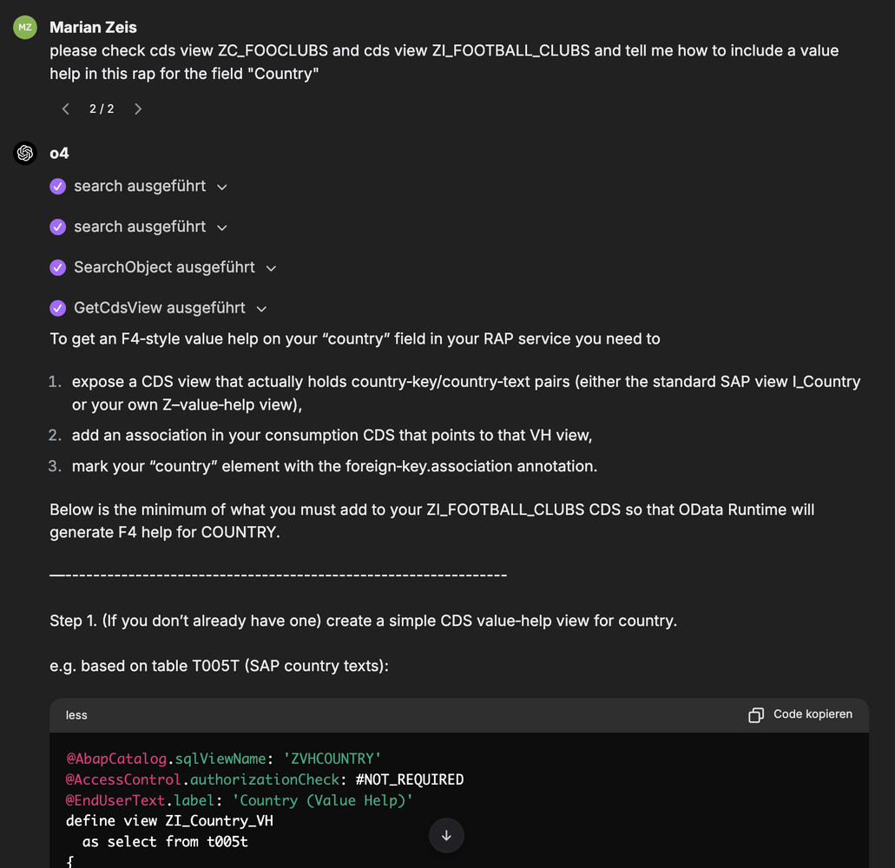

This post is a mirrored copy of my LinkedIn article, kept here so it remains searchable and independent from external platforms.
You can still find the original on LinkedIn: [LinkedIn Pulse article](https://www.linkedin.com/pulse/supercharged-local-open-source-joule-consultants-search-marian-zeis-gepbf/).

---

[Joule for Consultants](https://www.sap.com/germany/products/artificial-intelligence/ai-assistant/sap-consulting-capability.html) costs 250 € and mainly searches SAP Help, SAP Community and SAP for Me (Notes). That is useful, but it stops where real projects start: your own systems, codebase and sensitive data. Even though public assistants like ChatGPT and Claude can already reach SAP Help and SAP Community, the real gap is internal/authenticated data and code.

For this case I created a [LibreChat fork](https://github.com/marianfoo/local-llm-client-for-sap-consultants-librechat) that includes and auto-starts SAP MCP servers (Docs, Notes, S/4 OData and ABAP ADT) via Docker. So the MCP Server are local inside your Docker and no external MCP Server is used. [LibreChat](https://www.librechat.ai/) is an open‑source local chat UI with MCP support and built‑in Ollama integration, and it also supports many other model providers. You get a private assistant that can read official docs, inspect code and data from your systems without sending customer context to third‑party clouds. The fork’s documentation is here: [sap‑mcp‑docs](https://github.com/marianfoo/local-llm-client-for-sap-consultants-librechat/tree/main/sap-mcp-docs).

Running the assistant locally means the client, tools and, if you choose, the model stay on your machine (LibreChat supports Ollama), so you avoid pasting sensitive context into public chats. By adding S/4 OData and ABAP ADT, you bring real metadata, code and data into the loop.

### Which MCP servers are used here?

The [SAP Docs MCP](https://github.com/marianfoo/mcp-sap-docs) provides unified search and fetch across SAPUI5/OpenUI5, CAP, ABAP keyword docs, SAP Help and SAP Community. The [SAP Notes MCP](https://github.com/marianfoo/mcp-sap-notes) is for searching and fetching SAP Notes when you have an error, OSS number or concrete symptom; it requires an S‑User certificate (Passport). The [ABAP ADT MCP](https://github.com/mario-andreschak/mcp-abap-adt) reads ABAP sources, DDIC structures and tables content via ADT APIs so you never paste code into chat and still get precise context. The [S/4 OData MCP](https://github.com/lemaiwo/btp-sap-odata-to-mcp-server) discovers services and exposes safe CRUD tools so your assistant can read and write via approved APIs.

## How this works in practice

In my example I used o4‑mini from OpenAI, but LibreChat supports many [model providers](https://www.librechat.ai/docs/configuration/pre_configured_ai) including OpenAI, Anthropic, Google, Azure AI Foundry and even SAP AI Core (not tested by me). The key point: you can also use a local [model via Ollama](https://www.librechat.ai/blog/2024-03-02_ollama#getting-started-with-ollama). Depending on your use case, a local model is smart enough to call the right tools and MCP servers. I also use an ABAP Cloud Developer Trial instance connected via the S/4 OData and ADT MCP servers.

### SAP Notes lookup + ABAP table verification

This first example flow combines the SAP Notes MCP and ABAP ADT MCP. First the assistant searches and fetches a specific SAP Note (`sap_note_search`, `sap_note_get`), then verifies the relevant DDIC table and fields via ADT. This confirms the symptom and the fix steps before proposing a safe, auditable corrective action (for example, an OData action). This is the pattern for many “error → note → verify → fix” tasks.



### Service metadata + ValueList guidance

The assistant uses the S/4 MCP to discover the Football service and inspect entity schema (`search-sap-services`, `discover-service-entities`, `get-entity-schema`). It then pivots to the SAP Docs MCP to `sap_help_search` and `sap_help_get` the ValueList documentation and shows exactly where to add annotations. This marries live service metadata with the official docs so consultants can implement confidently, then validate in a Fiori app.



### CDS view Value Help research

For CDS‑centric cases, the assistant focuses on SAP Docs MCP to collect the canonical examples for `Common.ValueList` and relevant ABAP/CDS annotations. If needed, ABAP ADT MCP can retrieve the current CDS definition (`GetStructure`/`GetInclude`) to compare the as‑is state and generate the minimal edit plan.



### Other options and clients

There are other options and clients to use these MCP servers. If you prefer the Microsoft ecosystem, Visual Studio Code’s GitHub Copilot Chat supports MCP servers so you can connect the same SAP MCP endpoints there, as described in the [VS Code Copilot Chat MCP guide](https://code.visualstudio.com/docs/copilot/chat/mcp-servers). This is a simpler setup compared to the LibreChat fork. For a more governed setup you can use [Copilot Studio](https://adoption.microsoft.com/ai-agents/copilot-studio/) together with the hosted S/4 OData MCP server from [Nessi NV](https://www.sap.com/products/artificial-intelligence/partners/nessi-nv-ai-data-enabler.html?countryCode=US) and the SAP Docs MCP Server.

I talked about these MCP servers and showed a live example of Copilot Studio and other LLM clients at SAP Inside Track Munich 2025. The recording is here: [SAP Inside Track Munich 2025](https://www.youtube.com/watch?v=vTZCeaxsOwU).

You can also build your own LLM client and use the MCP servers directly. I tried a quick PoC with the current libraries and tools. It worked, but turning it into a production‑ready assistant with robust MCP support is non‑trivial; I would not recommend rolling your own for production. The PoC is here: [Custom LLM Client](https://github.com/marianfoo/custom-llm-client).

### Getting started

To run this on your own machine, clone the repository, configure the `.env` and `librechat.yaml` files and start the Docker container. The docs are in this [folder](https://github.com/marianfoo/local-llm-client-for-sap-consultants-librechat/tree/main/sap-mcp-docs) and the setup guide is here: [MCP_SETUP_GUIDE.md](https://github.com/marianfoo/local-llm-client-for-sap-consultants-librechat/blob/main/sap-mcp-docs/MCP_SETUP_GUIDE.md).

Minimal path (see guides for details):

```text
# Clone and configure
git clone https://github.com/marianfoo/local-llm-client-for-sap-consultants-librechat
cd local-llm-client-for-sap-consultants-librechat
cp .env.example .env
cp librechat.example.yaml librechat.yaml

# Configure the .env and librechat.yaml files

# Start in Docker
docker compose up -d
```

### Security: running AI and MCP locally

Because the client, MCP server and (optionally) the model run on your machine, prompts, retrieved docs and tool results stay inside your environment. When you do connect to external sources, do it intentionally and stick to trusted endpoints. Operationally keep it simple and start read-only by default and enable write tools only when you require it. The short version: a local, open-source stack is the safer option here; unlike cloud assistants, your information never leaves your machine unless you choose to send it.

### Conclusion

With MCP servers, LLM clients become smarter and more useful in real projects. LLMs simply cannot know everything, especially internal context that lives on enterprise networks and changes quickly. Because the Model Context Protocol is still relatively new in the enterprise, treat adoption with care and integrate it securely. Keeping information on your own machine and using open-source libraries lets you see exactly what runs and how.

SAP clearly wants to position Joule for Consultants as a unique product; today it still lags behind community projects for these use cases. At TechEd next week we’ll see whether community MCP servers are embraced and whether SAP’s own products improve enough to justify the price.

### References

- Custom LLM Client PoC: [https://github.com/marianfoo/custom-llm-client](https://github.com/marianfoo/custom-llm-client)
- SAP Inside Track Munich 2025 session: [https://www.youtube.com/watch?v=vTZCeaxsOwU](https://www.youtube.com/watch?v=vTZCeaxsOwU)
- SAP partner listing (S/4 integration via OAuth): [https://www.sap.com/products/artificial-intelligence/partners/nessi-nv-ai-data-enabler.html?countryCode=US](https://www.sap.com/products/artificial-intelligence/partners/nessi-nv-ai-data-enabler.html?countryCode=US)
- MCP clients overview (Claude Desktop etc.): [https://modelcontextprotocol.io/clients/](https://modelcontextprotocol.io/clients/)
- Copilot Studio: [https://adoption.microsoft.com/ai-agents/copilot-studio/](https://adoption.microsoft.com/ai-agents/copilot-studio/)
- VS Code Copilot Chat MCP docs: [https://code.visualstudio.com/docs/copilot/chat/mcp-servers](https://code.visualstudio.com/docs/copilot/chat/mcp-servers)
- CAP MCP server (official): [https://github.com/cap-js/mcp-server](https://github.com/cap-js/mcp-server)
- CAP MCP plugin (community): [https://github.com/gavdilabs/cap-mcp-plugin](https://github.com/gavdilabs/cap-mcp-plugin)
- S/4 OData MCP: [https://github.com/lemaiwo/btp-sap-odata-to-mcp-server](https://github.com/lemaiwo/btp-sap-odata-to-mcp-server)
- ABAP ADT MCP: [https://github.com/mario-andreschak/mcp-abap-adt](https://github.com/mario-andreschak/mcp-abap-adt)
- SAP Notes MCP: [https://github.com/marianfoo/mcp-sap-notes](https://github.com/marianfoo/mcp-sap-notes)
- SAP Docs MCP: [https://github.com/marianfoo/mcp-sap-docs](https://github.com/marianfoo/mcp-sap-docs)
- LibreChat Ollama guide: [https://www.librechat.ai/blog/2024-03-02_ollama#getting-started-with-ollama](https://www.librechat.ai/blog/2024-03-02_ollama#getting-started-with-ollama)
- LibreChat model providers: [https://www.librechat.ai/docs/configuration/pre_configured_ai](https://www.librechat.ai/docs/configuration/pre_configured_ai)
- LibreChat website: [https://www.librechat.ai/](https://www.librechat.ai/)
- LibreChat fork setup guide: [https://github.com/marianfoo/local-llm-client-for-sap-consultants-librechat/blob/main/sap-mcp-docs/MCP_SETUP_GUIDE.md](https://github.com/marianfoo/local-llm-client-for-sap-consultants-librechat/blob/main/sap-mcp-docs/MCP_SETUP_GUIDE.md)
- LibreChat fork docs folder: [https://github.com/marianfoo/local-llm-client-for-sap-consultants-librechat/tree/main/sap-mcp-docs](https://github.com/marianfoo/local-llm-client-for-sap-consultants-librechat/tree/main/sap-mcp-docs)
- LibreChat fork (SAP consultants, with MCP servers): [https://github.com/marianfoo/local-llm-client-for-sap-consultants-librechat](https://github.com/marianfoo/local-llm-client-for-sap-consultants-librechat)