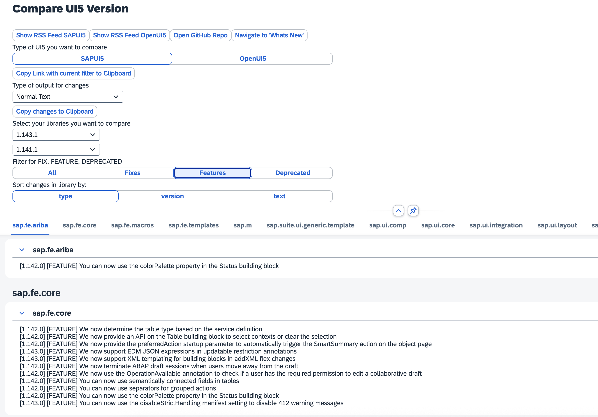
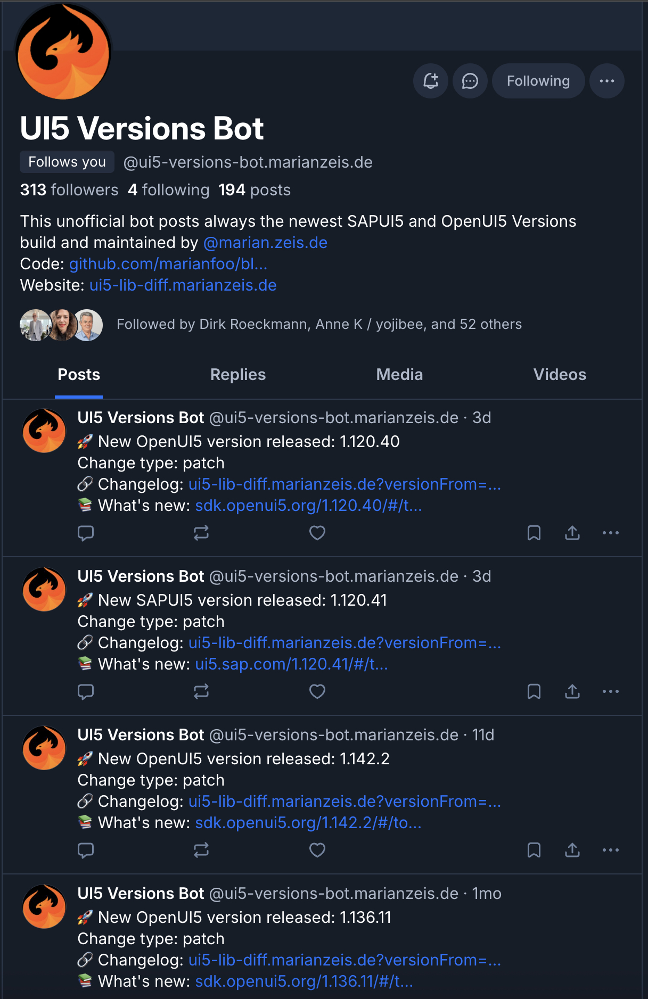

I was recently asked how my UI5 Versions Bot on Bluesky works. So I want to simply explain how it works and how I use an RSS feed as a small “microservice” so I can base other services on this data.

## How the ui5-lib-diff project works

The [`ui5-lib-diff`](https://github.com/marianfoo/ui5-lib-diff) project pulls data from official UI5 sources (SAPUI5/OpenUI5) and turns it into structured change data. That data is then used to generate an RSS feed entry for each patch update in both SAPUI5 and OpenUI5.

It runs a small GitHub workflow that runs every two hours, fetches library data and change logs, parses and consolidates the results, and then creates the RSS XML files ([`rss_feed_SAPUI5.xml`](https://ui5-lib-diff.marianzeis.de/rss_feed_SAPUI5.xml), [`rss_feed_OpenUI5.xml`](https://ui5-lib-diff.marianzeis.de/rss_feed_OpenUI5.xml)). A scheduled GitHub Actions workflow builds the UI5 app and publishes everything to the `docs` branch so it can be served via GitHub Pages. There’s also a static page at `https://ui5-lib-diff.marianzeis.de/` for browsing without using the RSS feeds and for creating diffs between versions.

So basically this is a small “microservice” that fetches data from the official UI5 sources and publishes it to an RSS feed. Now I’m able to use this data in other services — for example, in a Bluesky bot.

I also created a GitHub repo for multiple Bluesky bots (like a UI5 Version Bot and an SCN Bot): `https://github.com/marianfoo/bluesky-bots/tree/main/packages/blueskybotui5version`

## How the Bluesky UI5 version bot works

The Bluesky bot (see [`packages/blueskybotui5version`](https://github.com/marianfoo/bluesky-bots/tree/main/packages/blueskybotui5version)) is an example consumer of the RSS “microservice”.

Instead of scraping webpages, it periodically fetches the two RSS feeds from the UI5 microservice:

- SAPUI5: <https://ui5-lib-diff.marianzeis.de/rss_feed_SAPUI5.xml>
- OpenUI5: <https://ui5-lib-diff.marianzeis.de/rss_feed_OpenUI5.xml>

For each RSS item (for example “Version 1.143.0 Changes”), it extracts the version number and checks if it already posted about it. The bot persists that state in a local `posted_versions.json` file so it won’t repost the same version after a restart.

When it finds a new version, it creates a Bluesky post that links back to the “What’s new” comparison on `https://ui5-lib-diff.marianzeis.de/` and also adds the corresponding documentation link (SAPUI5: `https://ui5.sap.com/<version>/#/`, OpenUI5: `https://sdk.openui5.org/<version>/#/`). The bot uses the official `version.json` endpoints to determine the previous available version for comparisons, and it rate-limits posting to avoid spamming.

The bot itself does not run on GitHub but on my own private Hetzner server.

So RSS feeds are a great way to create a microservice that can be used by other services. To be fair, the kind of data you can put in an RSS feed is pretty limited but it’s perfectly valid for my use case.
