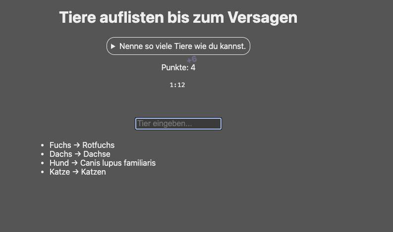

I found Vivian Rose’s little web game **“List Animals Until Failure”** through a Hacker News thread ([HN discussion](https://news.ycombinator.com/item?id=46842603)) and immediately got hooked.

Then I typed my first few animals… and realized my English animal vocabulary is not exactly perfect. So I did the only sensible thing and made a German version.

The UI text is mostly translated with AI help (as all the other code). The part that actually took time was getting the animal names.

---

## What the game is

It’s simple: you type animal names until you fail. If you repeat something, or you try to sneak in a too-broad term after a more specific one (and vice versa), the game calls you out.

The magic is that it feels **instant** because when you load the app you also load the complete animal list.

---

## Where the animal list comes from

Vivian explains the original approach in her write-up ([blog post](https://rose.systems/blog/list-animals-until-failure)): the game is powered by **Wikidata + Wikipedia**, and it ships a big offline lookup table so gameplay needs **no network calls**.

At a high level, the original project:
- mines Wikidata entities representing taxons and builds a parent/child tree
- uses Wikipedia article titles + redirects (and some extra heuristics like disambiguation pages) to decide what inputs should count as “the same animal term”
- has a bunch of hand-tuning for edge cases

For the German version, I took a pragmatic route:
- keep the **same Q-IDs and taxonomy structure** from the original dataset
- fetch **German names** for those Q-IDs from Wikidata in batches
- write out the German lookup tables that the game uses at runtime

I ended up with a few small Python helpers: one to fetch the German names from Wikidata, one to re-try missing entries, and one to add common singular forms (so “hai” works even if the canonical title is “haie”).

---

## Credits

This exists because Vivian Rose built something genuinely fun and also wrote about it:

- Original game: [List Animals Until Failure](https://rose.systems/animalist/)
- Original repo: [Roachbones/animalist](https://github.com/Roachbones/animalist)
- Original write-up: [blog post](https://rose.systems/blog/list-animals-until-failure)

And here’s my German adaptation again:

- German version: [animalist-de.marianzeis.de](https://animalist-de.marianzeis.de/)
- Repo: [marianfoo/animalist_de](https://github.com/marianfoo/animalist_de)

