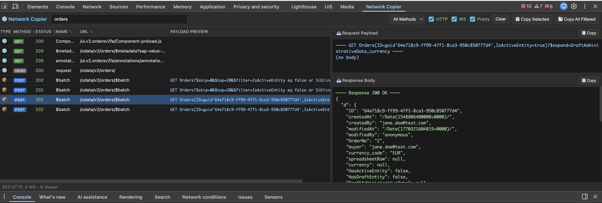

AI assistants already help a lot, but they work best when you can give them good context. In web apps, the most important context is usually the real traffic between frontend and backend: **request URLs, payloads, and responses**.

When debugging, I want to copy that information quickly and completely. And since I mostly work with **UI5 and OData**, I usually need the full URL plus request and response body. In Chrome DevTools that often means a lot of manuall copy pasting, and if you need more than one request, it gets annoying fast.

So I did the obvious thing: I built a small Chrome DevTools extension with AI help that solves this problem for me. Yes, I could also use MCP tooling or an automated browser to extract network data, but for day-to-day debugging I care about speed and I usually know exactly which requests matter.

After using it locally for a while, I decided to publish my first extension in the Chrome Web Store.

---

**Install it here:** [Chrome Web Store](https://chromewebstore.google.com/detail/network-request-response/mphiaidjajmllkfkjlkfgmfkccpnomgc)

**Update (2026-02-10):** Also available in the [Microsoft Edge Add-ons store](https://microsoftedge.microsoft.com/addons/detail/network-request-respons/mmfhobojdlgibnffjhkidhdcjfbfhgpo).

**Source code:** [GitHub](https://github.com/marianfoo/chrome-extension-copynetworkrequests)

---

## The solution

**Network Request & Response Copier** adds a dedicated panel to DevTools that shows network entries in a clean, sortable list.

- **Left panel**: sortable request list with filters, a payload preview, and pinning
- **Right panel**: request payload (top) and response body (bottom)
- **Copy buttons**: copy the selected entry, all filtered entries, or all pinned entries

And the part that matters most for my work: it makes OData traffic much easier to work with, especially `$batch` requests.

---

## Key features

- **Copy in one click**: Copy the selected entry with `Ctrl/Cmd+C`, or export all filtered or pinned entries. Output includes method, URL, payload, and response in one readable block.
- **OData `$batch` parsing**: Splits multipart `$batch` into per-operation blocks and shows a quick “what’s inside” preview in the list (for example: `PATCH MockConfig | GET Users`).
- **Better OData overview**: Keeps long `$select` and `$filter` URLs readable and shows request and response side-by-side, which makes sharing context (and debugging) much faster.
- **WebSocket included**: Captures sent and received messages and shows them alongside HTTP entries.
- **DevTools-like workflow**: Sort, search, filter by method, resize panes, pin important calls.
- **Stays fast**: 500-entry cap, throttled UI updates, cached parsing.

---

## How it works (short version)

- Runs as a DevTools panel, so it only exists while DevTools is open.
- Collects HTTP traffic via `chrome.devtools.network.onRequestFinished` (HAR entries).
- Detects and parses `$batch` payloads to show a per-operation overview.
- Captures WebSocket messages by instrumenting `WebSocket` in the inspected page.
- Copies to clipboard with fallbacks that work in the DevTools environment.

You're welcome to use it and let me know what you think, try it out suggest changes!
