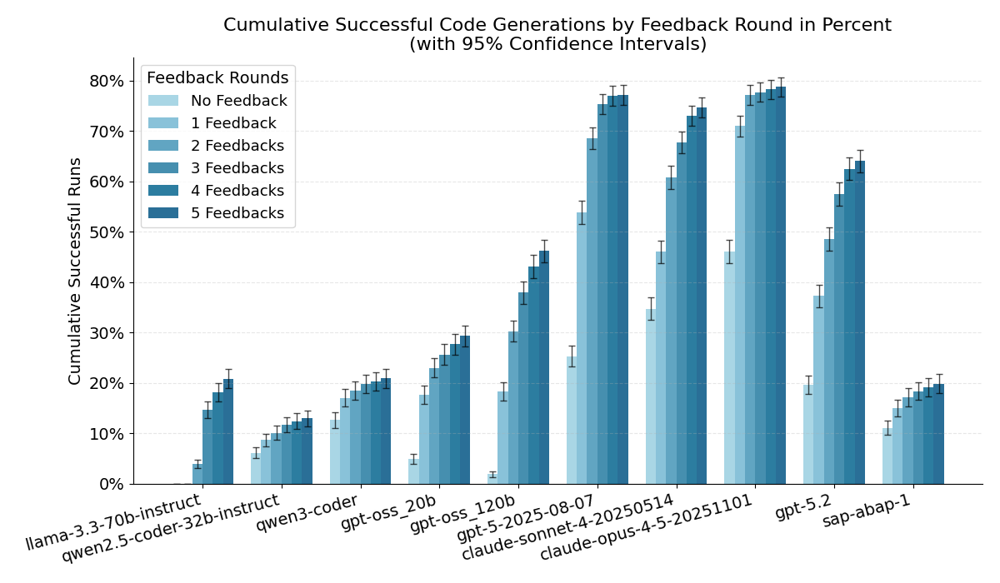

In a lot of SAP webcasts and webinars, especially around AI, the question comes up very early: which model are you using, and which one do you recommend?

For [CAP](https://cap.cloud.sap/docs/) and [UI5](https://ui5.sap.com/) the answer is usually pretty simple: use the current best model from Anthropic. If you add good context via [MCP servers](https://community.sap.com/t5/technology-blog-posts-by-sap/sap-build-introduces-new-mcp-servers-to-enable-agentic-development-for/ba-p/14205602) from the community or SAP, you are basically fine. There is just a lot of public knowledge available, and most of it is in JavaScript/TypeScript, which LLMs handle extremely well.

With ABAP it's different.

ABAP is not the framework, it's the language. And compared to JavaScript/TypeScript, far less ABAP knowledge and code is publicly accessible, so models simply know much less about it.

Sure, you can help with extra context and tooling, but if you want this to work well, the model should already have a solid ABAP base. A good foundation makes it much easier to build on top.

So how do you figure out which models are actually best for ABAP? Anthropic, Google, OpenAI, or maybe [ABAP-1](https://help.sap.com/docs/sap-ai-core/generative-ai/sap-abap-1?locale=en-US) from SAP?

Luckily, TH Köln recently published a paper that answers exactly this question: [Benchmarking Large Language Models for ABAP Code Generation](https://arxiv.org/html/2601.15188v1).

---

## The benchmark

The paper builds a benchmark so different LLMs can be compared fairly for ABAP code generation.

It includes 180 tasks ([HumanEval](https://github.com/marianfoo/LLM-Benchmark-ABAP-Code-Generation/tree/main/dataset/abap_canonical_solution) adapted to ABAP plus a set of ABAP/SAP practical scenarios). The flow is fully automated: the model generates ABAP code, the code is created and activated in a fixed SAP environment ([ABAP Cloud Developer Trial as a Docker image](https://hub.docker.com/r/sapse/abap-cloud-developer-trial)), and then ABAP Unit tests run against it.

If syntax checks or tests fail, the model gets the error messages as feedback and can try again for up to 5 rounds. In the end, it's not about whether the code "looks plausible", but whether it actually passes the tests (and how quickly it gets there).

The nice part: the authors published everything.

- **Original code**: [LLM-Benchmark-ABAP-Code-Generation](https://github.com/timkoehne/LLM-Benchmark-ABAP-Code-Generation)
- **Dataset (prompts, unit tests, expected classes)**: [dataset folder](https://github.com/timkoehne/LLM-Benchmark-ABAP-Code-Generation/tree/main/dataset)
- **My updated benchmark repo (additional models, speed-ups, plots, data, webpage)**: [marianfoo/LLM-Benchmark-ABAP-Code-Generation](https://github.com/marianfoo/LLM-Benchmark-ABAP-Code-Generation)

---

## Updating the benchmark

One small problem: the evaluation in the paper is from mid-2025 (for example using GPT-5 and Claude Sonnet 4). The model landscape moves fast, and now we already have things like GPT-5.3 and [Claude Opus 4.6](https://www.anthropic.com/news/claude-opus-4-6).

So I wanted a way to update the results and include additional models that are relevant for ABAP.

I built on the original benchmark and added runs for additional models, so I can compare them against the original GPT-5 and Sonnet numbers:

- Anthropic Claude Opus 4.5 (4.6 will be next)
- OpenAI GPT-5.2
- SAP ABAP-1

I also made a few changes to speed up execution:

- For OpenAI and Anthropic I used the vendor batch APIs like in the original code ([OpenAI Batch API](https://platform.openai.com/docs/guides/batch), [Anthropic batch processing](https://docs.anthropic.com/en/docs/build-with-claude/batch-processing)). GPT-5.2 Codex was not available via batch for me yet, but that model will be next.
- ABAP-1 has no batch API, so I implemented a parallel execution with multiple threads.
- I also parallelized the execution on the ABAP Trial system itself to reduce overall runtime. I'm happy I have a well-equipped MacBook, but during the runs RAM usage and fan speed were definitely not idle.
- Since there is a lot of Python code and I don't know Python well enough, all the coding was done with AI help.

The next step is a small website with an overview of the current results and an easy model comparison.

You can find the current results here: [abap-llm-benchmark.marianzeis.de](http://abap-llm-benchmark.marianzeis.de/)

---

## So what is the best model for ABAP?

Not too surprising: the best results came from GPT-5 and Claude Opus 4.5, with a small edge for Opus.

To make it more concrete, here are the cumulative success rates from my current comparison (Round 0 = first attempt, Round 5 = after up to 5 feedback iterations with compiler/test errors):

| Model | Round 0 | Round 5 |
| --- | ---: | ---: |
| Claude Opus 4.5 | 31.61% | 78.72% |
| GPT-5 | 19.28% | 77.11% |
| GPT-5.2 | 16.33% | 64.00% |
| SAP ABAP-1 | 10.67% | 19.89% |

Here is the same as a chart:

What I find interesting here is not only the final number, but also how the models behave across the feedback loops.

### Why is GPT-5.2 worse than GPT-5 (in this benchmark)?

I can't prove the exact reason (this is a black box), but based on the patterns in the benchmark it looks like GPT-5 is simply better at using compiler feedback to dig itself out of ABAP syntax and declaration issues.

GPT-5.2 still does fine, but compared to GPT-5 it is:

- less consistent across reruns (about 41% of prompts solved 10/10 vs about 59% for GPT-5)
- less likely to recover from certain ABAP-specific errors within a few feedback rounds

My best guess is that GPT-5.2 is tuned differently (for example more general, faster, cheaper, or optimized for other coding workflows), and that does not translate 1:1 to "generate a full ABAP class that compiles and passes ABAP Unit tests". Maybe when using the codex model, the results are better.

### Claude Opus 4.5

Opus starts very strong in Round 0. That usually means less back and forth for basic ABAP class structure and syntax, and more time spent on the actual logic.

In practice, this is what you want: you want to reach the unit test stage quickly, because that feedback is much more actionable than "your code does not activate".

### SAP ABAP-1

ABAP-1 is clearly not competitive for code generation in this benchmark, and it also benefits much less from the feedback loops.

This matches what SAP writes in the docs: ABAP-1 is mainly meant to explain ABAP code, while generation is experimental. For me, ABAP-1 is still useful as an "ABAP explainer", but if you want to generate correct ABAP code fast, you still want a strong general model plus good tooling and feedback loops.

### What this means in practice

This matters most when you work with APIs and actually build things. If you only call APIs, the model choice matters more. If you actively develop, it matters a bit less because we can add a lot of context and feedback loops.

When developing ABAP, we can provide much more context (for example via my [ABAP MCP server](https://github.com/marianfoo/abap-mcp-server)), catch syntax errors early, run tools like [abaplint](https://abaplint.org/), and then feed that back into the LLM to improve the code, basically like in TypeScript. That usually gets you to pretty good ABAP code that also follows your rules.

Depending on cost, I'll try to keep this up to date with newer models. If you have a model you want to see in the comparison, just open an issue in my blog repo: [GitHub issues](https://github.com/marianfoo/LLM-Benchmark-ABAP-Code-Generation/issues).

Big thanks to Stephan Wallraven, Tim Köhne, Hartmut Westenberger, and Andreas Moser for creating the foundation with their benchmark and paper.