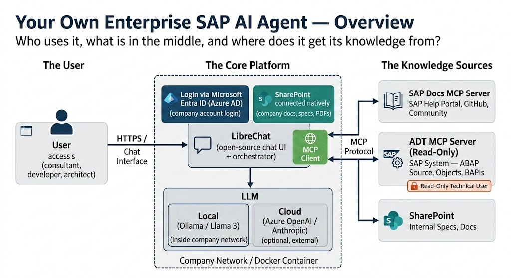
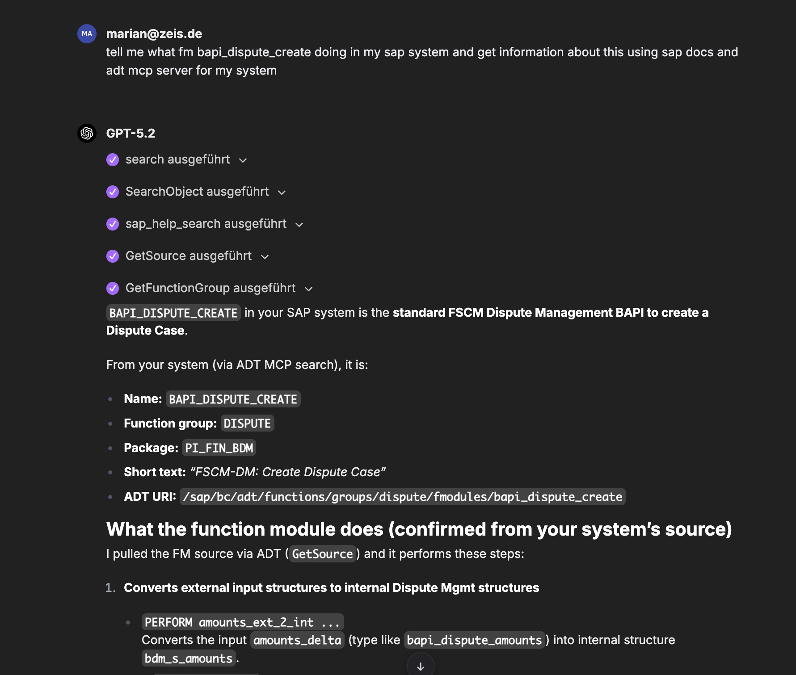
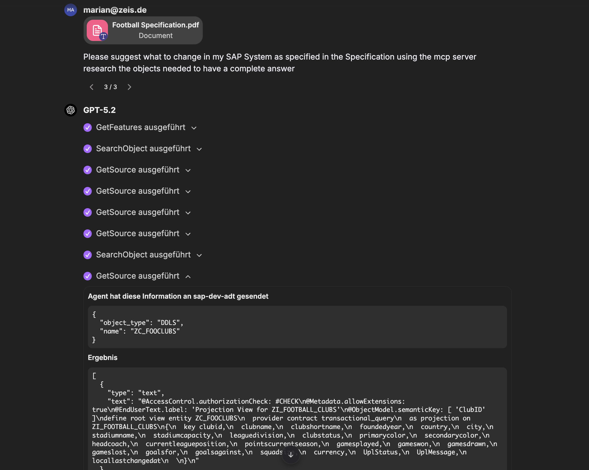
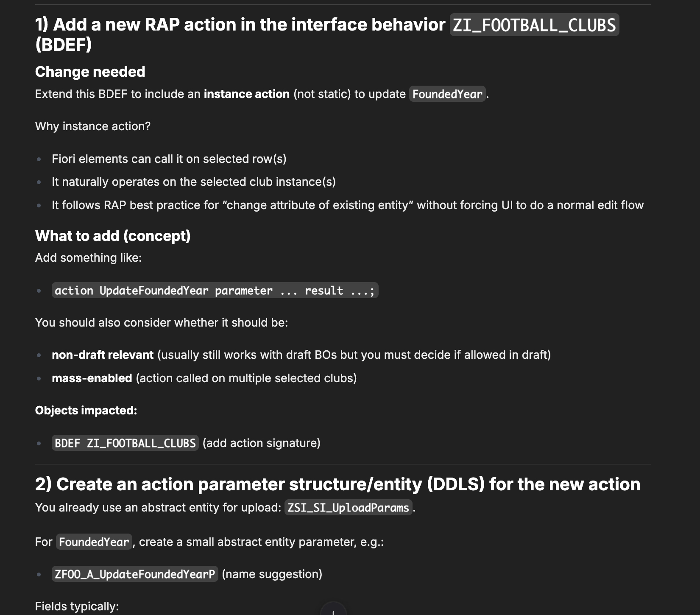
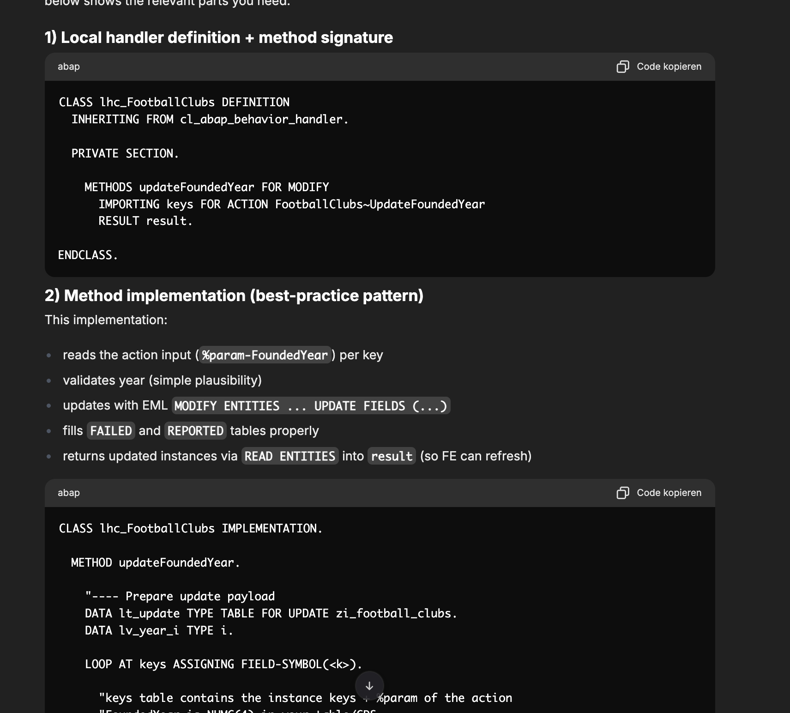

There is currently a huge hype around the new **MCP (Model Context Protocol)** servers. I've built one for [SAP Docs](https://github.com/marianfoo/mcp-sap-docs), and there are excellent community projects like the [ADT API MCP Server](https://github.com/oisee/vibing-steampunk).

These tools are fantastic for individual developers. You install them, connect them to your IDE or a local LLM, and suddenly your AI assistant knows about SAP.

### Architecture overview (in one picture)

Before diving into the details, here is the high-level architecture I’m aiming for:

The idea is simple: users talk to **LibreChat** (the UI + orchestrator). LibreChat calls an **LLM** (local inside the company network, or a trusted cloud model) and enriches answers via **MCP servers**. Those MCP servers connect to your knowledge sources (SAP docs, your SAP system via a read-only ADT connection, and internal SharePoint) without turning this into an “AI tool with write access to prod”.

**But here is the problem:** For a common SAP consultant, architect, or developer in a corporate environment, this setup is often a nightmare.

1.  **Complexity:** Setting up a local LLM, configuring MCP, and dealing maybe with Docker isn't everyone's cup of tea.
2.  **Security:** This is the big one. The default ADT MCP server, for example, is powerful, it allows reading and *writing* to the SAP system. No security department in their right mind would allow a "random" AI tool to have write access to the entire development system without strict governance.
3.  **Governance:** Companies need to know where the data is going. Is it staying in Europe? Is it training the model?

This is not mainly a "developer toy". The biggest value is for everyone who needs to understand what is going on in an SAP system: consultants, architects, project leads, support, and developers who are new to a system.

For ABAP developers specifically, the best enterprise-ready setup today is often **GitHub Copilot in ADT** because Agent Mode is available and you can add ABAP-specific knowledge through my [ABAP MCP Server](https://github.com/marianfoo/abap-mcp-server). But this IDE setup still has a gap: it does not give a complete overview of the system and it cannot reliably retrieve additional classes, programs, and related objects on demand to build the full context for an answer.
Neverthless, it is a great tool for many ABAP developers to query the system and get a complete context for an answer. As you can see in the sample workflow below, it is possible to use the MCP servers to build the full context for an answer and just copy-paste the code into Eclipse.

### The Enterprise Struggle

I recently saw a discussion that perfectly illustrates this struggle. Companies are desperately searching for "Enterprise Ready" AI usage, but they are hitting walls.

Some are trying manual workarounds, such as exporting their entire codebase to SharePoint for Microsoft Copilot to index. This often involves flattening package hierarchies to bypass navigation limits and manually creating `README.md` or cross-reference files to provide context, all while battling hallucinations where the AI fails to find existing transactions due to indexing errors.

Then there is **SAP Joule**. SAP's own AI assistant is available for consultants, but it is quite limited in 
what it can do. It doesn't connect to your custom codebase, can't search your internal SharePoint documentation, 
and has no way to follow references across ABAP objects the way an MCP-based agent can. It is a nice chatbot for 
general SAP questions, but it is far from a tool that understands *your* system.

This also matches the broader picture. In the [DSAG Investment Report 2026](https://dsag.de/presse/dsag-investment-report-2026-companies-are-investing-more-selectively-ai-is-becoming-established-cloud-computing-is-being-put-to-the-test/), most respondents who already run AI use cases do so with **non-SAP solutions**, not SAP's AI offerings.

On the other end of the spectrum, you have high-end commercial solutions like **Nova Intelligence**. They do exactly what you want: they read the SAP system directly, understand the context, and are enterprise-ready. But they are also **really expensive**.

### The "Middle Ground": A Secure, Open Source Alternative

So, is there nothing in between? Do you have to choose between a hacking-together-files-on-SharePoint workaround and a six-figure enterprise contract?

**No.** I want to show you that there is a "Middle Ground."

You can build a secure, enterprise-grade setup using Open Source tools. Think of it as **building your own internal "SAP Copilot"** that runs entirely under your control.

This setup allows you to:
*   **Search your SAP System** (Reports, Classes, Tables)
*   **Search SAP Documentation** (Help, GitHub, SAP Community)
*   **Use your internal SharePoint** (Specs, Docs)
*   **Keep it Secure** (Read-Only access, Authentication via Entra ID)

### The Stack

I used **LibreChat** as the UI and Orchestrator to showcase what is possible. It's an open-source web interface that looks and feels like ChatGPT but gives full control.

*   **Client:** [LibreChat](https://www.librechat.ai/) (supports Entra ID, SharePoint, and MCP out of the box).
*   **Knowledge Source 1:** [SAP Docs MCP Server](https://github.com/marianfoo/mcp-sap-docs) (for public documentation).
*   **Knowledge Source 2:** [ADT MCP Server](https://github.com/oisee/vibing-steampunk) (for your SAP System).
*   **LLM:** A local LLM via Ollama.

### Step 1: Security First (The ADT Connection)

The biggest concern is the SAP connection. I did **not** want the AI to write code or change things autonomously.

The [ADT MCP Server](https://github.com/oisee/vibing-steampunk) has a specific mode for this. I configured it to be **Read-Only**.

Furthermore, I connected it using a **Technical User** in SAP that has *only* display authorizations. This ensures that even if the AI wanted to (or was tricked to), it effectively cannot change anything in the system. It can only "look", just like a developer using SE80 in display mode.

### Step 2: The Setup

The entire setup can be containerized with Docker. This means you can run it on a secure server within your company network. No requests need to leave your intranet if you use a local model, or they only go to your trusted Azure OpenAI instance.

Here is the high-level concept:

1.  **Deploy LibreChat**: Configure it with your company's Entra ID (Azure AD). This means users log in with their standard company Microsoft accounts. No separate user management needed.
2.  **Connect SharePoint**: LibreChat has native SharePoint support. Connect it to your project's documentation libraries.
3.  **Connect MCP Servers**: Add the SAP Docs and ADT MCP servers to the configuration.

### Why this works better

1.  **Context is Key**: Unlike the SharePoint export method, the ADT MCP server understands the structure of ABAP. If you ask about a class, it knows to look for the definition and implementation. It doesn't rely on a flat list of text files.
2.  **Data Privacy**: If you use a local model (like Llama 3) or a private Azure instance, your code never trains a public model.
3.  **User Experience**: Developers get a chat interface they are used to (like ChatGPT), but it has "superpowers" to look up SAP notes and internal code.

### Sample Workflow: Understanding What Is Going On in Your System

This is the day-to-day use case for consultants, architects, support, and anyone onboarding onto an SAP landscape.

**The Request:**
Someone asks: "Tell me what `BAPI_DISPUTE_CREATE` is doing in my SAP system. Use SAP docs and my system source code."

**The Process:**
The agent uses SAP Docs MCP to understand the standard context (what the BAPI is meant to do), then uses the ADT MCP server to find the function module in the actual system, pull the source and function group, and summarize what happens step by step.

### Sample Workflow: Implementing a RAP Action

Instead of just answering simple questions, the agent can plan and implement features.

**The Request:**
A developer uploads a PDF specification and asks: *"Please suggest what to change in my SAP System as specified in the Specification..."*

**The Process:**

1.  **System Research (ADT MCP):** The Agent autonomously explores the system. It executes `SearchObject` and `GetSource` to find the relevant Business Object (`ZI_FOOTBALL_CLUBS`), the Behavior Definition, and the Projection view.
2.  **Impact Analysis:** It identifies that a new action `UpdateFoundedYear` is needed and lists the exact objects that need to be created or changed (BDEF, Class, Projection, Metadata).
3.  **Best Practice Lookup (SAP Docs MCP):** When asked for the implementation code, the agent searches SAP Help Portal for "Non-factory action" and "Action input parameter" to ensure the code follows best practices.
4.  **Code Generation:** It generates the complete ABAP implementation for the `ZCL_FOOTBALL_CLUBS` class, including error handling (`FAILED`/`REPORTED`) and EML statements.

This turns the agent into a true pair programmer that understands *your* specific system architecture.

### Not Just for LibreChat and Local Models

I used LibreChat and Ollama because they are free and open source, which makes them perfect for a showcase. But the beauty of this architecture is its flexibility.

**Want better models?**
You can swap Ollama for Azure OpenAI, Anthropic, or Mistral in seconds. LibreChat supports them out of the box. I even benchmarked different models for ABAP recently: [Benchmarking LLMs for ABAP](https://blog.zeis.de/posts/2026-02-09-abap-llm-benchmark/).

**Want to use Microsoft Copilot?**
Since MCP is an open standard, you aren't tied to LibreChat. You can host these MCP servers as simple HTTP services and connect them to other clients, including Microsoft Copilot or other agent platforms that support the protocol. The MCP servers are just "infrastructure", the client is interchangeable.

**Want more data sources?**
There are MCP servers for GitHub, Jira, Confluence, and many more. You can "dock" them onto your agent just like we did with the SAP Docs server.

**Want to extend it?**
You can add more MCP servers, create custom tools, or even build your own agents with specialized knowledge. The possibilities are endless.

### Conclusion

You don't need to wait for a perfect, expensive enterprise product to start using AI securely with SAP. With Open Source tools like LibreChat and the ecosystem of MCP servers, you can build a solution that is secure, compliant, and incredibly powerful.

It requires a bit of setup (Docker, Entra ID), but the payoff is a tool that actually understands your SAP system, without compromising on security.

If you are interested in the technical details, check out my **[Setup Guide](https://github.com/marianfoo/llm-client-sap-system-integration-sharepoint/blob/main/docs/GUIDE.md)** in the GitHub repository [marianfoo/llm-client-sap-system-integration-sharepoint](https://github.com/marianfoo/llm-client-sap-system-integration-sharepoint).

---

### References & Resources

*   **Setup Guide & Repository:** [marianfoo/llm-client-sap-system-integration-sharepoint](https://github.com/marianfoo/llm-client-sap-system-integration-sharepoint)
*   **SAP Docs MCP Server:** [marianfoo/mcp-sap-docs](https://github.com/marianfoo/mcp-sap-docs)
*   **ABAP MCP Server (for Copilot in ADT):** [marianfoo/abap-mcp-server](https://github.com/marianfoo/abap-mcp-server)
*   **ADT MCP Server (vibing-steampunk):** [oisee/vibing-steampunk](https://github.com/oisee/vibing-steampunk)
*   **LibreChat:** [librechat.ai](https://www.librechat.ai/)
*   **DSAG Investment Report 2026 (AI usage):** [Companies are investing more selectively, AI is becoming established](https://dsag.de/presse/dsag-investment-report-2026-companies-are-investing-more-selectively-ai-is-becoming-established-cloud-computing-is-being-put-to-the-test/)
*   **Benchmarking LLMs for ABAP:** [My Benchmark Post](https://blog.zeis.de/posts/2026-02-09-abap-llm-benchmark/)
*   **MCP Protocol:** [modelcontextprotocol.io](https://modelcontextprotocol.io/)
