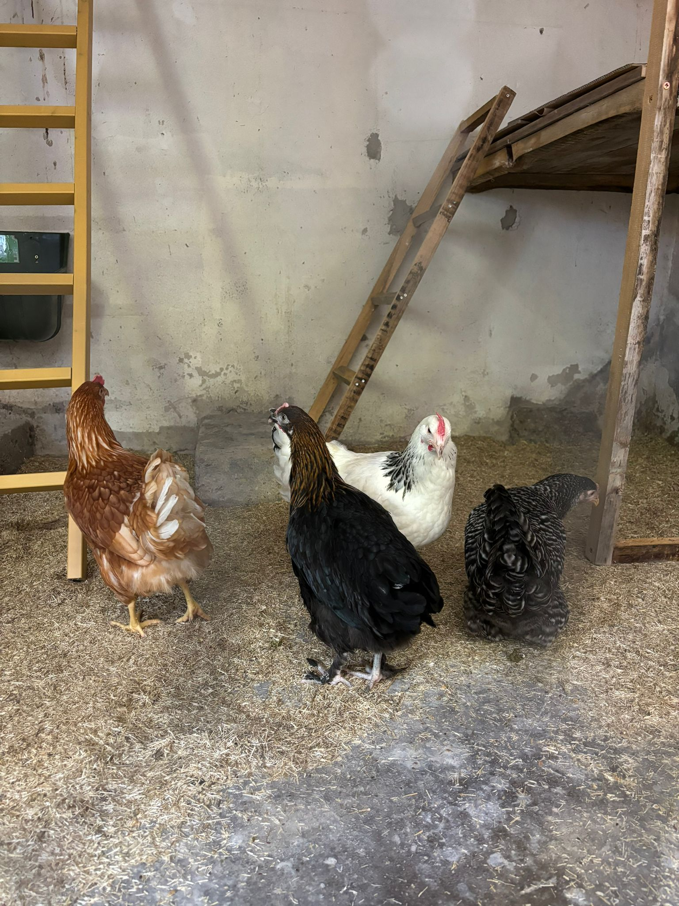

I posted a picture of our chickens on Bluesky once, and since then a few people have asked me about them. So I wanted to write down how we got the chickens and what we learned so far.

This should be a small series with three parts, not a huge guide and also not seven tiny posts:

1. How we got the chickens and how the first stall started.
2. What the everyday routine looks like and what we changed around the stall and the outside area.
3. What did not work so well, including red mite, losing one chicken, and adding new chickens to the group.

This first part is only about the beginning.

## Coming Back To The Village

I grew up in a small village, but during the last fifteen years I was a lot away from home. The plan was always to come back at some point. Ideally with a house, some land, and enough space around it.

In 2024 we found that house, bought it, and moved in.

The bigger plan was always "many animals". But of course that is not something you just do because it sounds nice. You need time, space, and you have to actually take care of them.

Chickens felt like a good first step.

They are quite easy compared with many other animals, and they fit well into a garden. Also, of course, having your own eggs is nice.

But for us they are still pets, not really farm animals. If you count everything we bought or built for them, the eggs are not cheap. That is also not really the point. It is just nice to have them around.

## The Old Parrot House

We also had a good starting point. There is a small side building on the property that the previous owners had used for parrots. So there was already an indoor area and outside there was a large aviary.

For chickens that was almost perfect. We still had to change a few things, but it was much easier than starting from nothing.

Inside, we built a small stall area with laying nests, roosting bars, water, and ladders so the chickens could get outside. The ladders were needed because parrots can fly and chickens are not really good at that. So the exit was quite high for them.

Outside, the aviary was already there. It was probably even a bit too large for the beginning, but that is a good problem to have.

Within two days, the first version of the chicken stall was ready.

_The first indoor setup. It worked for the beginning, but later we changed quite a lot._

## Four Hens, Four Names

We did not want four chickens that all looked the same. So we bought four different breeds.

So the first group became:

- **Hedwig**: white, Sussex
- **Bella**: black, Maran
- **Hermine**: brown, laying hybrid
- **Sperber**: white and grey barred, Amrock

Sperber is called Sperber because she is a Sperber. So the name was easy.

And then they were there. Before that it was mostly building, fixing, thinking about the exit, the ladders, the nests, and the water. Suddenly there were four chickens in the stall.

## From Project To Routine

At the beginning I mostly thought about the practical side. Where do they sleep? Where do they lay eggs? How do they get outside? How often do we need to refill water and food? How easy is it to clean everything?

Those questions matter, but then you also notice how quickly they become part of everyday life.

You go outside and check them. You collect eggs. You watch where they like to scratch. When we let them run freely in the garden, they usually go first to the grass pile or to the vegetable garden where the compost is.

_That is one of the nice everyday things: they just walk around the garden and search through everything._

## Protection Became A Bigger Topic

The first setup was enough to start, but it was not the final setup. Over time, we added more outside area and more protection.

The covered outdoor run became important later. They have more space there, but there is still a net above them. That became much more important after a hawk attacked one chicken in the garden. Luckily I heard it early enough and could get there in time, but after that it was clear that they should not be outside without protection when we are not there.

_This photo is already from a later stage, but it shows where the setup went: more space, but with a net above it._

## Not Just About Eggs

We have not bought eggs since we got the chickens. Even when we later had only three chickens for a while, we usually had enough eggs. Sometimes we also give some away.

That is nice, but it is not the main reason to have them.

The main reason is simply that they are nice to have around. They become more trusting over time, especially when they can run around outside while we are also in the garden.

_Eggs are useful, but this is more the reason why we like having chickens._

## What Comes Next

This first post is only the beginning. It explains why chickens made sense for us and how the first four moved in.

The plan for the other two parts is:

- **Part 2**: the everyday routine, larger food and water containers, automatic doors, automatic light in the stall, the covered outside area, and the hawk scare.
- **Part 3**: the things that were harder, especially red mite, rebuilding parts of the inside, losing one chicken, and later adding two new chickens to the group.

So yes, chickens are quite easy. But they are not "nothing". You still have to build things, clean things, watch them, and fix problems when they come up.

<!--
Image ideas for later drafts:
- Outside view of the old parrot house or aviary before the chicken conversion.
- Building process photos: nests, roosting bars, ladders, and the high former parrot exit.
- One close photo for each chicken, especially Hedwig, Bella, Hermine, and Sperber.
- The automatic coop door, the outside door, and the Shelly/light setup.
- Larger feed and water containers, to show the difference between automation and simple reserve capacity.
- The covered sand bath or small shelter inside the run.
- The first eggs or a basket of eggs.
- Photos from the compost area, vegetable garden, or grass pile where they like to scratch.
-->
