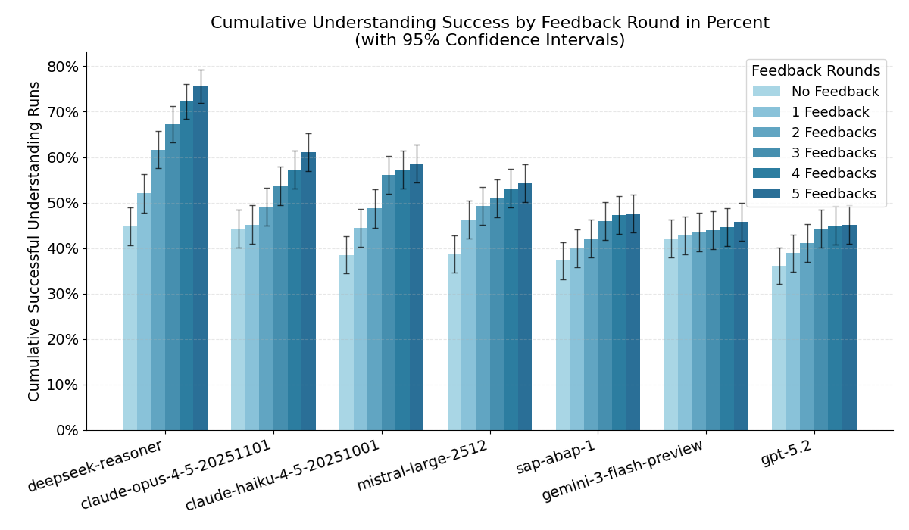
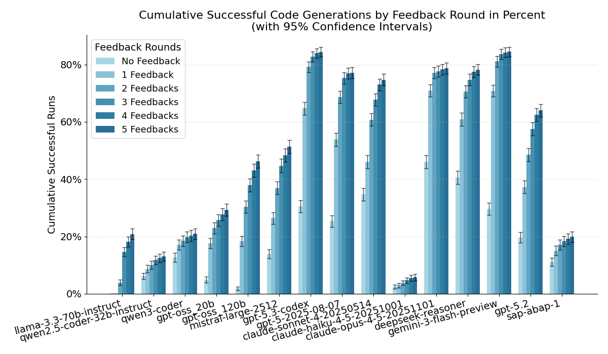

**Previous post (code generation benchmark):** [Benchmarking LLMs for ABAP](https://blog.zeis.de/posts/2026-02-09-abap-llm-benchmark/)
  
**Live benchmark results (old + new):** [abap-llm-benchmark.marianzeis.de](https://abap-llm-benchmark.marianzeis.de/)

In my first evaluation (based on the TH Köln benchmark paper), I extended the original setup with additional models and focused on a very concrete question: how well can LLMs generate ABAP code that actually compiles and passes ABAP Unit tests?

I also tested SAP’s model **ABAP-1**, and it performed very poorly for code generation. To be fair: SAP also states this in the documentation. ABAP-1 is primarily meant [for explaining ABAP code](https://www.sap.com/products/artificial-intelligence/sap-abap.html) not for reliably generating full working implementations.

So I built a second test that targets exactly that: understanding and explaining ABAP.

## The “Understanding” test

In the “Understanding” benchmark, the model gets existing ABAP code plus the corresponding ABAP Unit tests (so this is not a generation task). From that, it must extract concrete facts as structured JSON, for example:

- which classes and methods are relevant
- expected behavior and validations
- inputs and outputs

The JSON output is then scored automatically against a reference, so we can measure in a reproducible way how well a model understands ABAP code and describes it correctly. This works without running SAP or ADT.

Here is the key result as a chart (cumulative success across feedback rounds):

## What this says about ABAP-1

As expected, ABAP-1 is clearly better in this “Understanding” setup than in code generation. But it still does not keep up with current general-purpose models.

Even the current Anthropic Haiku model (optimized for speed and cost) beats ABAP-1 on this benchmark.

That makes the practical conclusion pretty simple: **for almost any ABAP use case, ABAP-1 is not a good default choice.** It is priced closer to premium models, but does not deliver premium results. So the “maybe it is cheaper” argument also does not hold.

## New models

After the first post, people asked for more models to be added. I’m tracking those requests as GitHub issues here: [LLM-Benchmark-ABAP-Code-Generation issues](https://github.com/marianfoo/LLM-Benchmark-ABAP-Code-Generation/issues?q=sort%3Aupdated-desc%20is%3Aissue)

I added the following models:

- DeepSeek Reasoner
- Mistral Large 2512
- GPT-5.3 Codex
- Claude Haiku 4.5
- Gemini 3.1 Flash Preview

To put the “new models” into context, here is the updated **code generation** overview (this is the original benchmark: generate ABAP, then iterate with compiler/test feedback up to 5 rounds). The plot already includes the new lineup:

GPT-5.3 Codex produced very strong results and even beat Opus 4.5 on some metrics. My guess is: if we compare against Opus 4.6, the gap will likely be small (or they might end up roughly equal).

Depending on the metric, Opus 4.5 is still excellent: it has the highest first-try success rate (Round 0) and the best AUC across all feedback rounds.

Unfortunately, Mistral’s current “best” model performed worse than I expected and does not look like a great choice for ABAP.

For price/performance, DeepSeek Reasoner is the clear winner in this lineup.

Using the public list prices (at the time of writing), Codex is at around **$1.75 per 1M input tokens**, while DeepSeek Reasoner is at **$0.28 per 1M input tokens** (more than 6x cheaper). The bigger difference is output: DeepSeek output is **$0.42 per 1M tokens**, while Codex output is around **$14.00 per 1M tokens** (about 33x).

### Gemini 3.1 Flash Preview

Gemini 3.1 Flash Preview also surprised me with strong results. It is cheap and in my runs it was even slightly ahead of GPT-5.3 Codex, while being significantly cheaper.

At the time of writing, Gemini Flash was roughly **$0.50 per 1M input tokens** and **$3.00 per 1M output tokens**, which is a big difference compared to Codex pricing.

Unfortunately, I could not test Gemini 3.1 Pro: the rate limit was effectively capped at ~25 requests per minute and I repeatedly hit 503 errors (“system overloaded”). With several thousand requests, that made a full benchmark run impractical. My guess is that Gemini 3.1 Pro would be similar to, or better than, GPT-5.3 Codex, but Flash already delivered very good results.

### Why Haiku 4.5 did so badly here

Haiku 4.5 failed systematically because it kept using CDS-style type notation like `abap.char(20)` in classic ABAP implementations (syntax errors). Worse, misleading parser error messages made it hard for the model to identify the real root cause, so it did not correct itself even across multiple feedback rounds.

## A practical takeaway 

For me, this is now a pretty solid baseline to decide which models are worth considering for ABAP, and which ones are not, depending on whether you care more about API calls (cost) or daily development (quality + speed).

One important reminder: these models acted only on what they already “know”. Results can be improved a lot with tooling and better context, for example:

- **ABAP MCP Server** for ABAP best practices and keyword documentation: [marianfoo/abap-mcp-server](https://github.com/marianfoo/abap-mcp-server)
- **abaplint** for static checks and fast feedback loops: [abaplint.org](https://abaplint.org/)

With that kind of tooling and feedback loop, you can generate very good ABAP code even if you “only” use a strong general model.

And yes, my conclusion from the first post still stands: I would not recommend ABAP-1. If SAP wants better outcomes, I think the bigger lever is not “yet another model”, but better tools and better integration so frontier models (OpenAI, Anthropic, Google) can reliably produce correct ABAP in real-world projects.  

You can still suggest models I have not tested yet, but benchmarks like this are not cheap. For now I will pause adding more models unless there is a very strong reason to do another run.

## References & links

- TH Köln paper: [Benchmarking Large Language Models for ABAP Code Generation](https://arxiv.org/html/2601.15188v1)
- Previous post (code generation benchmark): [Benchmarking LLMs for ABAP](https://blog.zeis.de/posts/2026-02-09-abap-llm-benchmark/)
- Live results website: [abap-llm-benchmark.marianzeis.de](https://abap-llm-benchmark.marianzeis.de/)
- Original benchmark repo (TH Köln): [timkoehne/LLM-Benchmark-ABAP-Code-Generation](https://github.com/timkoehne/LLM-Benchmark-ABAP-Code-Generation)
- Dataset (prompts + ABAP Unit tests): [dataset folder](https://github.com/timkoehne/LLM-Benchmark-ABAP-Code-Generation/tree/main/dataset)
- Benchmark repo (my fork with updates): [marianfoo/LLM-Benchmark-ABAP-Code-Generation](https://github.com/marianfoo/LLM-Benchmark-ABAP-Code-Generation)
- Model requests / discussion: [GitHub issues](https://github.com/marianfoo/LLM-Benchmark-ABAP-Code-Generation/issues?q=sort%3Aupdated-desc%20is%3Aissue)
- SAP ABAP-1 documentation: [SAP ABAP-1](https://help.sap.com/docs/sap-ai-core/generative-ai/sap-abap-1?locale=en-US)
- ABAP Cloud Developer Trial (Docker image used by the benchmark): [sapse/abap-cloud-developer-trial](https://hub.docker.com/r/sapse/abap-cloud-developer-trial)
- Batch APIs (used for running large benchmarks cheaper): [OpenAI Batch API](https://platform.openai.com/docs/guides/batch), [Anthropic batch processing](https://docs.anthropic.com/en/docs/build-with-claude/batch-processing)
- Pricing references:
  - OpenAI: [API pricing](https://openai.com/api/pricing)
  - DeepSeek: [Pricing (official docs)](https://api-docs.deepseek.com/quick_start/pricing/)
  - Google Gemini: [Gemini API pricing](https://ai.google.dev/gemini-api/docs/pricing)
  - Anthropic: [Claude API pricing](https://docs.anthropic.com/en/docs/about-claude/pricing)