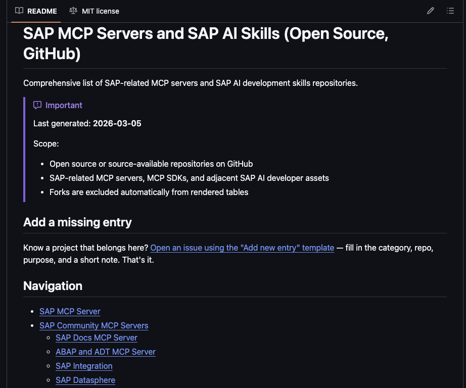

If you are building SAP developer assistants with MCP (Model Context Protocol), you quickly end up with the same question:

What MCP servers exist in the SAP area, which ones are official, and what else is useful around them?

That is why I like this new repo:

- **`marianfoo/sap-ai-mcp-servers`**: [SAP MCP Servers and SAP AI Skills](https://github.com/marianfoo/sap-ai-mcp-servers)

It is a curated list of **SAP-related MCP servers, SAP AI skills, and adjacent tooling**. The README is structured as a set of tables so you can scan by category, compare licenses, and spot what is actively maintained.

### What you will find inside

- **Official SAP MCP servers**: for example Fiori, CAP, UI5, and MDK servers.
- **Community MCP servers**: docs, ABAP and ADT, integration, Datasphere, OData, SAP GUI, HANA.
- **Skills and adjacent tools**: skills repos plus “helper” tooling (plugins, samples, IDE integrations) that often matters just as much as the server itself.

### How to contribute

If you know a project that belongs there, you can add it by opening an issue using the [“Add new entry”](https://github.com/marianfoo/sap-ai-mcp-servers/issues/new?template=add-entry.yml) template in the repo.

If you build anything SAP plus MCP related, this is the list I would want to keep open in a browser tab.
