Series note: This post is part of my [AI ABAP development series](/tags/ai-abap-development-series/), where I go from AI development in general, to ABAP-specific problems, and then to ARC-1.

In the [previous post](https://blog.zeis.de/posts/2026-04-29-arc-1-btp/), I wrote about running [ARC-1](https://github.com/marianfoo/arc-1) on SAP BTP. That was the architecture part: central deployment, XSUAA, destinations, Cloud Connector, Principal Propagation, roles, and auditability.

This post is the next step. If ARC-1 is already deployed centrally on BTP, then it does not have to be used only from developer tools like VS Code, Claude, Cursor, or Eclipse. It can also be used from [Microsoft Copilot Studio](https://learn.microsoft.com/en-us/microsoft-copilot-studio/) and then published into [Teams or Microsoft 365 Copilot](https://learn.microsoft.com/en-us/microsoft-copilot-studio/publication-add-bot-to-microsoft-teams). That changes the audience quite a bit.

For developers, ARC-1 is mainly an ADT MCP gateway for code, packages, activation, transports, diagnostics, and system context. MCP is the protocol that lets an AI client call external tools, and ADT is the API layer behind [ABAP Development Tools](https://help.sap.com/docs/btp/sap-business-technology-platform/abap-development-user-guides). But this SAP system access is not only useful for developers. [ARC-1 tools](https://marianfoo.github.io/arc-1/tools/) can also expose table structures, selected data, messages, transaction metadata, API release state, feature toggles, FLP content, dumps, transport information, and more. Depending on the enabled ARC-1 tools and SAP authorizations, that can become useful for functional consultants, solution architects, testers, security people, and support teams.

The question for this post is: what happens if the SAP system context is not only available inside an IDE?

## Why Copilot Studio fits here

Functional consultants usually do not live in a local IDE. They work in Teams, Excel, Word, SharePoint, Jira, SAP GUI, Fiori, and many other tools around the actual system. So if the only AI access pattern is "install an MCP server locally and configure your IDE", then we miss a large part of the SAP project team.

Copilot Studio fits here because it is already close to where many business users work. An agent can be [published into Teams and Microsoft 365 Copilot](https://learn.microsoft.com/en-us/microsoft-copilot-studio/publication-add-bot-to-microsoft-teams). It can use [SharePoint as a knowledge source](https://learn.microsoft.com/en-us/microsoft-copilot-studio/knowledge-add-sharepoint). It can use connectors for systems like [Jira Cloud](https://learn.microsoft.com/en-us/microsoft-365/copilot/connectors/jira-cloud-deployment), and the same idea also applies to other enterprise sources like Confluence if there is a connector or MCP server for it. I did not use Confluence in this test, but the architecture would be the same. And since Copilot Studio can [connect to existing MCP servers](https://learn.microsoft.com/en-us/microsoft-copilot-studio/mcp-add-existing-server-to-agent), it can also call ARC-1 when the server is deployed to BTP.

That does not mean everyone should get write access to SAP from Teams. Quite the opposite. For this kind of usage I would start read-only and very controlled. But even read-only is already powerful if the agent can combine:

1. A business specification from SharePoint.
2. SAP documentation from the separately deployed [mcp-sap-docs](https://mcp-sap-docs.marianzeis.de/) MCP server.
3. Real system context from ARC-1.
4. Tickets or tasks from Jira.
5. The conversation interface in Teams.

## The Architecture Stays The Same

Copilot Studio should not create a second SAP access architecture. It should use the same [BTP-deployed ARC-1 endpoint](https://marianfoo.github.io/arc-1/phase4-btp-deployment/) from the previous post.

```text
Copilot Studio / Teams
  -> ARC-1 MCP endpoint on SAP BTP
  -> XSUAA / OAuth
  -> Destination Service
  -> Cloud Connector
  -> SAP ABAP system
```

This means the security story does not change only because the client changes. ARC-1 still has the [server ceiling](https://marianfoo.github.io/arc-1/authorization/#the-model-in-one-picture). [XSUAA roles](https://marianfoo.github.io/arc-1/xsuaa-setup/) still control what the user can do. SAP still decides the backend authorization. If [Principal Propagation](https://marianfoo.github.io/arc-1/principal-propagation-setup/) is active, the SAP system can still see the real user.

In simpler words: Copilot calls ARC-1 over HTTPS, BTP authenticates the user and resolves the SAP destination, and the Cloud Connector forwards the request to the ABAP system. The server ceiling is the maximum ARC-1 capability the admin enabled for this instance, so a user role can never enable more than the server allows.

For Copilot Studio I would be extra conservative with the first setup:

```text
read/search/diagnose only
data preview only for selected users
free SQL only for selected users
writes disabled by default
transport writes disabled
```

A Copilot Studio agent can be much more accessible to non-developers than an IDE tool, so the safety model matters even more.

## Setup

I would keep the setup simple and reuse the BTP deployment from the previous post:

1. Deploy ARC-1 on BTP with [XSUAA](https://marianfoo.github.io/arc-1/xsuaa-setup/), [BTP destinations](https://marianfoo.github.io/arc-1/btp-destination-setup/), and ideally [Principal Propagation](https://marianfoo.github.io/arc-1/principal-propagation-setup/). The detailed steps are in the [BTP deployment guide](https://marianfoo.github.io/arc-1/phase4-btp-deployment/).
2. Keep ARC-1 read-only first, or at least very restricted with [ARC-1 authorization and roles](https://marianfoo.github.io/arc-1/authorization/).
3. In Copilot Studio, add ARC-1 as an [existing MCP server](https://learn.microsoft.com/en-us/microsoft-copilot-studio/mcp-add-existing-server-to-agent) with the public HTTPS endpoint from BTP, for example `https://arc1-ecc-dev.cfapps.eu10.hana.ondemand.com/mcp`.
4. Use OAuth 2.0 for the MCP server authentication. Copilot Studio supports manual OAuth configuration for MCP servers, and ARC-1 on BTP can use XSUAA for that.
5. Add [SharePoint as a knowledge source](https://learn.microsoft.com/en-us/microsoft-copilot-studio/knowledge-add-sharepoint), add the [SAP documentation MCP server](https://mcp-sap-docs.marianzeis.de/) with its public MCP endpoint `https://mcp-sap-docs.marianzeis.de/mcp`, and then add other enterprise sources only where they make sense.
6. [Publish the agent to Teams or Microsoft 365 Copilot](https://learn.microsoft.com/en-us/microsoft-copilot-studio/publication-add-bot-to-microsoft-teams) after testing.

The [existing MCP server page](https://learn.microsoft.com/en-us/microsoft-copilot-studio/mcp-add-existing-server-to-agent) also documents Streamable transport and the API key or OAuth 2.0 authentication options. For SAP system access I would not start with API keys unless it is a very controlled automation scenario, because OAuth gives a better identity story.

In my test agent I used ARC-1 on BTP, a Jira MCP server, and SAP Docs as tools. For knowledge, I added SharePoint locations for specifications and IT documents, plus a Jira connector. For this showcase I enabled the available read and write tools.

Microsoft's own [MCP Server for Enterprise](https://learn.microsoft.com/en-us/graph/mcp-server/use-enterprise-mcp-server-copilot-studio) points in a similar direction for Microsoft Graph: enterprise context should come through governed endpoints, not random local scripts.

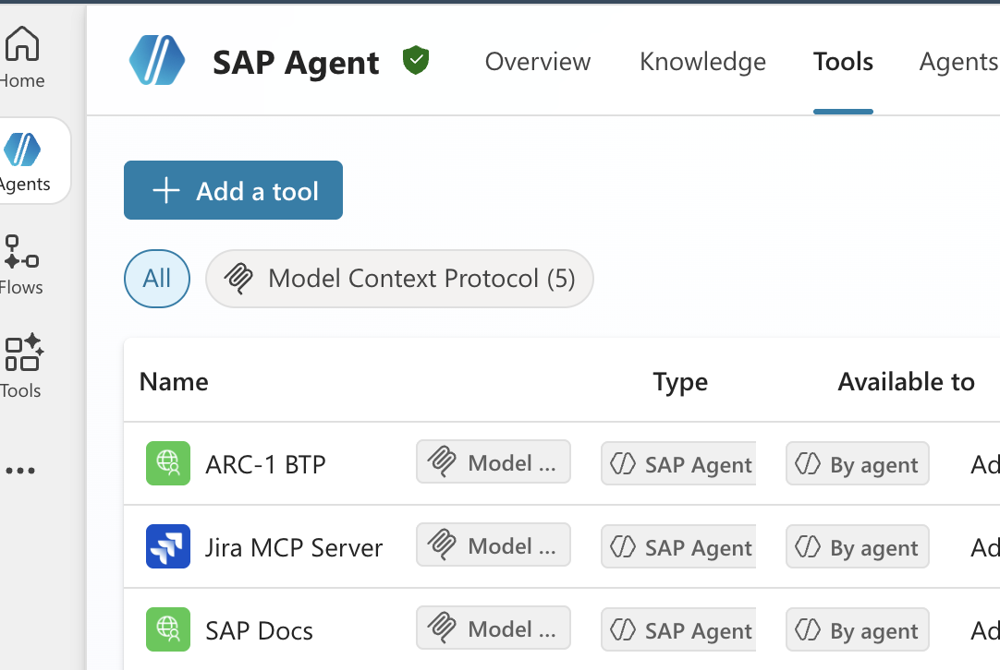

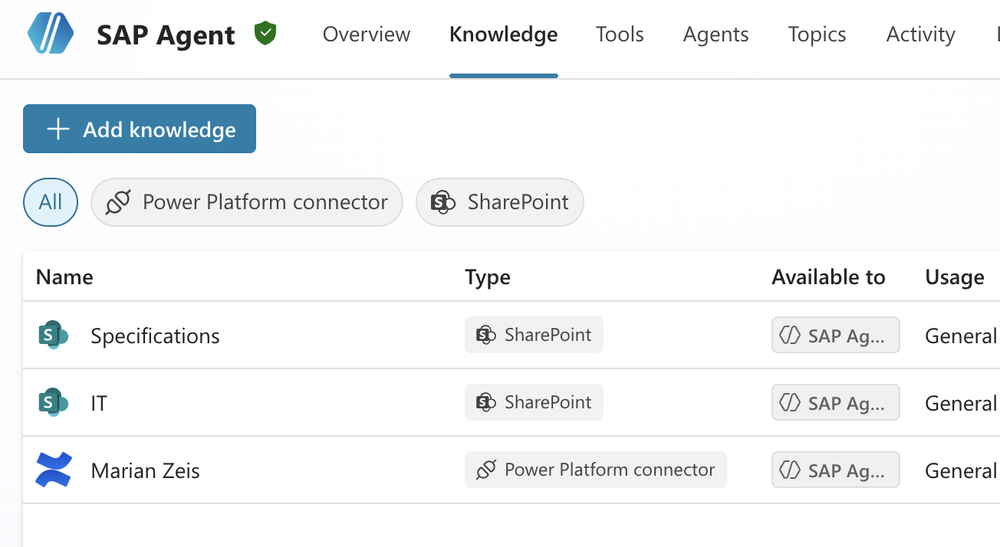

## SharePoint And SAP Documentation

The most natural non-developer setup is probably SharePoint plus SAP docs plus SAP system context. SharePoint is where many specifications and project documents already live, and Copilot Studio can use [SharePoint as a knowledge source](https://learn.microsoft.com/en-us/microsoft-copilot-studio/knowledge-add-sharepoint) while Microsoft authentication keeps the normal document permissions in place.

But SharePoint alone is not enough. A specification can say what should happen, but it often does not know how the SAP system actually works today. This is where ARC-1 comes in. The agent can ask ARC-1 for current ABAP objects, CDS views, table structures, message texts, service bindings, transaction metadata, or selected table data, depending on what is enabled and authorized in the [ARC-1 tool and role model](https://marianfoo.github.io/arc-1/authorization/).

Then I would add the separately deployed [mcp-sap-docs](https://mcp-sap-docs.marianzeis.de/) server as the documentation layer, using the public MCP endpoint `https://mcp-sap-docs.marianzeis.de/mcp`. It can search SAP documentation, ABAP keyword docs, RAP samples, style guides, DSAG guidelines, SAP Community, and also released object information. That gives the agent a much better chance to not only say "this is possible", but also explain what SAP recommends and where the current system differs.

This combination is more useful than any single source alone:

```text
SharePoint = what the project wants
Jira = what needs to be solved
mcp-sap-docs = what SAP recommends
ARC-1 = what the SAP system actually does
```

Of these four, ARC-1 is the only one that can read or write actual ABAP in actual SAP. Everything else is orchestration around it.

## The Real Use Cases I Tested

I created a few small demo scenarios and tested them in Copilot Studio with ARC-1. The screenshots below are from those conversations.

## Use Case 1: Bug Fix From A Jira Ticket

The first scenario is still a developer scenario, but it shows the complete loop very well. The Jira ticket `KAN-2` only says that a customer with exactly EUR 1,000,000.00 revenue gets the wrong discount tier. Copilot reads the ticket, searches the SAP system, reads `ZARC1_DEMO_DISCOUNT`, compares the implementation with the header comment specification, and proposes the one character patch.

```text
Look at KAN-2, propose a patch, but don't apply it yet.
```

The important part for me is the confirmation step. The agent does not immediately write to SAP. It first shows the root cause and the diff. Only after the follow-up prompt it updates and activates the report.

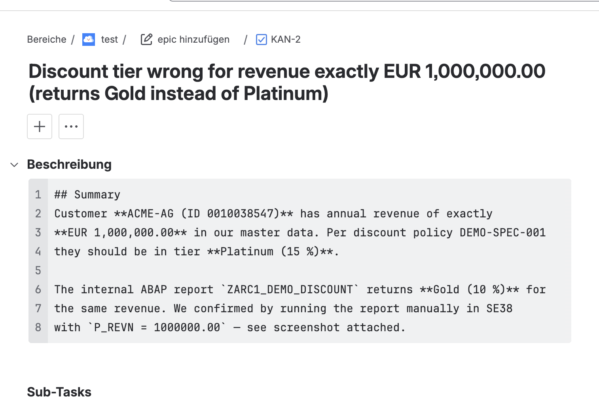

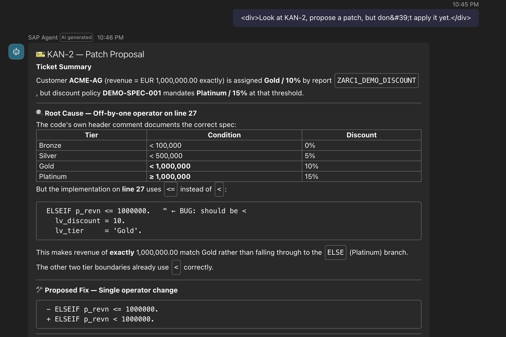

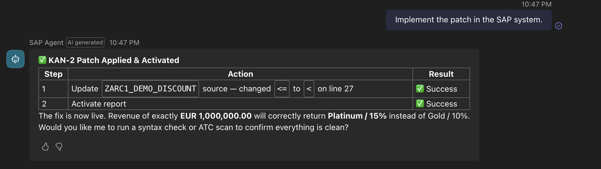

[Open the formatted full answer](full-answer-viewer.html?case=Use%20Case%201&title=Bug%20fix%20from%20a%20Jira%20ticket&answer=conversations/01/full-answer.txt)

This captured run shows both steps: first the patch proposal, then the explicit follow-up to apply and activate it. In a safer setup, the first step alone can already be enough. The developer can copy the suggested diff, review it, test it manually, and keep ARC-1 read-only for that scenario.

## Use Case 2: SharePoint Change Request To Impact Analysis

The second use case is more interesting for architects. A short SharePoint memo asks to widen `ZARC1_DEMO_AMOUNT_DOM` from `CURR 13,2` to `CURR 23,2`. Copilot reads the memo and then uses ARC-1 to walk the dependency chain in SAP.

```text
Read the change request in IT/Clean Core/ and tell me what would break.
```

The answer is not just "yes, change the domain". It lists the dependency chain from domain to data element to table to report, then explains the risks: activation order, possible table lock, output length, and the hardcoded report layout.

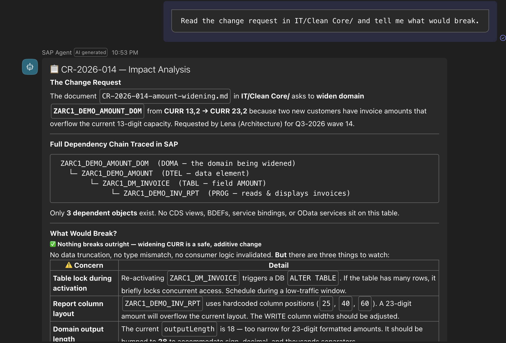

[Open the formatted full answer](full-answer-viewer.html?case=Use%20Case%202&title=SharePoint%20change%20request%20impact%20analysis&answer=conversations/02/full-answer.txt)

This is where a solution architect or functional consultant benefits from SAP system context without needing an IDE. It turns a business change request into a better technical discussion.

## Use Case 3: Build A CDS View From A SharePoint Specification

The third use case combines SharePoint, SAP documentation, and ARC-1. The input is a small SharePoint specification for a sales order KPI CDS view. Copilot reads the spec, uses [mcp-sap-docs](https://mcp-sap-docs.marianzeis.de/) for SAP documentation and CDS conventions, reads the source table from SAP, and then creates and activates the views.

```text
Build the CDS view from IT/Specifications/spec-orders-kpi.md.
```

What I liked in this example is that the agent had to adapt to the system. The first simple idea did not work because the system did not allow arithmetic expressions directly inside aggregate functions. The final result was a two-layer CDS design: a base view for line revenue and a KPI view for aggregation.

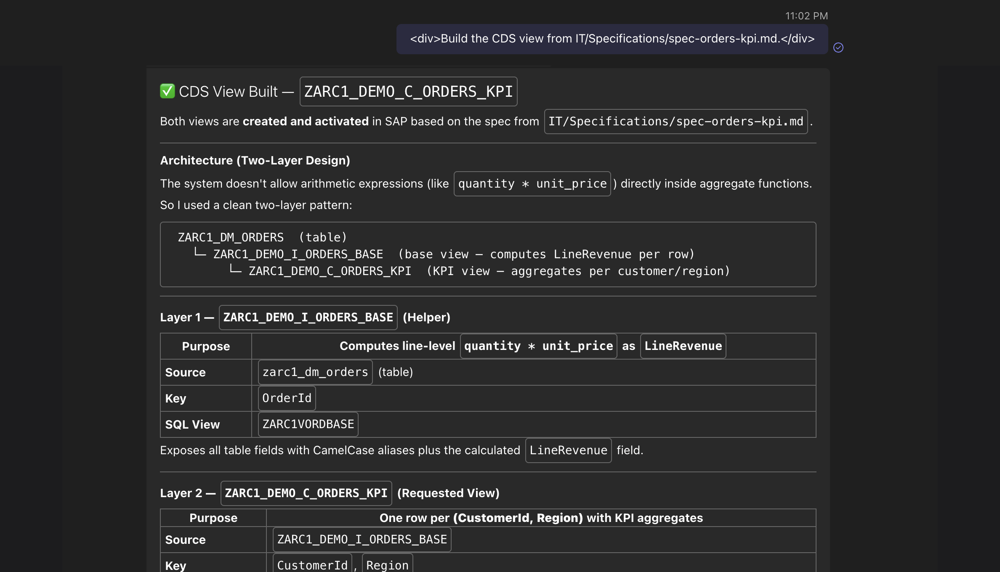

[Open the formatted full answer](full-answer-viewer.html?case=Use%20Case%203&title=CDS%20view%20from%20a%20SharePoint%20specification&answer=conversations/03/full-answer.txt)

This is where Copilot Studio becomes more than a chatbot over documents: SharePoint for the requirement, mcp-sap-docs for the SAP pattern, and ARC-1 for the real table and activation.

## Use Case 4: Code Quality Report

The fourth scenario is reporting only. The prompt asks Copilot to audit the `$TMP` `ZARC1_DEMO_*` ABAP programs and post a quality report. The captured answer shows the generated Markdown report, not the SharePoint write-back step.

```text
Audit our $TMP ZARC1_DEMO_* ABAP programs and post a quality report.
```

Copilot searches the SAP system, reads the programs, runs both SAP ATC checks and abaplint, and produces a per-program report with the two findings axes scored against an overall Risk column. It also catches things pure linting would not flag on its own: SQL injection in the dump-trigger report, full-table scans in the invoice list, and table-buffer bypass on `USR02`. The same output could then be written to SharePoint, Word, or another document store depending on the connectors and permissions.

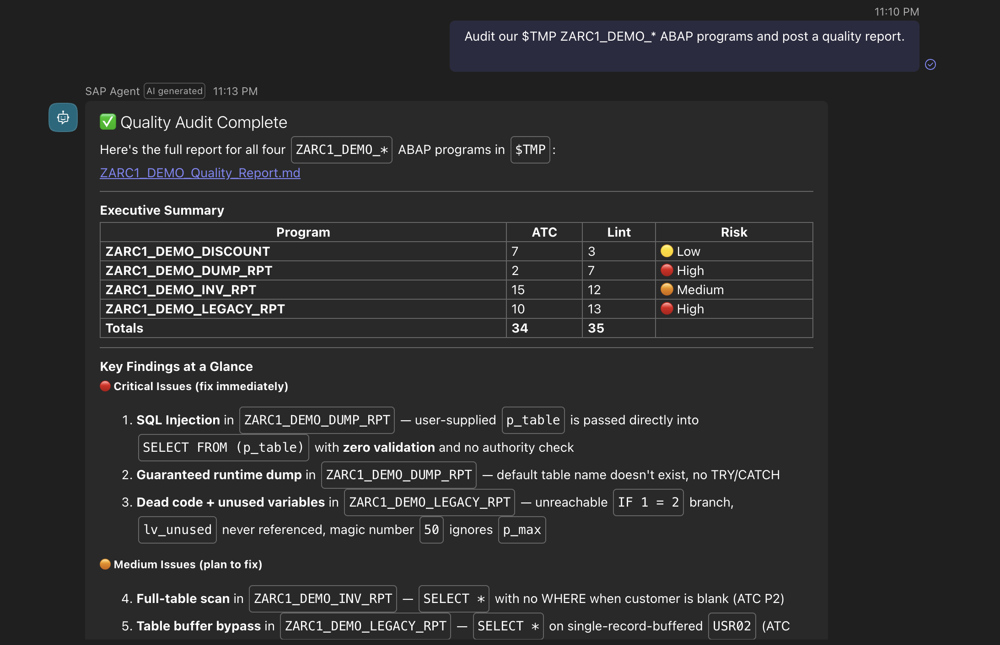

[Open the formatted full answer](full-answer-viewer.html?case=Use%20Case%204&title=ABAP%20code%20quality%20report&answer=conversations/04/full-answer.txt)

This is not mainly a coding example. It gives an architect, technical lead, or quality manager a faster first view: which programs are risky, which findings are only style, and which ones would block a promotion.

## Use Case 5: Short Dump Diagnosis From A Jira Ticket

The fifth example starts from an intentionally weak Jira ticket. It only says that `ZARC1_DEMO_DUMP_RPT` short dumped overnight and that ST22 has the dump. This is close to how many real support tickets start.

```text
Investigate KAN-3 and apply a defensive fix.
```

Copilot reads the Jira ticket, uses ARC-1 to read short dumps, identifies `DBSQL_SQL_ERROR`, reads the report, explains the root cause, and applies a defensive fix. In this demo it adds validation before a dynamic `SELECT FROM (p_table)`.

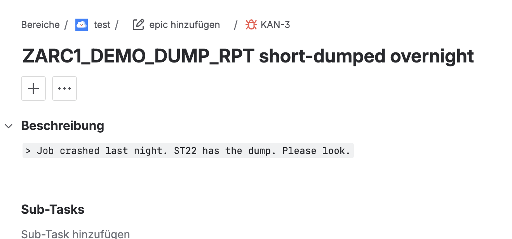

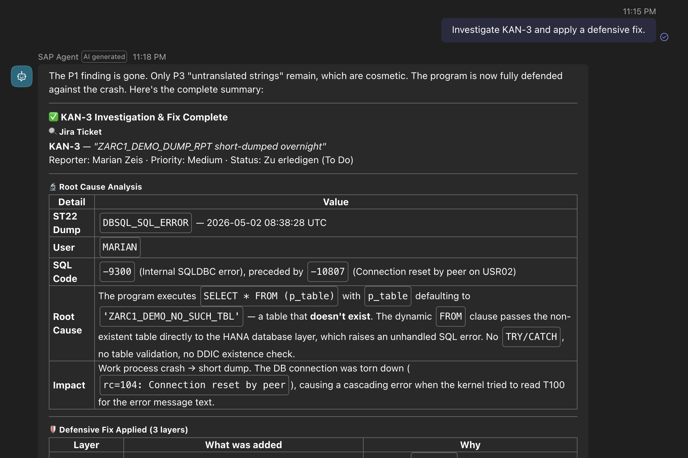

[Open the formatted full answer](full-answer-viewer.html?case=Use%20Case%205&title=Short%20dump%20diagnosis%20from%20Jira&answer=conversations/05/full-answer.txt)

In bug fixing, the analysis is often the biggest part. If the agent can collect the ticket, dump, source code, and related objects, then the developer starts much further ahead.

## Use Case 6: Clean Core Readiness Check

The last scenario is about clean core readiness. The prompt is simple:

```text
Is ZCL_ARC1_DEMO_CCORE clean-core ready?
```

Copilot reads the class through ARC-1 and finds direct selects on `USR02` and `BUT000`. Then it uses two different context sources for the assessment. ARC-1's `API_STATE` read capability asks the SAP system for release state and successor information. The SAP documentation source adds the official guidance around clean core, released APIs, ABAP Cloud readiness, and why direct table access to internal SAP tables is problematic. When SAP documentation returned no entry at all for `USR02`, the agent treated that as "strictly internal, find a released alternative" rather than "unknown, assume fine", and inferred the right successor anyway. Based on that combined context, Copilot proposes released successor APIs like `I_BUSINESSUSERBASIC` and `I_BUSINESSPARTNER`.

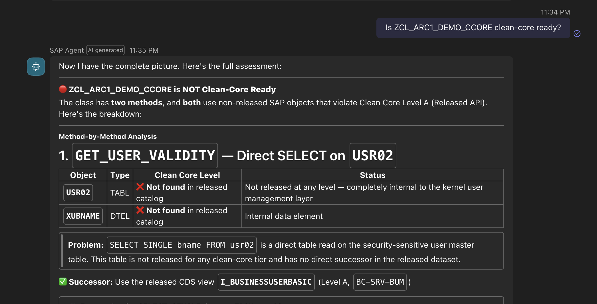

[Open the formatted full answer](full-answer-viewer.html?case=Use%20Case%206&title=Clean%20core%20readiness%20check&answer=conversations/06/full-answer.txt)

ARC-1 provides the real custom code and the system-specific release state, while SAP documentation provides the official target direction. That makes the result useful for architecture and modernization planning, not only for a developer sitting in an IDE.

## Why This Matters

The important change is not that Copilot Studio can call one more tool. The important change is that a centrally deployed ARC-1 endpoint can make SAP system context available in places where more project roles can use it.

Developers still need IDEs, and Copilot Studio does not replace ABAP development tools. But it can become a useful layer for analysis, specification, support, documentation, and architecture work, especially when it combines SAP system context, SAP documentation, SharePoint, Jira, and Microsoft 365 through governed tools and connectors. Without that central architecture, this would again become a local tool story. With BTP, it becomes an enterprise agent story.

## References & links

- [ARC-1 on GitHub](https://github.com/marianfoo/arc-1)
- [ARC-1 Documentation](https://marianfoo.github.io/arc-1/)
- [ARC-1 Tools](https://marianfoo.github.io/arc-1/tools/)
- [ARC-1 Authentication Overview](https://marianfoo.github.io/arc-1/enterprise-auth/)
- [ARC-1 BTP Cloud Foundry Deployment](https://marianfoo.github.io/arc-1/phase4-btp-deployment/)
- [ARC-1 XSUAA Setup](https://marianfoo.github.io/arc-1/xsuaa-setup/)
- [ARC-1 BTP Destination Setup](https://marianfoo.github.io/arc-1/btp-destination-setup/)
- [ARC-1 Principal Propagation Setup](https://marianfoo.github.io/arc-1/principal-propagation-setup/)
- [ARC-1 Authorization and Roles](https://marianfoo.github.io/arc-1/authorization/)
- [mcp-sap-docs](https://github.com/marianfoo/mcp-sap-docs)
- [SAP Help: ABAP Development Tools for Eclipse: User Guides](https://help.sap.com/docs/btp/sap-business-technology-platform/abap-development-user-guides)
- [Microsoft Learn: Copilot Studio documentation](https://learn.microsoft.com/en-us/microsoft-copilot-studio/)
- [Microsoft Learn: Connect your agent to an existing MCP server](https://learn.microsoft.com/en-us/microsoft-copilot-studio/mcp-add-existing-server-to-agent)
- [Microsoft Learn: Create a new MCP server](https://learn.microsoft.com/en-us/microsoft-copilot-studio/mcp-create-new-server)
- [Microsoft Learn: Add SharePoint as a knowledge source](https://learn.microsoft.com/en-us/microsoft-copilot-studio/knowledge-add-sharepoint)
- [Microsoft Learn: Connect and configure an agent for Teams and Microsoft 365 Copilot](https://learn.microsoft.com/en-us/microsoft-copilot-studio/publication-add-bot-to-microsoft-teams)
- [Microsoft Learn: Jira Cloud connector for Microsoft 365 Copilot](https://learn.microsoft.com/en-us/microsoft-365/copilot/connectors/jira-cloud-deployment)
- [Microsoft Learn: Use Microsoft MCP Server for Enterprise from Copilot Studio](https://learn.microsoft.com/en-us/graph/mcp-server/use-enterprise-mcp-server-copilot-studio)
