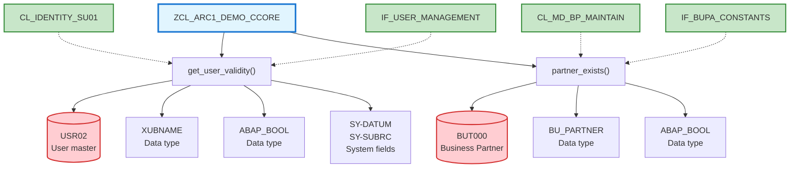

This is the translated and rendered full reply from the Joule Studio test. The original answer was in German. I translated it into English for the blog post, but kept the structure and content of the answer.

# Dependency Diagram for ZCL_ARC1_DEMO_CCORE

## Mermaid Flowchart

**Legend:**
- Blue box: main class ZCL_ARC1_DEMO_CCORE
- Red boxes: critical direct SAP table access
- Green boxes: recommended released successor APIs
- Dotted lines: recommended migration paths

## Evidence Table: Verified Technical Dependencies

| Category | Object | Usage | Clean Core Status | Risk Rating |
|----------|--------|-------|-------------------|-------------|
| **Direct SAP tables** | | | | |
| USR02 | User master | SELECT SINGLE on BNAME, GLTGV, GLTGB in get_user_validity() | Not compliant | High |
| BUT000 | Business Partner | SELECT SINGLE on PARTNER in partner_exists() | Not compliant | High |
| **Data types** | | | | |
| XUBNAME | User name | Parameter for get_user_validity() | Standard | Low |
| BU_PARTNER | Partner ID | Parameter for partner_exists() | Standard | Low |
| ABAP_BOOL | Boolean | Return value of both methods | Compliant | Low |
| **System fields** | | | | |
| SY-DATUM | System date | Date comparison in get_user_validity() | Standard | Low |
| SY-SUBRC | Return code | Existence check in both methods | Standard | Low |
| **Recommended APIs** | | | | |
| CL_IDENTITY_SU01 | User details | Replacement for USR02 access | Released | n/a |
| IF_USER_MANAGEMENT | User management | Alternative for user validation | Released | n/a |
| CL_MD_BP_MAINTAIN | BP management | Replacement for BUT000 access | Released | n/a |
| IF_BUPA_CONSTANTS | BP constants | Alternative for partner existence check | Released | n/a |

## Transport and Package Context

**Note**: Due to system access issues, transport and package information could not be retrieved directly. Based on the naming convention (ZCL_ARC1_*), the class is probably:

- **Package**: likely Z namespace (customer-specific)
- **Transport status**: development object
- **Dependencies**: no direct custom callers identified

## Clean Core Compliance Summary

| Assessment Criterion | Status | Recommendation |
|----------------------|--------|----------------|
| Direct DB access | 2 critical violations | Immediate migration to released APIs |
| API usage | No released APIs | Implement the recommended alternatives |
| Future readiness | At risk | High priority for modernization |
| Migration complexity | Medium | Clear functional boundaries make refactoring easier |

## Recommendations

1. **Immediate actions**:
   - Identify all callers of ZCL_ARC1_DEMO_CCORE
   - Assess the business criticality

2. **Migration to Clean Core**:
   - Replace USR02 access with CL_IDENTITY_SU01 or IF_USER_MANAGEMENT
   - Replace BUT000 access with CL_MD_BP_MAINTAIN or IF_BUPA_CONSTANTS
   - Implement unit tests to preserve behavior

3. **Risk reduction**:
   - Use wrapper classes for a smoother migration
   - Document the migration paths
   - Integrate the object into the Clean Core roadmap
