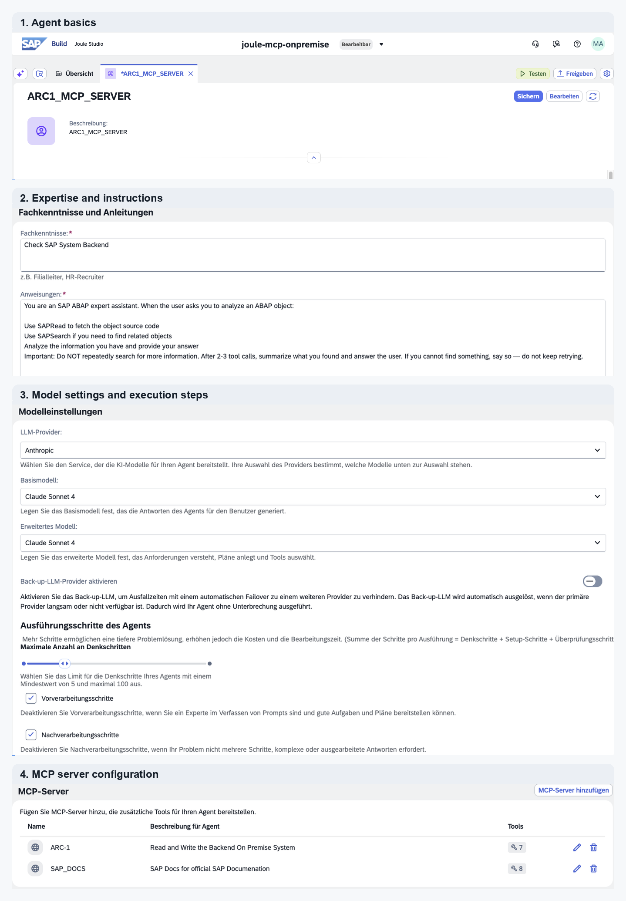
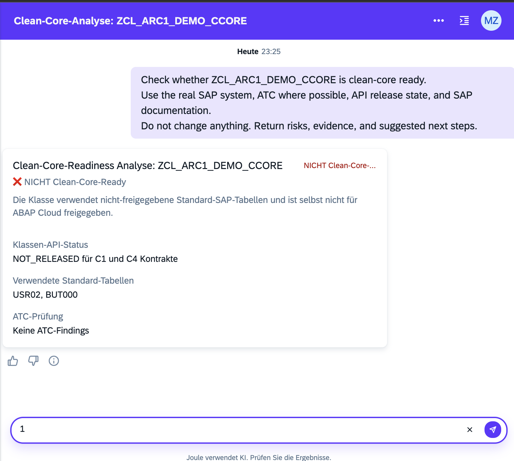
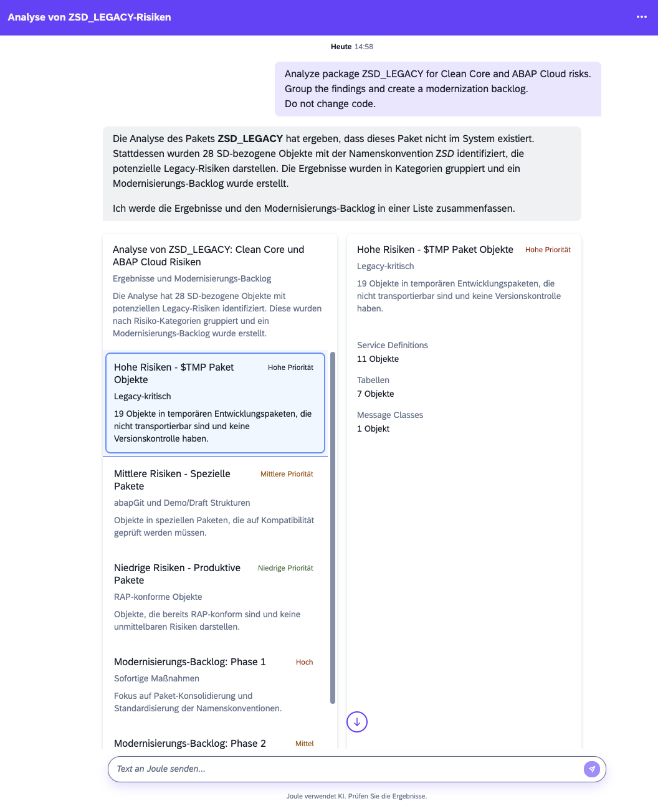

Series note: This post is part of my [AI ABAP development series](/tags/ai-abap-development-series/), where I go from AI development in general, to ABAP-specific problems, and then to ARC-1.

In the [previous post](https://blog.zeis.de/posts/2026-05-05-arc-1-copilot-studio/), I showed [ARC-1](https://github.com/marianfoo/arc-1) with Microsoft Copilot Studio. The idea was that SAP system context should not be locked inside a local IDE. If ARC-1 runs centrally on SAP BTP, it can also be used from Teams, Microsoft 365 Copilot, SharePoint, Jira, and other places where functional consultants, architects, support teams, and project leads already work.

This post is the SAP-native version of that idea. If Microsoft Copilot Studio is close to the Microsoft workday, then [Joule](https://help.sap.com/docs/JOULE/3fdd7b321eb24d1b9d40605dce822e84) is close to the SAP workday. SAP describes Joule as the unified assistant experience across SAP's solution portfolio, and [Joule Studio](https://www.sap.com/products/artificial-intelligence/joule-studio.html) as the place to build custom Joule agents with SAP and non-SAP integrations.

So the question is not only: can Joule call another MCP server? The better question is: can the ARC-1 capabilities be brought to the place where SAP users already ask questions?

## What Carries Over From Earlier Posts

ARC-1 is a secure ADT MCP server for ABAP systems. It connects AI clients to SAP systems through [ABAP Development Tools](https://help.sap.com/docs/btp/sap-business-technology-platform/abap-development-user-guides) APIs and exposes this through tools like [SAPRead, SAPSearch, SAPWrite, SAPActivate, SAPContext, SAPDiagnose, SAPTransport, and SAPManage](https://marianfoo.github.io/arc-1/tools/).

For this post, the important part is not the full tool list. It is the operating model from the earlier BTP post:

```text
central server instead of every user laptop
safe by default instead of allow all by default
server ceiling + user permission + SAP authorization
audit logging instead of invisible local tool calls
```

In the [BTP post](https://blog.zeis.de/posts/2026-04-29-arc-1-btp/), I described how ARC-1 can run as a central Cloud Foundry application with [XSUAA](https://marianfoo.github.io/arc-1/xsuaa-setup/), [BTP destinations](https://marianfoo.github.io/arc-1/btp-destination-setup/), [Cloud Connector](https://help.sap.com/docs/connectivity/sap-btp-connectivity-cf/cloud-connector), [Principal Propagation](https://marianfoo.github.io/arc-1/principal-propagation-setup/), roles, and BTP audit logging. For Joule Studio, I would not create a second SAP access architecture. I would reuse that controlled endpoint.

## What ARC-1 Adds To Joule

Joule already has useful SAP context. SAP has [Joule for Developers](https://www.sap.com/products/artificial-intelligence/joule-for-developers.html), [Joule for Developers, ABAP AI capabilities](https://www.sap.com/products/artificial-intelligence/joule-for-developers-abap-ai-capabilities.html), and [Joule for Consultants](https://www.sap.com/products/artificial-intelligence/joule-for-consultants.html). So this is not about pretending Joule cannot help with ABAP at all.

But there is a difference between a useful standard assistant and a tool that can query my actual ABAP system through ADT, read my custom code, inspect dependencies, run diagnostics, check release state, read ATC findings, and create a system-specific proposal.

That workflow is not something I get just by opening standard Joule. If SAP does not expose this level of ABAP system access in Joule today, a custom MCP server can still bring it there. With ARC-1, Joule is no longer limited to general SAP knowledge or predefined product capabilities. It can ask the real ABAP system.

Not because the model became smarter. Because the tool access became better.

That matters beyond pure development. The same ADT-backed context can help architects with Clean Core planning, functional consultants with impact analysis, support teams with dumps and bug analysis, quality leads with ATC reporting, and developers with implementation proposals.

## The Architecture I Would Show

SAP's Architecture Center describes [A2A and MCP for interoperability](https://architecture.learning.sap.com/docs/ref-arch/ca1d2a3e/1). The important part for this post is the direction: Joule as the user-facing assistant, A2A for agent-to-agent collaboration, and MCP for tool access. SAP also describes an [MCP Gateway in SAP Integration Suite](https://architecture.learning.sap.com/docs/ref-arch/ca1d2a3e/1#mcp-gateway-in-integration-suite) as a governed way to expose SAP and non-SAP APIs, integrations, data sources, and external MCP servers as tools for AI agents.

ARC-1 fits that pattern as the ADT development-tooling adapter:

```text
User in Joule
  -> Joule Studio Agent
  -> SAP Integration Suite API Management / future MCP Gateway
  -> ARC-1 on SAP BTP Cloud Foundry
  -> Destination Service + Connectivity Service
  -> SAP Cloud Connector
  -> SAP S/4HANA or ABAP system
  -> ADT development APIs
```

ARC-1 can fit the architecture pattern SAP describes. Joule is the user-facing AI entry point, Integration Suite is the governed access layer, ARC-1 is the ADT adapter, and the SAP system stays protected behind BTP connectivity and SAP authorizations.

There are still open points. [Joule Studio already supports adding MCP servers](https://help.sap.com/docs/Joule_Studio/45f9d2b8914b4f0ba731570ff9a85313/3d9dfad0bc39468292d508f0808a12fe.html) through BTP destinations, but the documentation also lists restrictions: the destination must be streamable HTTP and MCP servers requiring interactive OAuth user authorization are not supported. SAP also shows MCP hub capabilities on the roadmap, but from what I can see this is still a future SAP Build capability and not the fully available enterprise MCP hub today.

So I would present this as a target architecture and showcase, not as a final productive setup guide yet.

For the showcase, I configured a Joule Studio agent with a small instruction set, Anthropic Claude Sonnet 4 as model, and two MCP servers: [ARC-1](https://github.com/marianfoo/arc-1) for the ABAP system and the [SAP Docs MCP Server](https://github.com/marianfoo/mcp-sap-docs) for official SAP documentation context. I condensed the screenshots here to show only the relevant configuration parts:



## Use Cases I Would Show In This Post

I would not repeat all Copilot Studio examples. The Joule post should show scenarios that make sense because the user starts inside the SAP world, not in Teams or SharePoint.

One note before the screenshots: I was not able to change the language in this Joule setup, so the screenshots are in German. I describe the important parts in English below each screenshot.

The first task for the agent is a Clean Core readiness check for one object. It is narrow enough to be understandable and safe enough because it can be read-only:

```text
Check whether ZCL_ARC1_DEMO_CCORE is clean-core ready.
Use the real SAP system, ATC where possible, API release state, and SAP documentation.
Do not change anything. Return risks, evidence, and suggested next steps.
```

This is a good first agent task because it shows the difference between "Joule explains Clean Core" and "Joule analyzes this class in this SAP system for Clean Core risk". ARC-1 reads the ABAP source, dependencies, ATC findings, and `API_STATE`. [mcp-sap-docs](https://mcp-sap-docs.marianzeis.de/) adds SAP guidance and released API context. Joule returns a short assessment with evidence.

This is the kind of result I mean:



The screenshot is still a rough showcase, but it already shows the value. Joule is not only giving generic Clean Core advice. It can show that the class is not released for the relevant contracts, that it uses `USR02` and `BUT000`, and that there are no ATC findings in this small example. That is a much better starting point for an architect or developer than a general explanation of what Clean Core means.

I also asked a follow-up prompt for a dependency diagram. The result was almost the answer I wanted: not perfect, but useful because it returned a Mermaid diagram and an evidence table instead of only prose. You can open the [translated and rendered full Joule reply here](full-reply/).

The second use case is package-level modernization planning. This is where an agent is useful because it needs multiple tool calls, grouping, prioritization, and a bit more reasoning:

```text
Analyze package ZSD_LEGACY for Clean Core and ABAP Cloud risks.
Group the findings and create a modernization backlog.
Do not change code.
```

The same agent can combine ARC-1 for package content, dependencies, ATC, release state, and where-used information with SAP documentation for official guidance. The output should be a backlog, not a "fixed everything" claim:

```text
Priority 1: direct SAP table usage with released successors
Priority 2: ATC findings with clear fix direction
Priority 3: objects that need architecture discussion
Priority 4: probably dead or low-value code to review later
```

This screenshot shows another interesting part of Joule. The response is not only a long text answer. Joule created a left-side list with grouped findings and backlog items, and the selected item is shown with details on the right side:



In this run, the package `ZSD_LEGACY` did not exist. Joule still searched the system and found 28 `ZSD*` objects that may represent legacy risks. It grouped them into high, medium, and low risk buckets, and then created a modernization backlog. The selected high-risk card shows temporary `$TMP` package objects, split into service definitions, tables, and message classes. That is not a final assessment, but it is a useful interactive starting point.

These examples have a better through line for this post than repeating the Copilot Studio demos. Copilot Studio is good when the work starts in Microsoft 365. Joule Studio is good when the work starts in SAP, but still needs real ABAP system context.

## Why I Use An Agent Here

For this showcase an agent is perfectly fine. The interesting part is not the packaging. The interesting part is that Joule can call [ARC-1](https://github.com/marianfoo/arc-1) and the [SAP Docs MCP Server](https://github.com/marianfoo/mcp-sap-docs), collect system evidence, and turn that into something useful for the user.

For ARC-1 I would still keep the first Joule Studio agent conservative: one object or one package, read-only by default, no automatic rewrite. I would not start with a big automation story. I would start with analysis, evidence, and a proposal.

And yes, you can also vibe code with this. If write access is enabled for a development or sandbox system, a Joule Studio agent can propose changes and call ARC-1 to apply them. I just do not want this to be the main story here, because the more important point is the architecture: first give Joule controlled access to real ABAP system context, then decide which write actions are safe enough.

## Open Points

The [SAP API Policy](https://help.sap.com/doc/sap-api-policy/latest/en-US/API_Policy_latest.pdf) and [API Policy FAQ](https://www.sap.com/documents/2026/04/e2a0665e-4c7f-0010-bca6-c68f7e60039b.html) also matter here, but they should not become the whole post. ARC-1 should be positioned as ADT development tooling, not as a generic business-data extraction layer. Clean Core checks, ATC, code inspection, syntax checks, ABAP Unit, activation, and development support are the story. Data extraction is not the story.

This is also why the Joule Studio architecture is interesting. The API Policy talks about agentic API access through SAP-endorsed architectures, and the FAQ describes SAP Integration Suite and API Management as part of a governed pathway for AI agents, including a governance layer like an MCP gateway in front of APIs. That is much closer to the setup in this post than a local MCP server on a developer laptop. It gives the agent a controlled entry point, central configuration, identity, monitoring, and auditability. It does not mean every possible ADT usage is automatically fine, but the architecture shape is much closer to what SAP is describing for API agents.

## Why This Matters

Copilot Studio and Joule Studio are different surfaces:

```text
Copilot Studio = close to Teams, Microsoft 365, SharePoint, Excel, Word, Jira
Joule Studio = close to SAP products, SAP Build, Joule agents, SAP users
ARC-1 = governed ABAP system access layer that can serve both
```

The client can change, but the security model should not. For me that is the main point. ARC-1 should not be locked to Claude, Cursor, Copilot Studio, or Joule Studio. If the company allows it, the same governed ARC-1 endpoint should be usable from different AI clients.

And ARC-1 is open source, which is important to me. If this kind of access layer becomes part of SAP AI architectures, then people should be able to inspect how it works, challenge the security model, test it against real systems, and decide for themselves if it fits their landscape.

Also, this does not have to start with write access. Even read-only mode is already very powerful. Reading code, dependencies, ATC findings, release state, dumps, messages, packages, and where-used information can help architects, consultants, support teams, and developers without the assistant writing a single line of ABAP.

The target picture is not "AI writes ABAP from a chat prompt". The better target is:

```text
the user asks inside Joule
Joule has access to the right tools
ARC-1 provides real ABAP system context
SAP documentation provides the official direction
Integration Suite provides governance
SAP authorizations still protect the backend
humans approve the risky parts
```

That is much more interesting than a local MCP demo. It is also much closer to what I think enterprise ABAP agentic development needs.

## References & links

- [ARC-1 on GitHub](https://github.com/marianfoo/arc-1)
- [ARC-1 Documentation](https://marianfoo.github.io/arc-1/)
- [ARC-1 Tools](https://marianfoo.github.io/arc-1/tools/)
- [ARC-1 Authorization and Roles](https://marianfoo.github.io/arc-1/authorization/)
- [ARC-1 BTP Cloud Foundry Deployment](https://marianfoo.github.io/arc-1/phase4-btp-deployment/)
- [ARC-1 Principal Propagation Setup](https://marianfoo.github.io/arc-1/principal-propagation-setup/)
- [mcp-sap-docs](https://mcp-sap-docs.marianzeis.de/)
- [SAP Help: What is Joule?](https://help.sap.com/docs/JOULE/3fdd7b321eb24d1b9d40605dce822e84)
- [SAP: Joule Studio](https://www.sap.com/products/artificial-intelligence/joule-studio.html)
- [SAP Help: Add MCP Servers to Your Joule Agent](https://help.sap.com/docs/Joule_Studio/45f9d2b8914b4f0ba731570ff9a85313/3d9dfad0bc39468292d508f0808a12fe.html)
- [SAP Architecture Center: A2A and MCP for Interoperability](https://architecture.learning.sap.com/docs/ref-arch/ca1d2a3e/1)
- [SAP Integration Suite API Management](https://help.sap.com/docs/integration-suite/sap-integration-suite/api-management-capability)
- [SAP Joule for Developers](https://www.sap.com/products/artificial-intelligence/joule-for-developers.html)
- [SAP Joule for Developers, ABAP AI capabilities](https://www.sap.com/products/artificial-intelligence/joule-for-developers-abap-ai-capabilities.html)
- [SAP Joule for Consultants](https://www.sap.com/products/artificial-intelligence/joule-for-consultants.html)
- [SAP API Policy](https://help.sap.com/doc/sap-api-policy/latest/en-US/API_Policy_latest.pdf)
- [SAP API Policy FAQ](https://www.sap.com/documents/2026/04/e2a0665e-4c7f-0010-bca6-c68f7e60039b.html)
