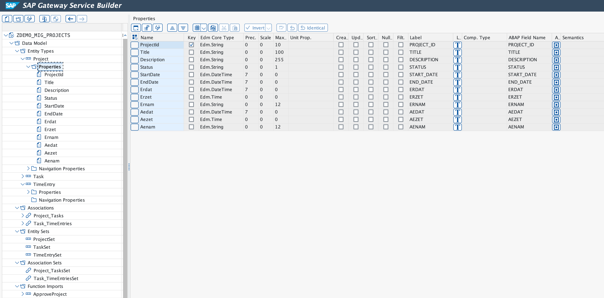
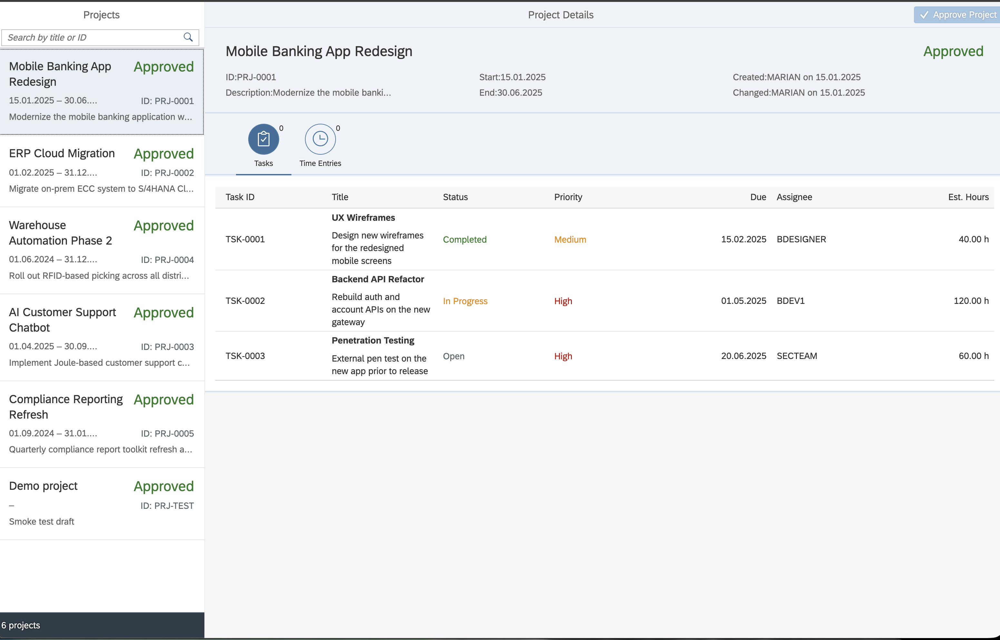
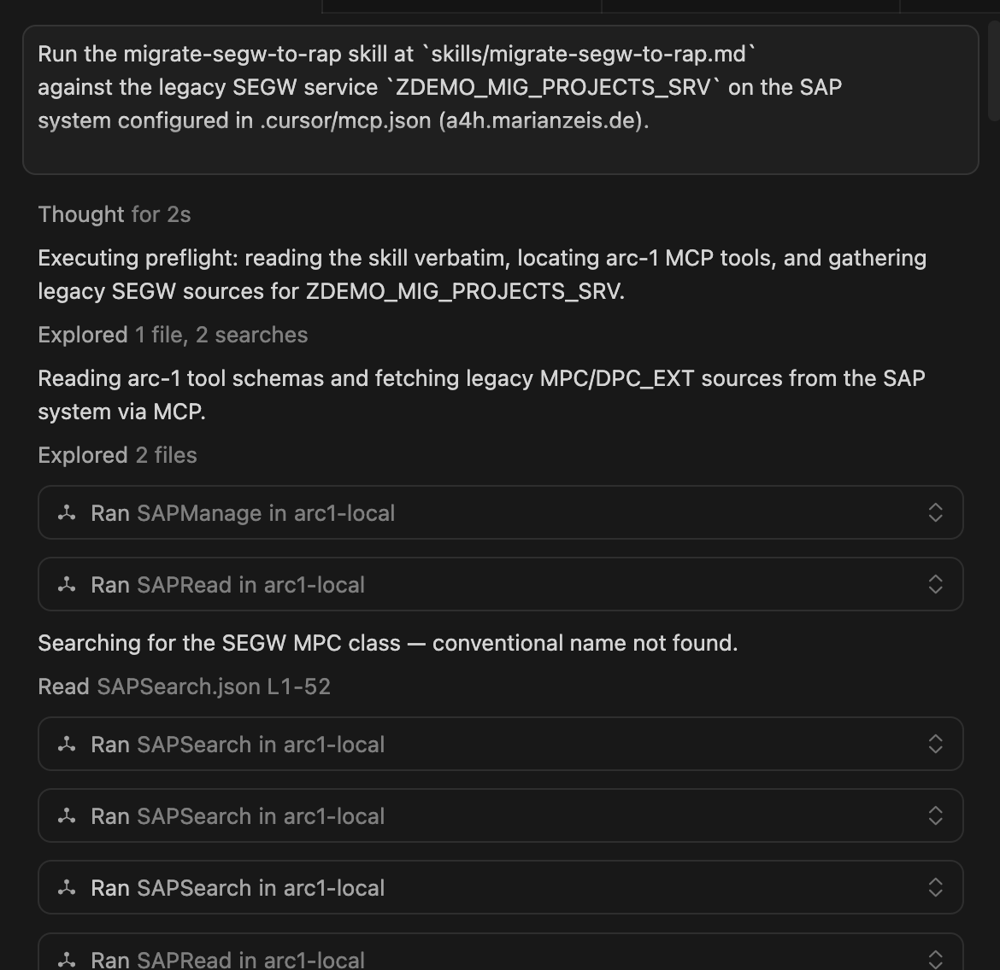
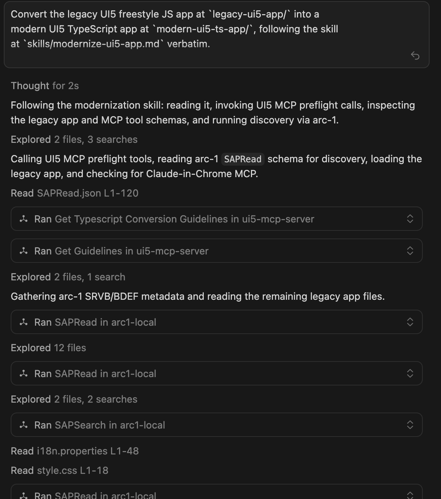
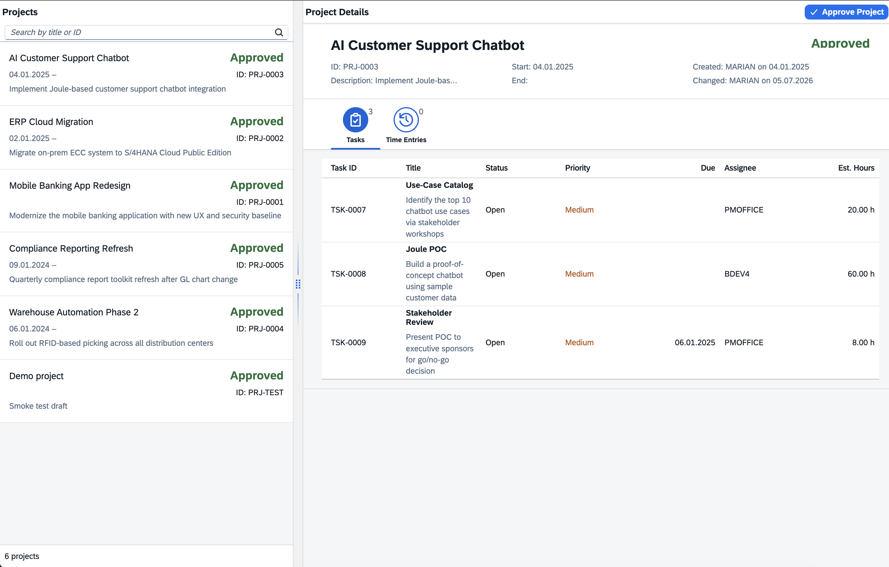
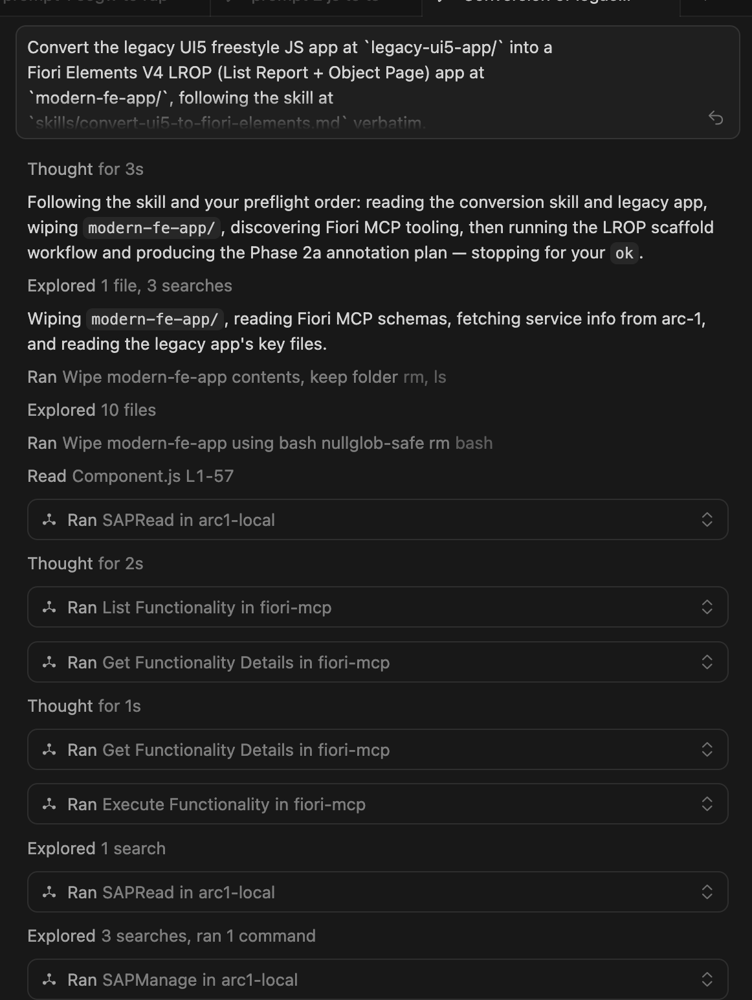
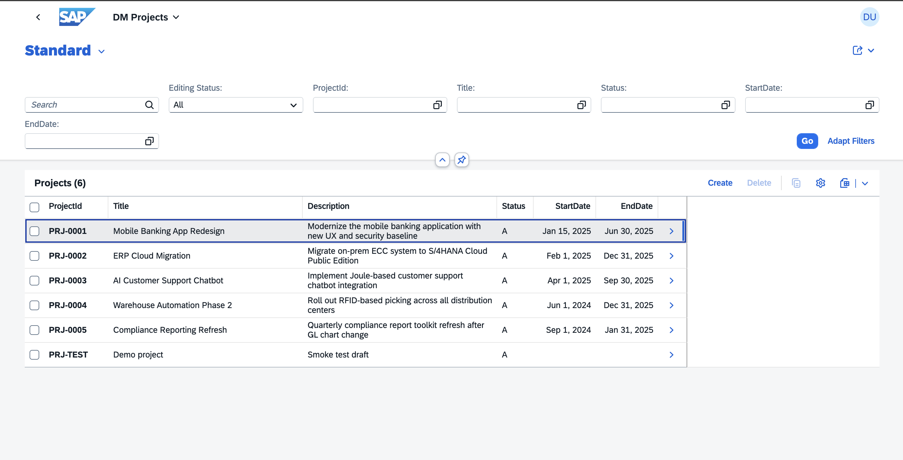
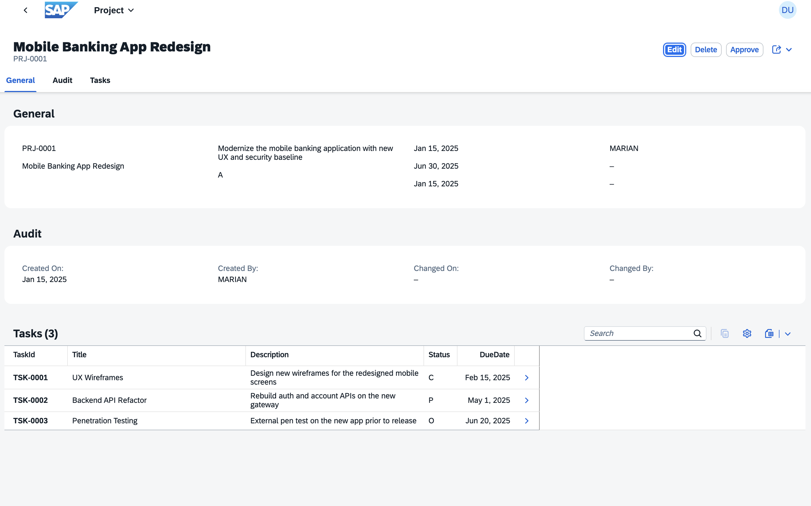

Series note: This post is part of my [AI ABAP development series](/tags/ai-abap-development-series/), where I go from AI development in general, to ABAP-specific problems, and then to ARC-1.

In the last posts I introduced [ARC-1](https://github.com/marianfoo/arc-1), explained why I built it, showed the BTP architecture, and then used it from Copilot Studio and Joule Studio. Those posts were mostly about architecture and possible use cases.

This one is different. This is the use case ARC-1 was originally built for: making real SAP development easier.

A lot of SAP customers are still somewhere between old ECC-style custom development and the S/4HANA world they actually want to reach. The uncomfortable part is that "moving to S/4" can easily become a technical lift and shift. The old custom code moves, the old OData services move, the old UI patterns move, and after the migration the landscape is still not really modern. It just runs somewhere newer.

That is not the direction I find interesting. If we already touch those applications, then we should also ask where it makes sense to move them toward RAP, OData V4, Fiori elements, cleaner APIs, and a development model that fits the Clean Core direction much better.

So I built a small but complete demo for that:

- a legacy SEGW OData V2 service
- a legacy freestyle UI5 JavaScript app
- a new RAP OData V4 service
- a modern UI5 TypeScript app
- a Fiori elements app on top of the RAP service

The full workspace, generated code, ABAP sources, screenshots, and chat logs are published here:

[github.com/marianfoo/arc-1-segw-to-rap](https://github.com/marianfoo/arc-1-segw-to-rap)

## The Starting Point

The demo starts with a small project management application on an S/4HANA 2023 trial system, ABAP Platform 7.58. The legacy backend sits in package `ZDEMO_MIG` and uses three custom tables: [`ZDM_PROJECT`](https://github.com/marianfoo/arc-1-segw-to-rap/blob/main/ABAP_SRC/src/zdm_project.tabl.xml), [`ZDM_TASK`](https://github.com/marianfoo/arc-1-segw-to-rap/blob/main/ABAP_SRC/src/zdm_task.tabl.xml), and [`ZDM_TIMEENTRY`](https://github.com/marianfoo/arc-1-segw-to-rap/blob/main/ABAP_SRC/src/zdm_timeentry.tabl.xml).

On top of that sits the SEGW service [`ZDEMO_MIG_PROJECTS_SRV`](https://github.com/marianfoo/arc-1-segw-to-rap/blob/main/ABAP_SRC/src/zdemo_mig_projects_srv_0001.iwsg.xml). It exposes `ProjectSet`, `TaskSet`, and `TimeEntrySet`, with navigation from projects to tasks and from tasks to time entries. The one bit of behavior is the `ApproveProject` function import, which changes the project status.

This is the old service in SAP Gateway Service Builder. You can see the classic SEGW shape directly: entity types, properties, navigation associations, entity sets, and the function import sitting next to the data model.



The old UI is a classic master/detail app. The left side shows projects, the right side shows the selected project with tasks and time entries. It works, but it also contains the kind of patterns many SAP teams know too well: manual OData V2 model creation, global formatters, synchronous bootstrap, path string parsing, `jQuery.sap.require`, manual function import calls, and UI state that is partly stitched together in controller code.



The backend is similar. The generated [MPC class](https://github.com/marianfoo/arc-1-segw-to-rap/blob/main/ABAP_SRC/src/zcl_zdemo_mig_projects_mpc.clas.abap) describes the model, and the [DPC_EXT class](https://github.com/marianfoo/arc-1-segw-to-rap/blob/main/ABAP_SRC/src/zcl_zdemo_mig_projects_dpc_ext.clas.abap) contains the custom logic. For the demo I made the legacy code deliberately rough: manual reads, ignored filters in some places, no authority checks, manual navigation handling, and an `ApproveProject` function import that updates the project status directly.

That is a good migration target because the interesting question is not "can an AI write a RAP sample from scratch?". The more useful question is:

Can it inspect the old service, understand the contract, and create a modern replacement that keeps the functional shape?

## The Skills

For this run I did not just write one big prompt. I used three ARC-1 skills from the maintained [`arc-1/skills`](https://github.com/marianfoo/arc-1/tree/main/skills) folder: [`migrate-segw-to-rap`](https://github.com/marianfoo/arc-1/tree/main/skills/migrate-segw-to-rap), [`modernize-ui5-app`](https://github.com/marianfoo/arc-1/tree/main/skills/modernize-ui5-app), and [`convert-ui5-to-fiori-elements`](https://github.com/marianfoo/arc-1/tree/main/skills/convert-ui5-to-fiori-elements).

The point of these skills is not that they are perfect generic migration products. They are templates for a process.

That distinction matters. The real value is that the skill forces the agent into a structured workflow:

1. Read the instructions first.
2. Inspect the old system and source code before designing anything.
3. Print the extracted model and plan.
4. Stop for confirmation before writes.
5. Create the new artifacts.
6. Activate, publish, lint, typecheck, and smoke test.
7. Use the feedback from those gates before calling the run done.

This is much closer to how I want agentic SAP development to work. Not "please convert my system" and hope for the best, but a guided workflow with discovery, constraints, acceptance gates, and real SAP system access.

For the run, I used Cursor with Composer-2. I did that intentionally. This was not meant to be a best-case frontier-model demo. It should be closer to what people might actually try in an IDE with a good but not magical model.

The MCP setup was split by responsibility. [ARC-1](https://github.com/marianfoo/arc-1) handled the SAP system side: object reads, writes, activation, transports, and service binding work. [SAP Docs MCP Server](https://github.com/marianfoo/mcp-sap-docs) gave RAP and CDS documentation context. [UI5 MCP Server](https://github.com/UI5/mcp-server) and [SAP Fiori MCP Server](https://github.com/SAP/open-ux-tools/tree/main/packages/fiori-mcp-server) were used for the frontend conversion and validation steps.

The net execution time for the three guided runs was below 20 minutes. That does not include the time I spent before the final run building the demo, improving the skills, and learning from earlier failed attempts. But for the final guided process itself, this was comfortably under 20 minutes.

## Prompt 1: SEGW to RAP

The first prompt asked the agent to run the `migrate-segw-to-rap` skill against `ZDEMO_MIG_PROJECTS_SRV`. The full transcript is in [`llm-chat-history/prompt-1-segw-to-rap`](https://github.com/marianfoo/arc-1-segw-to-rap/tree/main/llm-chat-history/prompt-1-segw-to-rap).



The important part is what happened before the agent wrote anything. ARC-1 first probed the system and confirmed the real constraints: ABAP 7.58, RAP availability, transport access, search access, and write access. The agent then tried the obvious generated MPC naming, discovered that this SEGW service used the generated `ZCL_ZDEMO_MIG_PROJECTS_*` class names, and read the [MPC class](https://github.com/marianfoo/arc-1-segw-to-rap/blob/main/ABAP_SRC/src/zcl_zdemo_mig_projects_mpc.clas.abap) as the source of the OData model. After that it read the [DPC_EXT class](https://github.com/marianfoo/arc-1-segw-to-rap/blob/main/ABAP_SRC/src/zcl_zdemo_mig_projects_dpc_ext.clas.abap), because the interesting behavior was not in the metadata. It was in the custom code, especially the `ApproveProject` function import.

Only after that discovery step did it print the extracted model and stop for `ok`:

```text
Project
  key ProjectId
  navigation Tasks

Task
  key TaskId
  foreign key ProjectId
  navigation TimeEntries

TimeEntry
  key EntryId
  foreign keys TaskId, ProjectId

Function import
  ApproveProject(ProjectId) -> Project
```

After confirmation, ARC-1 created the [RAP stack under `ABAP_SRC/src/dm`](https://github.com/marianfoo/arc-1-segw-to-rap/tree/main/ABAP_SRC/src/dm). This is where the migration becomes interesting on the ABAP side.

The root interface view [`ZI_DM_PROJECT`](https://github.com/marianfoo/arc-1-segw-to-rap/blob/main/ABAP_SRC/src/dm/zi_dm_project.ddls.asddls) selects from `ZDM_PROJECT` and models tasks as a RAP composition child. The same pattern continues with [`ZI_DM_TASK`](https://github.com/marianfoo/arc-1-segw-to-rap/blob/main/ABAP_SRC/src/dm/zi_dm_task.ddls.asddls) and [`ZI_DM_TIMEENTRY`](https://github.com/marianfoo/arc-1-segw-to-rap/blob/main/ABAP_SRC/src/dm/zi_dm_timeentry.ddls.asddls). So the old OData navigation model becomes a RAP business object structure instead of staying as manual navigation handling in DPC_EXT.

The interface behavior definition [`ZI_DM_PROJECT`](https://github.com/marianfoo/arc-1-segw-to-rap/blob/main/ABAP_SRC/src/dm/zi_dm_project.bdef.asbdef) is managed, uses `strict ( 2 )`, and enables draft. It maps the nicer RAP field names like `ProjectId`, `StartDate`, and `EstimatedHours` back to the old table fields like `project_id`, `start_date`, and `estimated_hours`. It also defines the project as the lock master and the child entities as dependent by project. The draft tables [`ZDM_PROJECT_D`](https://github.com/marianfoo/arc-1-segw-to-rap/blob/main/ABAP_SRC/src/rap/zdm_project_d.tabl.xml), [`ZDM_TASK_D`](https://github.com/marianfoo/arc-1-segw-to-rap/blob/main/ABAP_SRC/src/rap/zdm_task_d.tabl.xml), and [`ZDM_TIMEENTRY_D`](https://github.com/marianfoo/arc-1-segw-to-rap/blob/main/ABAP_SRC/src/rap/zdm_timeentry_d.tabl.xml) are part of that generated target shape.

The projection layer then exposes the service-facing model. [`ZC_DM_PROJECT`](https://github.com/marianfoo/arc-1-segw-to-rap/blob/main/ABAP_SRC/src/dm/zc_dm_project.ddls.asddls) is a transactional query projection on the interface view, redirects `_Tasks` to [`ZC_DM_TASK`](https://github.com/marianfoo/arc-1-segw-to-rap/blob/main/ABAP_SRC/src/dm/zc_dm_task.ddls.asddls), and carries metadata extension support. The projection behavior [`ZC_DM_PROJECT`](https://github.com/marianfoo/arc-1-segw-to-rap/blob/main/ABAP_SRC/src/dm/zc_dm_project.bdef.asbdef) reuses create, update, delete, draft actions, and the new approve action from the interface behavior.

Finally, the service definition [`ZUI_DM_PROJECTS`](https://github.com/marianfoo/arc-1-segw-to-rap/blob/main/ABAP_SRC/src/dm/zui_dm_projects.srvd.srvdsrv) exposes the projection entities as `Project`, `Task`, and `TimeEntry`, and the service binding [`ZUI_DM_PROJECTS_O4`](https://github.com/marianfoo/arc-1-segw-to-rap/blob/main/ABAP_SRC/src/dm/zui_dm_projects_o4.srvb.xml) publishes them as OData V4.

The new service is OData V4 and published through the service binding:

```text
/sap/opu/odata4/sap/zui_dm_projects_o4/srvd/sap/zui_dm_projects_o4/0001/
```

The old `ApproveProject` function import became a RAP action:

```abap
action approve_project result [1] $self;
```

The [behavior implementation](https://github.com/marianfoo/arc-1-segw-to-rap/blob/main/ABAP_SRC/src/dm/zbp_dm_project.clas.locals_imp.abap) no longer does a direct `UPDATE ... COMMIT WORK` in the old DPC_EXT style. It uses RAP EML in local mode, updates the project status, and lets the RAP runtime handle the transactional context.

The logs also show why this is not just text generation. The agent had to deal with real ABAP Platform 7.58 details: where the provider contract belongs, how draft table fields need to be named, which timestamp annotations are available, and how the projection behavior should reuse the interface behavior. These are exactly the details that make a generated RAP example look easy and a real migration annoying.

That is the first Clean Core angle of the demo. It does not magically make every old custom object clean. But it moves the service shape away from a SEGW/DPC_EXT implementation and toward a RAP business object, CDS projections, behavior definitions, OData V4, draft support, and metadata-driven UI consumption.

For an ECC to S/4HANA journey, this is the kind of direction I would rather see than only lifting old custom services into the new system.

## Prompt 2: UI5 JavaScript to UI5 TypeScript

The second prompt converted the [legacy freestyle UI5 JavaScript app](https://github.com/marianfoo/arc-1-segw-to-rap/tree/main/legacy-ui5-app) into a [modern UI5 TypeScript app](https://github.com/marianfoo/arc-1-segw-to-rap/tree/main/modern-ui5-ts-app). The transcript is in [`llm-chat-history/prompt-2-js-to-ts`](https://github.com/marianfoo/arc-1-segw-to-rap/tree/main/llm-chat-history/prompt-2-js-to-ts).



Here the agent did not just rewrite files. The skill forced it to understand the old component setup, manifest, controllers, XML views, formatter logic, model setup, bootstrap, package scripts, and UI5 tooling config before writing the new app.

The [UI5 MCP Server](https://github.com/UI5/mcp-server) was the guardrail around that work. Before writing code, the agent used it for TypeScript conversion guidance and general UI5 guidelines. That shaped the target app: a real TypeScript scaffold, `@sapui5/types`, typed controller events, async loading, manifest-driven models, and no old `jQuery.sap.*` patterns. It also created the modern UI5 app scaffold and later ran the UI5 linter and manifest validation. Those checks are important because plain TypeScript compilation does not understand UI5-specific conventions, XML event-handler rules, or manifest schema details.

The UI result is mostly relevant here because it proves that the RAP service was usable from a real consumer. The old app talked to `/ProjectSet`, followed `Tasks`, and called `ApproveProject` as an OData V2 function import. The new freestyle app talks to the RAP V4 entity set `/Project`, follows `_Tasks`, and calls `approve_project` as a bound OData V4 operation. The app itself also moved from JavaScript controllers and a manual OData V2 model to TypeScript controllers, manifest-driven OData V4, FlexibleColumnLayout routing, imported formatter modules, and real lint/typecheck gates.

The new app consumes the RAP V4 service directly from its [manifest](https://github.com/marianfoo/arc-1-segw-to-rap/blob/main/modern-ui5-ts-app/webapp/manifest.json):

```json
"dataSources": {
  "mainService": {
    "uri": "/sap/opu/odata4/sap/zui_dm_projects_o4/srvd/sap/zui_dm_projects_o4/0001/",
    "type": "OData",
    "settings": {
      "odataVersion": "4.0"
    }
  }
}
```

The action call in the [detail controller](https://github.com/marianfoo/arc-1-segw-to-rap/blob/main/modern-ui5-ts-app/webapp/controller/Detail.controller.ts) also changed from the old OData V2 function import style to a bound OData V4 operation:

```ts
const operation = model.bindContext(
  "com.sap.gateway.srvd.zui_dm_projects.v0001.approve_project()",
  ctx
);
await operation.invoke("$auto");
```

The UI is still recognizable, but the app is now using a modern runtime and tooling setup.



This part is important because many real SAP teams cannot immediately replace every freestyle UI5 app with Fiori elements. Sometimes a freestyle app is still the right target. But even then, there is a big difference between old UI5 JavaScript glued to a SEGW V2 service and a modern TypeScript app consuming a RAP V4 service.

The run ended with the important gates green: ESLint, UI5 linter, manifest validation, TypeScript typecheck, and a browser render check.

That is the second lesson from the logs: the model needed tooling feedback. It was not enough to let it generate code once. The loop with UI5 MCP, linting, manifest validation, and browser verification made the result useful.

## Prompt 3: Legacy UI5 to Fiori Elements

The third prompt took a different path. Instead of converting the old freestyle app to another freestyle app, it rebuilt the user-facing contract as a [Fiori elements V4 list report and object page](https://github.com/marianfoo/arc-1-segw-to-rap/tree/main/modern-fe-app/dm-projects-fe). The transcript is in [`llm-chat-history/prompt-3-js-to-fiori-elements`](https://github.com/marianfoo/arc-1-segw-to-rap/tree/main/llm-chat-history/prompt-3-js-to-fiori-elements).



This is the more interesting Clean Core direction for many S/4HANA projects. A lot of old UI5 code exists because the backend metadata did not carry enough UI intent, or because the old stack made custom frontend code feel like the default. With RAP and Fiori elements, more of the application can move into CDS annotations and behavior.

The agent mined the legacy UI for the actual user contract: the columns from the old master list, search behavior, project header fields from the detail view, task table columns, time entry navigation from a selected task, `Approve` as a project action, and the status, priority, and date semantics that used to live in the formatter.

Then it moved that contract into RAP UI metadata, mainly through the [`ZME_DM_PROJECT`](https://github.com/marianfoo/arc-1-segw-to-rap/blob/main/ABAP_SRC/src/dm/zme_dm_project.ddlx.asddlxs), [`ZME_DM_TASK`](https://github.com/marianfoo/arc-1-segw-to-rap/blob/main/ABAP_SRC/src/dm/zme_dm_task.ddlx.asddlxs), and [`ZME_DM_TIMEENTRY`](https://github.com/marianfoo/arc-1-segw-to-rap/blob/main/ABAP_SRC/src/dm/zme_dm_timeentry.ddlx.asddlxs) metadata extensions. That is where the old UI intent becomes `@UI.headerInfo`, line items, selection fields, facets, field groups, presentation variants, search metadata, and semantic keys.

The [SAP Fiori MCP Server](https://github.com/SAP/open-ux-tools/tree/main/packages/fiori-mcp-server) had a different role than the UI5 MCP Server. It did not translate freestyle controller code into another set of controllers. It exposed the Fiori tools workflow for an external OData V4 list report and object page: discover the available generation capabilities, inspect the required generator configuration, and shape the app around a project name, target folder, UI5 version, service URL or metadata file, and main entity `Project`. In other words, it kept the frontend target inside the standard Fiori elements model instead of letting the conversion drift back into custom page wiring.

That also makes the split of responsibility clearer. ARC-1 and SAP Docs MCP helped create and correct the RAP annotations in the ABAP backend. Fiori MCP helped define and generate the Fiori elements application that consumes those annotations through `$metadata`.

The result is a Fiori elements list report on the RAP `Project` entity. The generated app manifest is also in the repo, under [`modern-fe-app/dm-projects-fe/webapp/manifest.json`](https://github.com/marianfoo/arc-1-segw-to-rap/blob/main/modern-fe-app/dm-projects-fe/webapp/manifest.json).



And the object page uses the RAP annotations and navigation model, including general data, audit data, and a tasks table.



This is the third lesson from the logs: Fiori elements migration is not mainly a JavaScript conversion. It is a relocation of intent.

Old freestyle UI5 had the intent spread across controllers, XML views, formatters, routing, and manual binding code. The Fiori elements version moves much of that intent into the RAP service metadata. That is not always the right answer for every app, but when it fits, it is exactly the direction I would prefer for S/4HANA custom apps.

## What The Logs Show

I included the [Cursor chat exports](https://github.com/marianfoo/arc-1-segw-to-rap/tree/main/llm-chat-history) in the repository because I think the transcript is more useful than a polished final result alone.

The [SEGW to RAP run](https://github.com/marianfoo/arc-1-segw-to-rap/tree/main/llm-chat-history/prompt-1-segw-to-rap) has 140 tool records. That is the most important transcript for this post because it shows ARC-1 reading the legacy service, extracting the model from the generated classes, creating the RAP artifacts, activating them, and publishing the service binding. The [UI5 TypeScript run](https://github.com/marianfoo/arc-1-segw-to-rap/tree/main/llm-chat-history/prompt-2-js-to-ts) has 142 tool records and is mostly about making the new V4 service usable from a freestyle app. The [Fiori elements run](https://github.com/marianfoo/arc-1-segw-to-rap/tree/main/llm-chat-history/prompt-3-js-to-fiori-elements) has 230 tool records because it had to mine the old UI and move more intent into annotations.

There are a few patterns that stand out.

First, the model needed real SAP context. It did not know the generated class names until ARC-1 searched the system. It did not know the exact service binding shape until ARC-1 read it. It did not know the old `ApproveProject` behavior until it inspected the DPC_EXT source.

Second, the skills mattered. Without the skills, the model would probably start writing too early. With the skills, it had to read, extract, summarize, stop, then write.

Third, the MCP servers had different jobs. [ARC-1](https://github.com/marianfoo/arc-1) was the SAP system bridge. [SAP Docs MCP Server](https://github.com/marianfoo/mcp-sap-docs) gave release and documentation context. [UI5 MCP Server](https://github.com/UI5/mcp-server) and [SAP Fiori MCP Server](https://github.com/SAP/open-ux-tools/tree/main/packages/fiori-mcp-server) grounded the frontend work in current UI5 and Fiori conventions.

## Why This Is More Than A Conversion Demo

The obvious reading of this demo is "AI converted old code to new code". That is true, but it is not the main point for me.

There are now companies like [Nova Intelligence](https://www.novaintelligence.com/) and [Conduct](https://www.conduct.ai/) working on SAP custom-code understanding and modernization. I think that is a good signal for the space. My angle here is different: how far can you get with open-source tools, your own AI setup, and MCP servers whose code you can actually inspect?

This kind of setup is not as polished as a full commercial SAP modernization platform. But the tradeoff is interesting. ARC-1 is open source, the SAP Docs MCP server is open source, and the UI5 and Fiori MCP servers are open-source SAP tooling. You can see what the tools do, adapt the skills, run the workflow against your own system, and understand why the agent made a decision. For many teams, that transparency matters as much as the raw automation.

The more important point is that this is the kind of workflow SAP teams need when they want to move away from lift and shift.

In a pure lift-and-shift migration, the old application survives almost unchanged:

```text
SEGW service stays SEGW
DPC_EXT logic stays DPC_EXT logic
UI5 JavaScript stays UI5 JavaScript
OData V2 stays OData V2
custom UI logic stays custom UI logic
```

That may be necessary in some places. But if you do that everywhere, the new S/4HANA system inherits most of the old custom development model.

In this demo, the target shape is different:

```text
SEGW contract -> RAP business object
OData V2 -> OData V4
DPC_EXT function import -> RAP action
manual UI wiring -> typed UI5 or Fiori elements metadata
frontend-only intent -> CDS annotations where possible
```

That is much closer to the Clean Core direction. Not because custom code disappears. It does not. But because the custom code is expressed in newer, more structured extension technologies that fit S/4HANA better.

For real projects I would still be careful. A large productive SEGW service can contain much more complex behavior than this demo. It may call BAPIs, use conversion exits, have custom authorization logic, support deep inserts, or depend on UI assumptions that are not visible in the service metadata. You do not solve that with one prompt.

But that is also why ARC-1 matters. It gives the agent a way to inspect the real objects, not only files copied into a prompt. And with good skills, the agent can be forced to build a migration plan before touching the system.

## What I Would Take From This

For me the practical takeaway is:

1. ARC-1 is strongest when the task needs real ABAP system context.
2. Skills are the right abstraction for repeatable SAP modernization workflows.
3. MCP servers should be combined by responsibility, not treated as one magic tool.
4. RAP and Fiori elements are not just "newer tech", they give the AI a more structured target model.
5. Clean Core migration is not only about deleting custom code. It is also about moving useful custom functionality into cleaner extension patterns.

The demo is intentionally small, but the pattern is the part I care about. If an agent can read an old SEGW service, understand a legacy UI5 app, create a RAP V4 service, modernize the freestyle UI, and generate a Fiori elements app in one guided run, then this is a useful direction for real SAP modernization work.

Not as an autopilot that blindly rewrites landscapes, but as a controlled development workflow with real SAP context, clear boundaries, and human review.

That is exactly where I want ARC-1 to go.

## References & Links

- [Demo repository: arc-1-segw-to-rap](https://github.com/marianfoo/arc-1-segw-to-rap)
- [ARC-1 on GitHub](https://github.com/marianfoo/arc-1)
- [ARC-1 Documentation](https://marianfoo.github.io/arc-1/)
- [SAP Docs MCP Server](https://github.com/marianfoo/mcp-sap-docs)
- [ABAP RESTful Application Programming Model](https://pages.community.sap.com/topics/abap/rap)
- [UI5 TypeScript](https://ui5.github.io/typescript/)
- [UI5 MCP Server](https://github.com/UI5/mcp-server)
- [SAP Fiori MCP Server](https://github.com/SAP/open-ux-tools/tree/main/packages/fiori-mcp-server)
- [ABAP Platform Fiori Feature Showcase](https://github.com/SAP-samples/abap-platform-fiori-feature-showcase)
- [Nova Intelligence](https://www.novaintelligence.com/)
- [Conduct](https://www.conduct.ai/)
