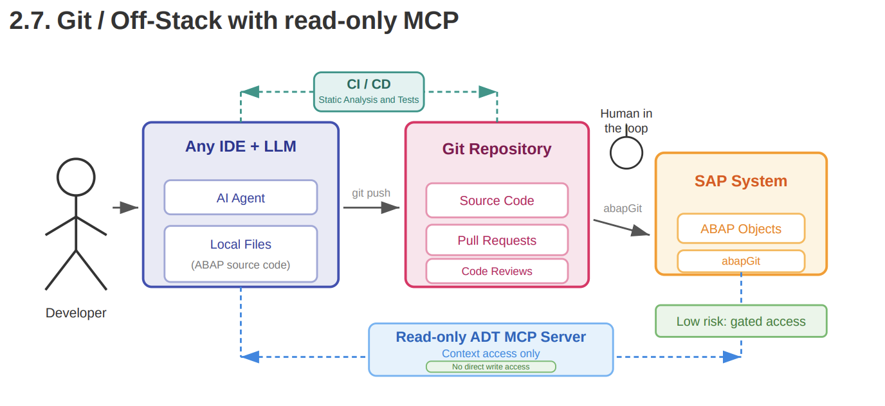
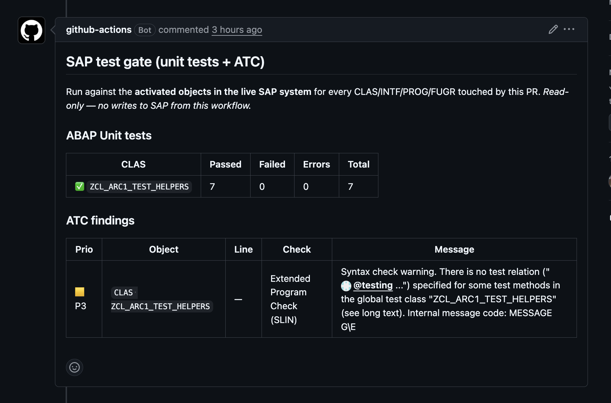
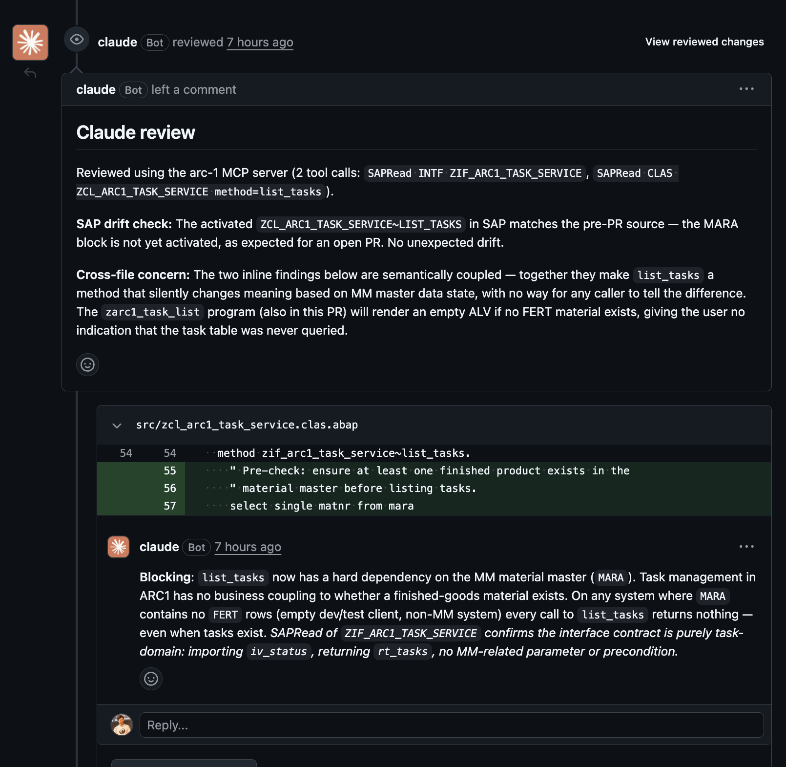
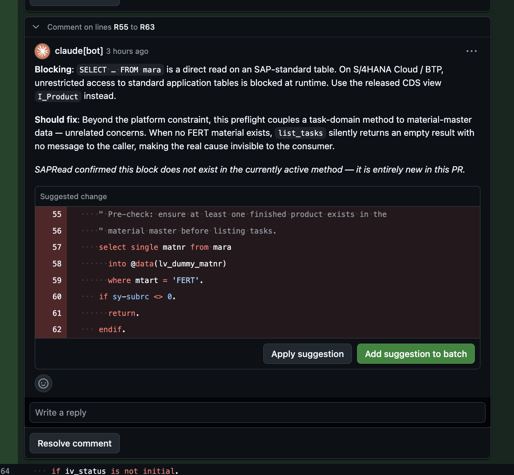
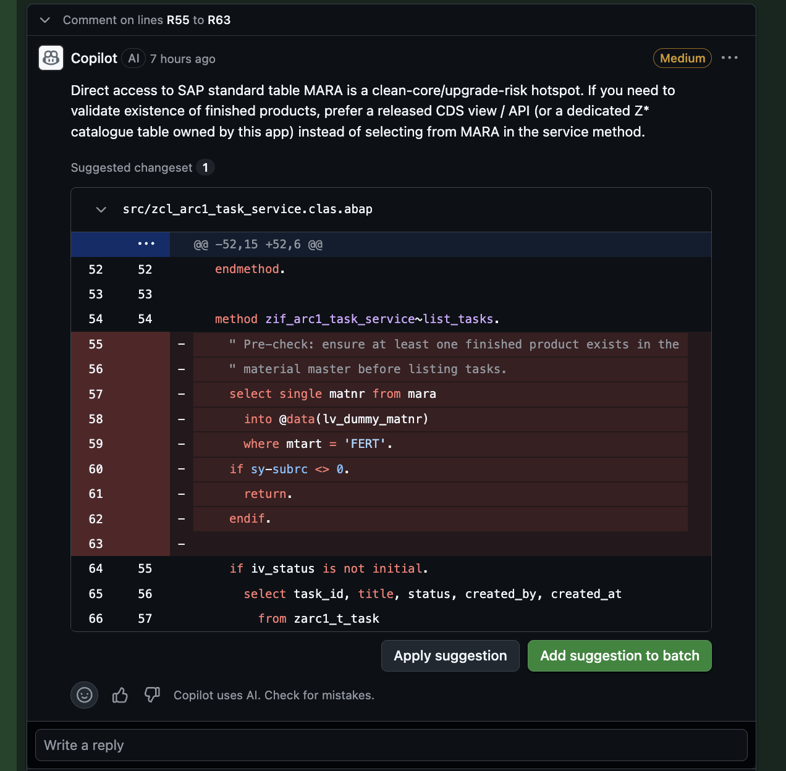
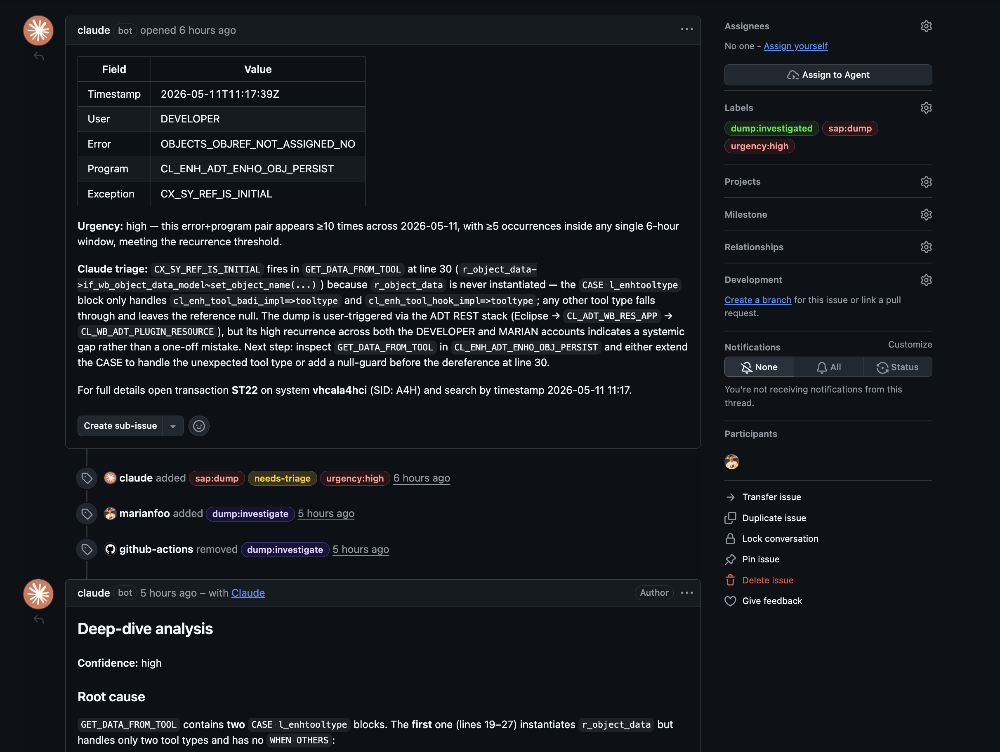

Series note: This post is part of my [AI ABAP development series](/tags/ai-abap-development-series/). In the previous posts I introduced [ARC-1](https://github.com/marianfoo/arc-1), then used it from BTP, Copilot Studio, Joule Studio, and a SEGW to RAP migration.

This post is about GitHub workflows as an ARC-1 development automation surface.

ABAP teams already have strong SAP-side tooling: ATC, Code Inspector, ST22, ADT, and the activated source in the SAP system. GitHub has a different strength: pull requests, review comments, checks, labels, issues, and automation.

The problem is that those worlds usually do not meet cleanly. [abapGit](https://abapgit.org/) can push ABAP source to GitHub, [abaplint](https://abaplint.org/) can run static checks, and Copilot or Claude can review a diff. But without access to the SAP system, the automation only sees text. It cannot run ABAP Unit, call ATC, compare against the activated object, inspect ST22, or verify what the SAP system actually knows.

The underlying idea comes from the [Patterns for using LLMs in ABAP development](https://docs.heliconialabs.com/patterns-for-using-llms-in-abap-development.pdf) document by Lars Hvam from Heliconia Labs. The relevant pattern is section 2.7, Git / Off-Stack with read-only MCP. ABAP source lives in Git. Pull requests, CI/CD, static analysis, and human review stay in the Git workflow. The MCP server gives the LLM read-only context from the SAP system, but does not let it write directly into the system.



So I created a small sample repository for this pattern: [github.com/marianfoo/arc-1-abap-cicd-review](https://github.com/marianfoo/arc-1-abap-cicd-review).

This is my ARC-1 implementation of the idea. GitHub is the workflow surface. abapGit connects the repository and the SAP system. ARC-1 is the SAP automation gateway that lets GitHub workflows execute SAP-side checks and gives AI reviewers read-only SAP context through MCP.

## What The Sample Shows

The sample repository contains a small ABAP package `ZARC1_DEMO` in abapGit format. The package is deliberately small. The interesting part is what can be automated around it when GitHub can reach SAP through ARC-1.

It covers three development automation scenarios:

1. PR checks for ABAP code: abaplint, ABAP Unit, and ATC.
2. PR review with SAP context: Copilot and Claude can review with live SAP reads instead of only the diff.
3. Operational follow-up: ARC-1 can check ST22 dumps on a schedule, create GitHub issues for new dumps, and trigger a deeper investigation from a label.

The repo has six small workflow files: [`pr.yml`](https://github.com/marianfoo/arc-1-abap-cicd-review/blob/main/.github/workflows/pr.yml), [`sap-tests.yml`](https://github.com/marianfoo/arc-1-abap-cicd-review/blob/main/.github/workflows/sap-tests.yml), [`copilot-review-trigger.yml`](https://github.com/marianfoo/arc-1-abap-cicd-review/blob/main/.github/workflows/copilot-review-trigger.yml), [`claude-review-trigger.yml`](https://github.com/marianfoo/arc-1-abap-cicd-review/blob/main/.github/workflows/claude-review-trigger.yml), [`sap-dump-triage.yml`](https://github.com/marianfoo/arc-1-abap-cicd-review/blob/main/.github/workflows/sap-dump-triage.yml), and [`sap-dump-deep-dive.yml`](https://github.com/marianfoo/arc-1-abap-cicd-review/blob/main/.github/workflows/sap-dump-deep-dive.yml). ARC-1 is the common backend. GitHub Actions is only the automation surface.

## Architecture And Setup

The architecture follows the Git / Off-Stack with read-only MCP pattern:

```text
Developer / IDE / LLM
  -> local ABAP files
  -> GitHub repository
  -> pull requests, code reviews, CI/CD
  -> abapGit
  -> SAP system

GitHub Actions / review automation
  -> ARC-1 MCP endpoint on SAP BTP
  -> read-only ADT context from the SAP system
```

The Git repository is the collaboration surface. It contains source files, pull requests, review comments, labels, and CI/CD checks. That is where the AI can propose changes and where a human keeps the gate.

The SAP system remains the source of truth for activated ABAP source, syntax checks, dumps, package content, and system-specific context. GitHub has the PR diff, but GitHub is not the runtime.

ARC-1 sits between GitHub and SAP. In my setup it runs on SAP BTP Cloud Foundry. GitHub Actions calls the ARC-1 `/mcp` endpoint over HTTPS with an API key. ARC-1 validates the key profile and then connects to the SAP system through the BTP destination. The technical SAP user is configured in that destination, not in GitHub.

GitHub runners and AI tools do not get SAP credentials. They only get the ARC-1 URL and a scoped API key. The SAP system itself is not exposed to GitHub runners.

The API key used in the demo has a `viewer-sql` profile. That means read access, SQL/table preview where needed, diagnostics, navigation, and linting. It does not expose write tools like `SAPWrite`, `SAPActivate`, `SAPManage`, `SAPTransport`, or `SAPGit`.

That last point matters. I do not want the first version of this pattern to be "AI writes ABAP from a PR comment". The safer and more useful first version is:

```text
AI can read the real SAP system.
AI can explain what it found.
AI can propose changes in a PR review.
Humans still decide what gets applied.
```

The setup has five parts.

First, get the ABAP source into GitHub with abapGit. The exact setup depends on the system and repository authentication. The important point is that ABAP objects are available as normal files in GitHub, and approved changes can later be pulled back into SAP through the normal abapGit process.

Second, deploy ARC-1. For this sample I use the BTP Cloud Foundry deployment because it gives GitHub Actions a public HTTPS endpoint while the SAP backend remains behind BTP connectivity. ARC-1 needs a destination to the ABAP system. The technical user is configured there and should only have the permissions needed for the checks you want to run. ARC-1 then adds the API key profile on top.

Third, configure GitHub Actions secrets and variables:

```text
ARC1_URL
ARC1_API_KEY
ANTHROPIC_API_KEY
COPILOT_TRIGGER_PAT
```

`ARC1_URL` points to the ARC-1 endpoint. `ARC1_API_KEY` is used by the SAP test gate and the Claude workflows. `ANTHROPIC_API_KEY` is needed for Claude Code Action. `COPILOT_TRIGGER_PAT` is needed for the Copilot trigger workflow because comments posted by the default `GITHUB_TOKEN` do not trigger `@copilot` mentions.

Fourth, configure Copilot Coding Agent. In the repository settings, the Copilot Cloud Agent gets an MCP configuration for ARC-1. The important detail is the tool allowlist: Copilot should see the read-side tools it needs for review, not the write-side tools.

Fifth, decide which workflows you actually want. For a first rollout I would start with abaplint, the SAP test gate, and one AI review path. The scheduled dump check is useful because it helps you see new runtime problems before someone reports them manually, but it is a separate operational pattern. You do not need to enable everything on day one.

## PR Automation Layers

**Layer 1: abaplint**

The static layer is intentionally boring.

Every pull request runs [abaplint](https://abaplint.org/) through [reviewdog](https://github.com/reviewdog/reviewdog). Findings appear as check annotations, inline comments where GitHub allows it, and a sticky summary comment. The workflow gates only on findings introduced by the PR diff. Existing findings stay visible, but they do not block a PR that did not create them.

If abaplint can catch it, abaplint should catch it. It is fast, deterministic, and basically free apart from GitHub Actions minutes.

In the sample PR, abaplint found existing issues in the class and test class. That is useful, but it did not catch the main semantic issue in the PR: a direct `SELECT` from `MARA` added inside a task service method. The code is syntactically valid. The problem is architectural and Clean Core related.

**Layer 2: ABAP Unit and ATC**

The next layer is still not AI. Here ARC-1 is simply the gateway connector from GitHub Actions into SAP.

[`sap-tests.yml`](https://github.com/marianfoo/arc-1-abap-cicd-review/blob/main/.github/workflows/sap-tests.yml) runs on every PR that touches `src/`. It parses the abapGit filenames, maps them back to ABAP object types, and then calls ARC-1 directly from Bash. There is no model involved in this part.

For changed classes it runs ABAP Unit through [`SAPDiagnose`](https://marianfoo.github.io/arc-1/tools/#sapdiagnose) with `action="unittest"`. For changed classes, interfaces, programs, and function groups it runs ATC through [`SAPDiagnose`](https://marianfoo.github.io/arc-1/tools/#sapdiagnose) with `action="atc"`. The result is posted as a sticky PR comment, and line-specific ATC findings are posted inline on the Files Changed tab when GitHub can attach them to the diff.

The gate is simple: failing or erroring unit tests fail the job, and P1/P2 ATC findings fail the job. P3 findings are visible but do not block.

The clean demo is [PR #20](https://github.com/marianfoo/arc-1-abap-cicd-review/pull/20). It adds one more unit test to [`ZCL_ARC1_TEST_HELPERS`](https://github.com/marianfoo/arc-1-abap-cicd-review/blob/main/src/zcl_arc1_test_helpers.clas.abap). The workflow [reports 7 of 7 ABAP Unit tests passing](https://github.com/marianfoo/arc-1-abap-cicd-review/pull/20#issuecomment-4432679538) and one non-blocking P3 ATC warning.



There is one important assumption here. The test workflow runs against activated objects in SAP. That matches the normal abapGit loop I use: edit, activate, push. If your team pushes before activation, you need a PR sandbox system or a pre-step that pulls and activates before this workflow runs.

**Layer 3: AI review without MCP**

GitHub's built-in Copilot Code Review can be assigned from the PR sidebar. That is already useful. It reads the diff and can catch common problems from the text alone.

In the sample [PR #14](https://github.com/marianfoo/arc-1-abap-cicd-review/pull/14), Copilot Code Review did catch the [direct `SELECT` from `MARA`](https://github.com/marianfoo/arc-1-abap-cicd-review/pull/14#discussion_r3226642123) as a Clean Core hotspot. That is a good result.

But this review has an important limitation: it is still a diff-only review. It cannot know whether the object is already activated in SAP. It cannot ask the system for callers. It cannot inspect ST22. It cannot prove that a claim is backed by the current SAP system.

That does not make it useless. It just means it is one layer.

**Layer 4: AI review with ARC-1**

The MCP-backed review is the more interesting part.

In the repo, applying the `copilot:review` label posts a canonical `@copilot review ...` prompt to the PR. Copilot Coding Agent then uses the ARC-1 MCP server configured in the repository settings.

Applying the `claude:review` label starts [`anthropics/claude-code-action`](https://github.com/anthropics/claude-code-action) in GitHub Actions. The workflow writes an MCP config file, allows only selected ARC-1 tools, loads the prompt from [`claude-review-prompt.md`](https://github.com/marianfoo/arc-1-abap-cicd-review/blob/main/.github/claude-review-prompt.md), and asks Claude to post one pull request review.

The prompt is deliberately concrete:

```text
Use 2 to 5 ARC-1 tool calls.
Read the changed ABAP object from SAP.
Check for GitHub to SAP drift.
Only navigate references when the public contract changed.
Do not repeat abaplint or SAP test gate findings.
Post inline comments on changed lines.
Use GitHub suggestion blocks when the fix is concrete.
```

This makes the review auditable. The model still reasons, but important claims can point back to tool results.

In PR #14, the decisive ARC-1 call was a [`SAPRead`](https://marianfoo.github.io/arc-1/tools/#sapread) of the activated `ZCL_ARC1_TASK_SERVICE~LIST_TASKS` method from SAP. Claude then posted the [key finding](https://github.com/marianfoo/arc-1-abap-cicd-review/pull/14#discussion_r3228270334): the `MARA` block is not only a direct SAP table access, it also changes the meaning of `list_tasks`. A task service should not silently return no tasks because the material master has no finished product.

It also did the useful drift check:

```text
The activated ZCL_ARC1_TASK_SERVICE~LIST_TASKS in SAP matches the pre-PR source.
The MARA block is not yet activated, as expected for an open PR.
No unexpected drift.
```

That is the small sentence that justifies the whole architecture. A diff-only reviewer cannot know that. ARC-1 can.



## Demo PRs

The main demo is [PR #14](https://github.com/marianfoo/arc-1-abap-cicd-review/pull/14). It contains one harmless refactoring and one deliberately bad preflight inside `ZCL_ARC1_TASK_SERVICE~LIST_TASKS`:

```abap
select single matnr from mara
  into @data(lv_dummy_matnr)
  where mtart = 'FERT'.
if sy-subrc <> 0.
  return.
endif.
```

This is deliberately wrong for the demo. It creates a hard dependency from a task service to the MM material master and reads a SAP-standard table directly. If product validation is needed, it should go through a released API or CDS view, and the service should not hide the reason by returning an empty list.

That PR is useful because it shows several review surfaces on the same diff:

- abaplint finds static issues, but not the `MARA` problem.
- the SAP test gate adds live ABAP Unit and ATC results for changed objects.
- Copilot Code Review sees the diff and flags the `MARA` access, but cannot verify SAP state.
- [Copilot Coding Agent with ARC-1](https://github.com/marianfoo/arc-1-abap-cicd-review/pull/14#issuecomment-4430841521) can combine diff review with live SAP reads, syntax, navigation, and release checks.
- [Claude with ARC-1](https://github.com/marianfoo/arc-1-abap-cicd-review/pull/14#discussion_r3228270334) posts a focused review with inline comments, suggestion blocks, and the SAP drift check.

The separate SAP test gate example is [PR #20](https://github.com/marianfoo/arc-1-abap-cicd-review/pull/20): one extra test method, 7 of 7 ABAP Unit tests green, and a single non-blocking P3 ATC finding.

**One-click suggestions**

Both Copilot and Claude can post GitHub review comments with suggestion blocks. That means the PR shows the same "Apply suggestion" button a human reviewer would get.

This is now verified in PR #14. [Copilot Code Review](https://github.com/marianfoo/arc-1-abap-cicd-review/pull/14#discussion_r3226642123) and [Claude](https://github.com/marianfoo/arc-1-abap-cicd-review/pull/14#discussion_r3228270334) both suggested deleting the `MARA` preflight block. Claude's version adds the SAP-side evidence on top: [`SAPRead`](https://marianfoo.github.io/arc-1/tools/#sapread) confirmed that this block is not part of the currently activated method, so the review can separate "new in this PR" from "already active in SAP".

The two screenshots below are from the same lines in PR #14. Copilot shows the diff-only version of the review. Claude shows the same GitHub suggestion UX, but with the SAP-side drift evidence from ARC-1.





The prompt asks for suggestion blocks only when the fix is concrete. A wrong suggestion block is worse than a normal comment because it invites the reviewer to apply it without thinking.

This is not a replacement for a proper feature branch. It is just a good review UX for small, local fixes.

## Operations Automation

**Autonomous dump triage**

The repo also has an operations pattern for staying ahead of runtime issues.

The [`sap-dump-triage.yml`](https://github.com/marianfoo/arc-1-abap-cicd-review/blob/main/.github/workflows/sap-dump-triage.yml) workflow asks ARC-1 for recent ST22 dumps through [`SAPDiagnose`](https://marianfoo.github.io/arc-1/tools/#sapdiagnose). It can run on a schedule, deduplicates dumps against existing GitHub issues by storing the dump ID in an HTML comment marker, and creates one issue for each new dump with metadata, a short Claude triage, and an urgency label.

For the sample repo, the cron is disabled so the issue list stays stable. In a real setup, I would turn it on so GitHub becomes a lightweight watch list for new dumps instead of waiting until someone reports the same runtime error again. The current examples are visible through the [`sap:dump` label](https://github.com/marianfoo/arc-1-abap-cicd-review/issues?q=is%3Aissue+label%3Asap%3Adump).

This is the part I like most conceptually:

```text
cheap shallow triage for everything
expensive deep investigation only when needed
```

That is a much better cost model than asking the LLM to deeply inspect every dump forever.

**Deep dive on demand**

The second stage is the [`sap-dump-deep-dive.yml`](https://github.com/marianfoo/arc-1-abap-cicd-review/blob/main/.github/workflows/sap-dump-deep-dive.yml) workflow. A human applies the `dump:investigate` label to a dump issue. The workflow extracts the dump ID, reads the full dump through ARC-1, reads the failing ABAP source, and posts one investigation comment.

The best demo is [issue #15](https://github.com/marianfoo/arc-1-abap-cicd-review/issues/15), an `OBJECTS_OBJREF_NOT_ASSIGNED_NO` dump in `CL_ENH_ADT_ENHO_OBJ_PERSIST`.

Claude found a very concrete root cause. In `GET_DATA_FROM_TOOL`, the first `CASE l_enhtooltype` block creates `r_object_data`, but it handles only BAdI and hook enhancement tool types. The dump variables showed `I_ENHO_TOOL` as `CL_ENH_TOOL_WDY`, a Web Dynpro enhancement tool. Because that tool type is not handled, `r_object_data` stays initial. The next dereference at line 30 raises `CX_SY_REF_IS_INITIAL`.

The interesting detail is that there is a second `CASE` block later in the same method with a `WHEN OTHERS` guard, but execution never reaches it because the null dereference happens earlier.

That is the kind of analysis I want from this setup. It used the dump, selected variables, call stack, and source code. It did not just say "probably a null reference". It explained why the reference was null and where the missing guard belongs.

The [deep-dive comment](https://github.com/marianfoo/arc-1-abap-cicd-review/issues/15#issuecomment-4431477985) then updates the labels from `needs-triage` to `dump:investigated`. So GitHub becomes the lightweight operations board, while SAP remains the source of truth.



## How I Would Use This

For a small ABAP team, I would start with this sequence:

1. Push ABAP source to GitHub with abapGit.
2. Run abaplint on every PR.
3. Run ABAP Unit and ATC through ARC-1 on every PR.
4. Use Copilot Code Review as a cheap, generic first AI review if you already have Copilot.
5. Add `claude:review` or `copilot:review` only when the PR needs deeper SAP context.
6. Enable dump triage manually first.
7. Turn on the scheduled dump check once the issue noise level is understood.
8. Use `dump:investigate` only for dumps that are recurring, high urgency, or unclear.

This keeps the workflow understandable. Not every PR needs a deep AI review, and not every dump needs full investigation. Static and deterministic checks should do the boring work first.

The label interface is intentionally simple:

- `copilot:review` triggers Copilot Coding Agent with ARC-1.
- `claude:review` triggers Claude Code Action with ARC-1.
- `sap:dump` marks a dump tracker issue.
- `needs-triage` means the shallow workflow created the issue.
- `dump:investigate` triggers the deep-dive workflow.
- `dump:investigated` means the deep dive has already posted its analysis.
- `urgency:high`, `urgency:medium`, and `urgency:low` make the issue list sortable.

The labels are the UI. That keeps the pattern easy to teach and easy to extend.

## Boundaries And Next Steps

**Limitations**

Copilot Code Review and Copilot Coding Agent are not the same thing. The sidebar review is useful, but it does not use the MCP server. For MCP context, this repo uses label-triggered workflows.

GitHub-hosted runners must reach the ARC-1 endpoint. That is why BTP Cloud Foundry is a good demo topology. If ARC-1 is only available inside a private network, use self-hosted runners or another controlled network path.

The SAP user behind the BTP destination still matters. Even with a read-only ARC-1 key, the workflow can read what that technical user can read. In a real setup, scope both the SAP user and the ARC-1 API key deliberately.

The SAP test gate runs against activated objects in SAP. That fits the edit, activate, push flow. If your team pushes before activation, use a PR sandbox system or add a controlled pull and activate step before the checks run.

And AI review is still review. The goal is not to replace an ABAP developer. The goal is to catch useful things earlier, with enough evidence that a developer can decide quickly.

**What else this pattern can do**

Once the plumbing exists, the same pattern can be used for more than PR review.

A scheduled Clean Core audit could read a package through ARC-1, check released API usage, and open GitHub issues. A multi-system setup could expose `arc-1-dev`, `arc-1-qa`, and `arc-1-prod` as separate MCP servers and compare what is active in each system.

The SAP test gate can also grow beyond this small demo. Full ATC variants, Code Inspector checks, transport checks, and package-level baselines can all surface in the same PR interface developers already use.

The next obvious step is the post-merge path. After a PR is merged to `main`, a GitHub workflow could call ARC-1 with a separate git-scoped key and run an abapGit pull through [`SAPGit`](https://marianfoo.github.io/arc-1/tools/#sapgit) for the package in the SAP system.

```text
SAP -> abapGit -> GitHub -> AI review -> merge -> ARC-1 pull -> SAP
```

I would keep that write path separate from the review key, gated by branch, labels, or environment approvals. If the pull has conflicts or activation problems, the workflow should report that back and stop.

That is also where the operations loop becomes interesting: detect a dump, investigate it, propose a fix PR, review it, merge it, and pull it back into SAP. The client can change. The governed SAP access layer stays the same.

## Takeaway

This is the direction I find practical for ABAP development automation.

Do not start with "AI should write all ABAP". Start with a safer and more useful question:

Can the development workflow become better if GitHub automation can safely use the actual SAP system?

For me, the answer is clearly yes. Not because the model magically understands ABAP, but because ARC-1 brings missing SAP context into the workflow: activated source, ABAP Unit, ATC, references, dumps, syntax checks, and system-specific evidence.

abapGit gets the code into GitHub. abaplint covers the static layer. ARC-1 runs ABAP Unit and ATC from GitHub Actions, and gives AI a read-only window into SAP. Copilot and Claude become more useful reviewers because they can stop guessing and start checking.

That is the main thread of this sample: GitHub is the automation surface, ARC-1 is the SAP gateway, and humans still decide what gets merged.

## References And Links

- [Sample repository: arc-1-abap-cicd-review](https://github.com/marianfoo/arc-1-abap-cicd-review)
- [Demo PR #14: multi-engine review with suggestion blocks](https://github.com/marianfoo/arc-1-abap-cicd-review/pull/14)
- [Demo PR #20: SAP Unit and ATC gate](https://github.com/marianfoo/arc-1-abap-cicd-review/pull/20)
- [Dump issue #15: deep-dive investigation](https://github.com/marianfoo/arc-1-abap-cicd-review/issues/15)
- [Dump tracker issues](https://github.com/marianfoo/arc-1-abap-cicd-review/issues?q=is%3Aissue+label%3Asap%3Adump)
- [ARC-1 on GitHub](https://github.com/marianfoo/arc-1)
- [ARC-1 Documentation](https://marianfoo.github.io/arc-1/)
- [Patterns for using LLMs in ABAP development](https://docs.heliconialabs.com/patterns-for-using-llms-in-abap-development.pdf)
- [abapGit](https://abapgit.org/)
- [abaplint](https://abaplint.org/)
- [reviewdog](https://github.com/reviewdog/reviewdog)
- [Claude Code Action](https://github.com/anthropics/claude-code-action)
- [GitHub Copilot cloud agent](https://docs.github.com/en/copilot/concepts/agents/coding-agent/about-coding-agent)
- [Model Context Protocol](https://modelcontextprotocol.io/)
- [Joule Studio and ARC-1 Clean Core post](/posts/2026-05-08-arc-1-joule-studio-clean-core/)
