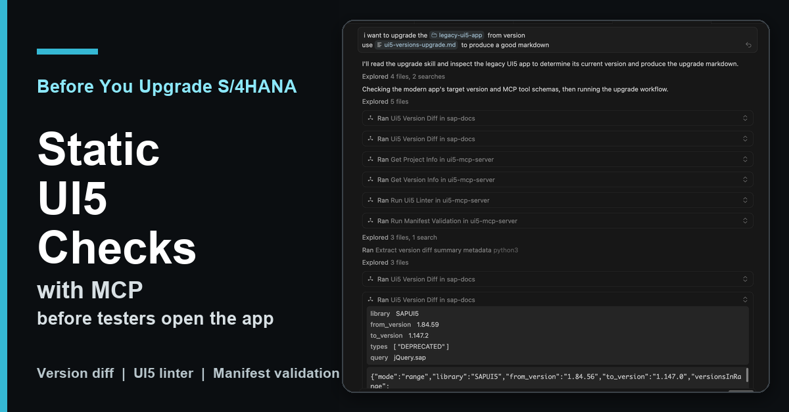
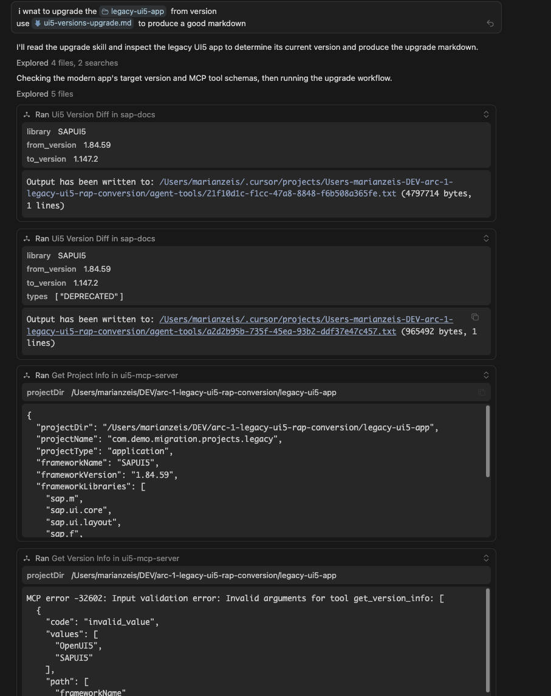
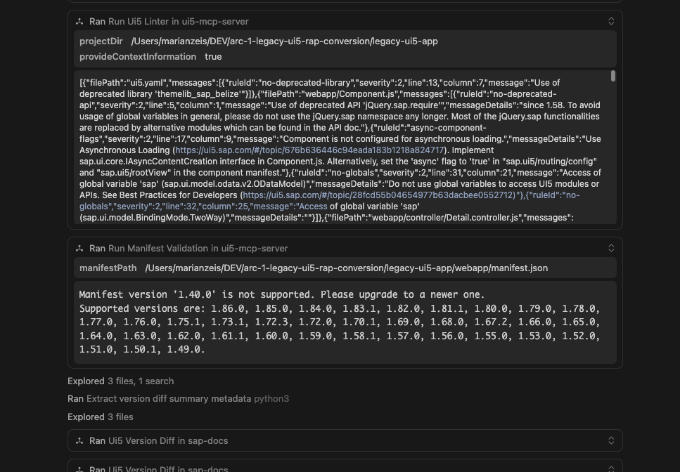
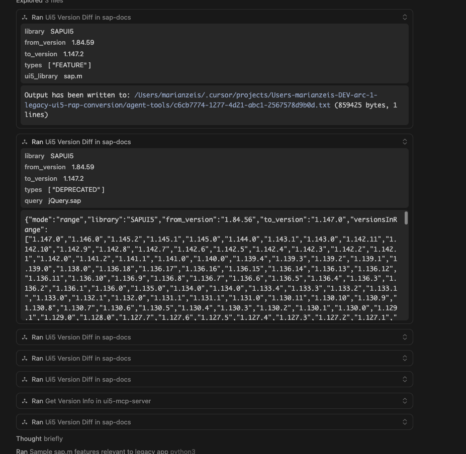
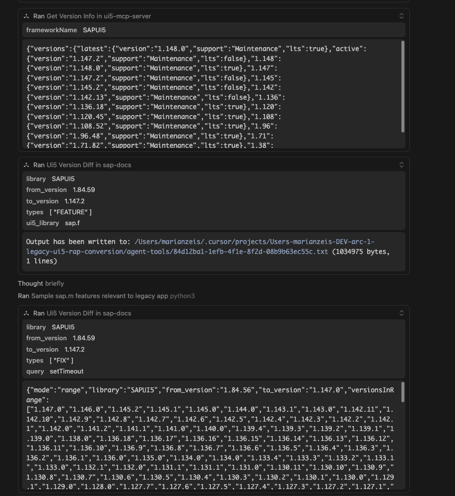

Series note: This post is part of my [AI ABAP development series](/tags/ai-abap-development-series/). It reuses the legacy UI5 app from the [SEGW to RAP migration demo](/posts/2026-05-11-segw-to-rap/), but this time the focus is only on the UI5 version upgrade problem.

In the SEGW to RAP post I used a deliberately old freestyle UI5 app as migration material. It runs on SAPUI5 1.84.59 and contains many patterns that were normal in older projects: `jQuery.sap.require`, global formatters, synchronous bootstrap, Belize theme, older manifest versions, and a few small controller workarounds.

That is a useful demo app because it is close to the kind of thing you find during S/4HANA upgrades. The backend migration is one problem, but the UI5 version jump is another one.

The process should look something like this: First, you identify the old and new UI5 versions. Then you read through the changelogs and What's New pages to see what has changed. Next check which APIs have been deprecated or which themes have been removed, and search the documentation for possible replacements. Then you apply those findings to the app and start the app to see if the fixes work.  
But usually you start the app with the new version and hope for the best and fix things you find there.

That works, but it is a lot of manual context switching. The release notes are broad, the app only uses a small part of UI5, and the important question is not "what changed in UI5?". The useful question is:

What changed in UI5 that matters for this app?



## What Changed

I added a new `ui5_version_diff` tool to my [SAP Docs MCP server](https://github.com/marianfoo/mcp-sap-docs) in [mcp-sap-docs PR #47](https://github.com/marianfoo/mcp-sap-docs/pull/47).

The tool is backed by [ui5-lib-diff](https://github.com/marianfoo/ui5-lib-diff). A small change in [ui5-lib-diff PR #11](https://github.com/marianfoo/ui5-lib-diff/pull/11) now publishes a static JSON API for tools.

The important part is that the MCP server does not send HTTP requests at runtime. During setup it downloads the `all-changes.json` bundle once. At runtime the tool reads the local bundle and filters it by version range, change type, UI5 library, or query text.

That makes it much more useful for agents. The UI5 Lib Diff app is still great for humans, because you can visually compare versions at [ui5-lib-diff.marianzeis.de](https://ui5-lib-diff.marianzeis.de/). But an agent needs structured data it can filter without opening a client-rendered UI route.



The second part is the official [UI5 MCP server](https://github.com/UI5/mcp-server) from SAP. That server can inspect a local UI5 project and run UI5-specific checks.

This is important: these checks run against the app source code in a local checkout, for example the version cloned from your Git server. They are not executed against the deployed app in the SAP system or against a running launchpad tile. The deployed app still needs runtime testing later, but the first evidence can come from the local project before that.

In this run the useful tools were:

- `get_project_info`
- `get_version_info`
- `run_ui5_linter`
- `run_manifest_validation`
- optionally `get_api_reference` and `get_guidelines` for follow-up details

So the split is clear:

- SAP Docs MCP says what changed between UI5 versions.
- UI5 MCP says what the local app actually uses and what fails.

That combination is the interesting part.

## The Run

For the showcase I used a local clone of the same [legacy UI5 app](https://github.com/arc-mcp/arc-1-segw-to-rap/tree/main/legacy-ui5-app) from the [arc-1-segw-to-rap repo](https://github.com/arc-mcp/arc-1-segw-to-rap). I also used the workflow in [`ui5-versions-upgrade.md`](https://github.com/arc-mcp/arc-1-segw-to-rap/blob/main/skills/ui5-versions-upgrade.md).

The prompt was basically:

```text
i want to upgrade the legacy-ui5-app from version
use ui5-versions-upgrade.md to produce a good markdown
```

The skill tells the agent to first establish the scope, then inspect the project, then cross-check deprecations with the linter and code, then look for fixes and relevant features. It also tells the agent not to dump the full changelog into the report.

For the demo app the report found:

- current version: SAPUI5 1.84.59
- target version: SAPUI5 1.147.2
- resolved diff range in the local bundle: 1.84.56 to 1.147.0
- 339 versions in range
- 3,540 features
- 15,249 fixes
- 985 deprecations
- 961 SAPUI5 What's New entries

That sounds like too much information, and it is. The point of the workflow is to reduce it.



The UI5 linter and manifest validation made the report concrete. It did not just say that some API somewhere is deprecated. It found issues in this app:

- `jQuery.sap.require` and `jQuery.sap.declare`
- global `sap.*` usage
- synchronous bootstrap
- missing async component configuration
- old `sap_belize` theme and `themelib_sap_belize`
- `sap.m.MessagePage`
- manifest `_version` 1.40.0
- old `minUI5Version`
- ambiguous XML event handlers
- old UI5 Tooling setup

That is exactly the kind of list I want before I start the live browser test. It does not replace testing the deployed app, but it removes a lot of blind work before testers touch the running application.

## Narrowing the Changelog

The broad range query is only the starting point. After that the agent used narrower calls:

- `types=["DEPRECATED"]` to focus on migration blockers
- `types=["FEATURE"]` with `ui5_library="sap.m"` or `sap.f`
- `query="jQuery.sap"` to inspect relevant deprecations
- `query="setTimeout"` to see if a local workaround matches a framework fix



That last point is the more interesting long-term use case. During upgrades we often carry workarounds forward because nobody knows if the original UI5 bug still exists. With a searchable version diff, an agent can look for a symptom or API and then check whether a fix landed between the old and new version.

It still has to verify the local code. A changelog entry is not proof that a workaround can be deleted. But it gives the agent a much better starting point than asking it to guess from memory.



The generated report is here:

[legacy-ui5-app-upgrade.md](https://github.com/arc-mcp/arc-1-segw-to-rap/blob/main/legacy-ui5-app-upgrade.md)

The report is not a replacement for a real migration. It is the first step: concrete evidence for what may need to change. For this demo it already produced a useful edit plan: update tooling, switch theme, migrate the manifest, enable async loading, clean module usage, replace deprecated controls, then rerun linter and manifest validation.

The next step can use the same MCP tools again, but now for implementation. You do not have to apply every finding at once. You can ask the agent to fix only the theme and manifest issues, only the `jQuery.sap.*` usage, or the full list. That is basically the same pattern I showed in the SEGW to RAP post when the legacy freestyle UI5 app was converted into a [modern UI5 TypeScript app](https://github.com/arc-mcp/arc-1-segw-to-rap/tree/main/modern-ui5-ts-app): inspect first, use UI5-specific tools, implement, then rerun linting, manifest validation, type checks, and browser checks.

If a finding needs more explanation, the same SAP Docs MCP server can still search SAPUI5 documentation and fetch more detail. For API-level replacement details, the UI5 MCP server can also use `get_api_reference`.

## Why I Like This Pattern

The useful shift is that the model is no longer asked to "know UI5 upgrades". It is given tools that expose the right context:

- the version diff tells it what changed
- the project info tells it what the app uses
- the linter tells it what is actually wrong
- the manifest validator tells it what the framework accepts
- the docs tools can fill gaps when a finding needs detail

That is a much better workflow than manually reading release notes until you hope you found everything.

It is especially useful for larger version jumps, for example during S/4HANA upgrades where the UI5 version changes a lot. But I think it also helps for smaller minor upgrades. Even then, you want to know if a workaround is still needed, if a deprecation starts to matter, or if a newer UI5 feature lets you simplify code.

The important boundary is still the same: the report is a first pass, not the final migration. You still need to edit, run the app, test the flows, and check the actual behavior. But the first pass can now be app-specific evidence instead of a generic changelog review, and the same tools can then help with the actual changes.

For me that is the real value of MCP in SAP development. Not magic. Better context at the point where the model needs to reason.

## References and Links

- [From SEGW and Legacy UI5 to RAP with ARC-1](/posts/2026-05-11-segw-to-rap/)
- [arc-1-segw-to-rap repo](https://github.com/arc-mcp/arc-1-segw-to-rap)
- [legacy UI5 app](https://github.com/arc-mcp/arc-1-segw-to-rap/tree/main/legacy-ui5-app)
- [ui5-versions-upgrade.md skill](https://github.com/arc-mcp/arc-1-segw-to-rap/blob/main/skills/ui5-versions-upgrade.md)
- [generated legacy UI5 upgrade report](https://github.com/arc-mcp/arc-1-segw-to-rap/blob/main/legacy-ui5-app-upgrade.md)
- [mcp-sap-docs repo](https://github.com/marianfoo/mcp-sap-docs)
- [mcp-sap-docs PR #47: load UI5 diffs from local bundle](https://github.com/marianfoo/mcp-sap-docs/pull/47)
- [ui5-lib-diff repo](https://github.com/marianfoo/ui5-lib-diff)
- [ui5-lib-diff PR #11: publish static UI5 diff bundle](https://github.com/marianfoo/ui5-lib-diff/pull/11)
- [UI5 Lib Diff app](https://ui5-lib-diff.marianzeis.de/)
- [UI5 Lib Diff static API manifest](https://ui5-lib-diff.marianzeis.de/api/v1/manifest.json)
- [UI5 MCP server GitHub repo](https://github.com/UI5/mcp-server)
- [@ui5/mcp-server on npm](https://www.npmjs.com/package/%40ui5/mcp-server)
- [SAP Community: Introducing the UI5 MCP Server](https://community.sap.com/t5/technology-blog-posts-by-sap/give-your-ai-agent-some-tools-introducing-the-ui5-mcp-server/ba-p/14200825)
- [SAPUI5 release notes](https://ui5.sap.com/#/releasenotes.html)
- [SAPUI5 What's New Viewer](https://help.sap.com/whats-new/67f60363b57f4ac0b23efd17fa192d60?locale=en-US)
