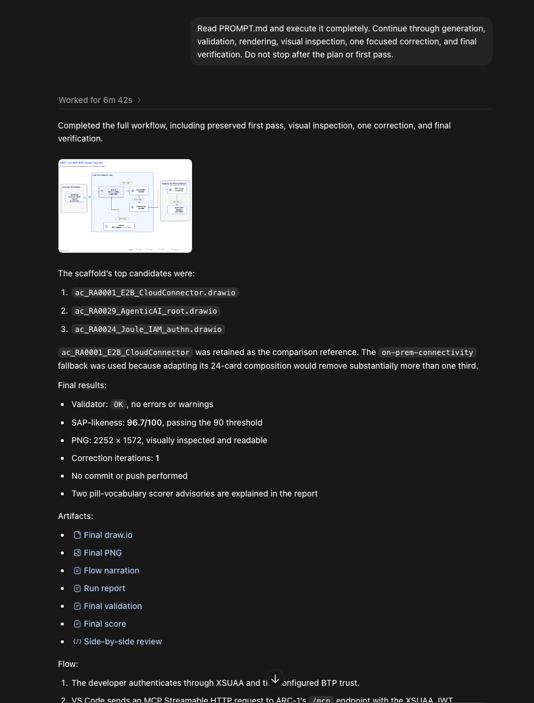
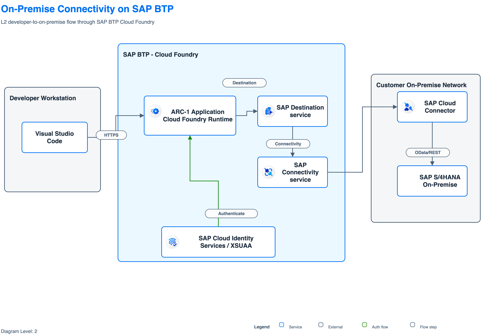
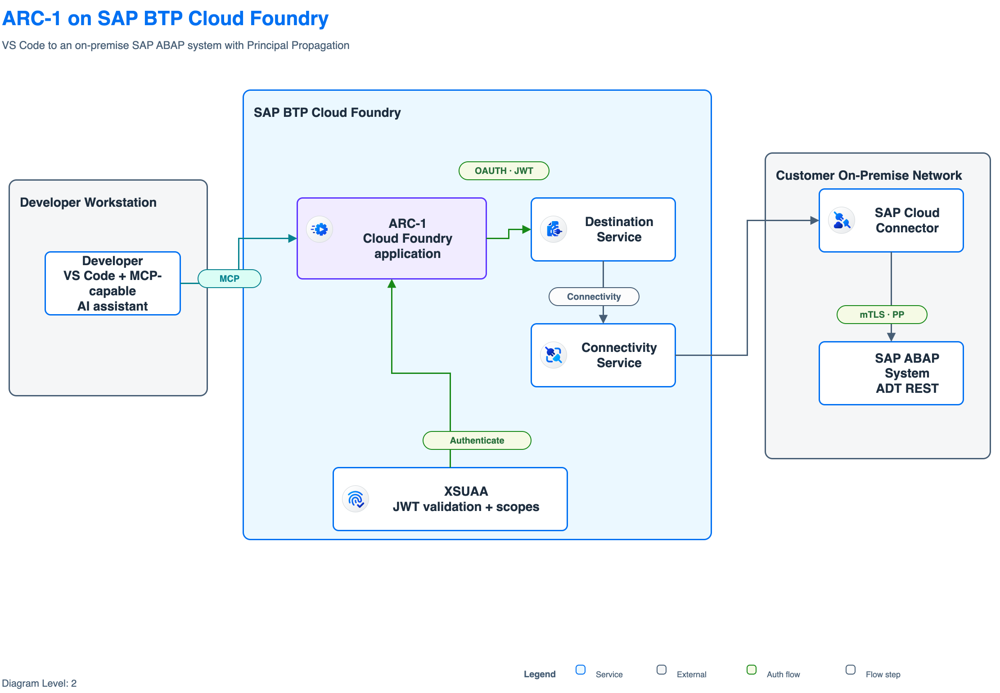

I wanted one practical thing: an editable draw.io diagram for ARC-1 on SAP BTP that looks like it belongs in the SAP Architecture Center.

My first attempts with generic diagram prompts were not really useful. They often had dark backgrounds, icons that were too large, and arrows running through boxes. I wanted something closer to the SAP examples: a white canvas, the right BTP areas and service icons, understandable flows, and an editable draw.io file that I could still correct by hand.

That became [`marianfoo/btp-drawio-skill`](https://github.com/marianfoo/btp-drawio-skill), a skill for creating SAP Architecture Center-style `.drawio` files from plain text.

## Where this started

I did not start this from zero. The main source was SAP itself, and there are two related projects that are easy to mix up:

- The [SAP BTP Solution Diagram Guidelines](https://sap.github.io/btp-solution-diagrams/) define how these diagrams should look: levels, areas, colors, icons, connectors, labels, and legends. The complete guideline and editable examples are in [`SAP/btp-solution-diagrams`](https://github.com/SAP/btp-solution-diagrams).
- The [SAP Architecture Center](https://architecture.learning.sap.com/) publishes real reference architectures for topics such as integration, identity, data, AI, and resiliency. Their source, including many editable `.drawio` files, is in [`SAP/architecture-center`](https://github.com/SAP/architecture-center).

The skill bundles selected diagrams and assets from these official sources. This gives the model both parts it needs: the visual rules and real SAP-authored examples.

Two community projects also appeared almost at the same time.

Wouter Lemaire published [`lemaiwo/btp-drawio-skill`](https://github.com/lemaiwo/btp-drawio-skill) on April 17. I took inspiration from its Claude marketplace structure and the idea of bundling the SAP icon XML libraries directly with the skill.

One day later, [`miyasuta/claude-drawio-btp-diagram`](https://github.com/miyasuta/claude-drawio-btp-diagram) appeared. I liked its separation between official guidelines, conventions, and concrete draw.io styles. Its center-alignment rule for straight connectors also became an important detail in my implementation.

I started my repository on April 22 because I needed the ARC-1 diagram. From there I added a larger SAP Architecture Center corpus, template ranking, asset extraction, built-in fallback layouts, validation, scoring, visual comparison, and the nudge loop.

The main lesson stayed simple: do not generate SAP diagrams from scratch when SAP already published the visual language and many real examples.

Before the example, it helps to understand what the skill actually does.

## How the skill works

Without the skill, the model starts with an empty canvas and has to invent the layout. With the skill, it first decides what kind of diagram is needed and then looks for the closest SAP example.

SAP defines three diagram levels based on the audience and required detail:

- `L0` is a business overview. It uses only a few blocks and simple neutral arrows. Technical details are left out.
- `L1` is a conceptual architecture. It shows named SAP services, the main zones such as BTP and on-premise, and the important flows between them.
- `L2` is a logical or technical architecture. It adds protocols, identity and trust flows, connector labels, and a legend. The ARC-1 example in this post is an L2 diagram.

The complete workflow looks like this:

```text
Your architecture description
            |
            v
Choose the level and closest SAP example
            |
            v
Copy and adapt the example
            |
            v
Validate -> render -> inspect -> correct
            |
            v
Editable .drawio file and PNG
```

The repository currently bundles 71 reference templates, 100 SAP BTP service icons, and 448 indexed draw.io assets. Most templates come from the two official SAP repositories above, with a few additional public SAP examples.

1. **Find a starting point.** [`scaffold_diagram.py`](https://github.com/marianfoo/btp-drawio-skill/blob/main/plugins/sap-architecture/skills/sap-architecture/scripts/scaffold_diagram.py) ranks the templates and copies the closest one. This copy is the scaffold.
2. **Adapt only what changed.** The model keeps the SAP layout and uses helpers such as [`relabel.py`](https://github.com/marianfoo/btp-drawio-skill/blob/main/plugins/sap-architecture/skills/sap-architecture/scripts/relabel.py), [`extract_icon.py`](https://github.com/marianfoo/btp-drawio-skill/blob/main/plugins/sap-architecture/skills/sap-architecture/scripts/extract_icon.py), and [`extract_asset.py`](https://github.com/marianfoo/btp-drawio-skill/blob/main/plugins/sap-architecture/skills/sap-architecture/scripts/extract_asset.py) to change labels and assets.
3. **Use a smaller fallback when needed.** If the closest template is much larger than the requested diagram, [`render_semantic.py`](https://github.com/marianfoo/btp-drawio-skill/blob/main/plugins/sap-architecture/skills/sap-architecture/scripts/render_semantic.py) can create a smaller layout for a few known patterns while keeping the SAP visual rules.
4. **Check the result and look at it.** [`autofix.py`](https://github.com/marianfoo/btp-drawio-skill/blob/main/plugins/sap-architecture/skills/sap-architecture/scripts/autofix.py) repairs known mechanical problems. [`validate.py`](https://github.com/marianfoo/btp-drawio-skill/blob/main/plugins/sap-architecture/skills/sap-architecture/scripts/validate.py) checks colors, fonts, icons, labels, and arrow routing. [`score_corpus.py`](https://github.com/marianfoo/btp-drawio-skill/blob/main/plugins/sap-architecture/skills/sap-architecture/scripts/score_corpus.py) compares the result with the SAP examples. Then [`iterate.py`](https://github.com/marianfoo/btp-drawio-skill/blob/main/plugins/sap-architecture/skills/sap-architecture/scripts/iterate.py) and [`render_compare.py`](https://github.com/marianfoo/btp-drawio-skill/blob/main/plugins/sap-architecture/skills/sap-architecture/scripts/render_compare.py) render the diagram so the model can inspect and correct it.

The important limit is that these checks only understand the file and its visual structure. They do not know if the architecture itself is correct.

## The sample use case in Codex

For the sample, I used the exact problem that started this project: a developer in VS Code asks an AI assistant to inspect an ABAP class through ARC-1.

```text
Developer and AI assistant in VS Code
                |
               MCP
                v
ARC-1 on SAP BTP Cloud Foundry
                |
Destination + Connectivity + Cloud Connector
                v
On-premise SAP ABAP system
```

XSUAA authenticates the client. Destination Service and Connectivity Service route the request through SAP Cloud Connector. Principal Propagation keeps the developer's identity for the ABAP call.

The diagram should make this complete path understandable for an SAP platform or development team. I used Codex to create it and kept the first result, the correction, and all validation output for the example below.

The skill started as a Claude Code plugin, but the important part is portable. It is a folder with Markdown instructions, SAP templates, local assets, and Python scripts.

For Codex I cloned the repository and pointed an `AGENTS.md` file at the skill:

```bash
git clone https://github.com/marianfoo/btp-drawio-skill.git
```

```markdown
For SAP architecture diagrams, use the sap-architecture skill at
<path>/btp-drawio-skill/plugins/sap-architecture/skills/sap-architecture.

Read SKILL.md completely. Always scaffold before editing. Run autofix,
validate, score, render, and inspect the image before finishing.
Never write the draw.io XML from scratch.
```

Codex reads the project instructions and can call the scripts directly. Python 3.8 or newer and shell access are required. The draw.io desktop app is only needed for PNG, SVG, or PDF export.

For the example I described one focused L2 architecture:

```text
Create an L2 SAP Architecture Center-style diagram.

A developer uses an MCP-capable AI assistant in VS Code to inspect an ABAP
class through ARC-1. ARC-1 runs on SAP BTP Cloud Foundry and exposes /mcp
over Streamable HTTP. The client authenticates through XSUAA. ARC-1 resolves
a PrincipalPropagation destination, uses Connectivity Service and SAP Cloud
Connector, and reads the on-premise SAP ABAP system through ADT REST.

Zones: Developer Workstation, SAP BTP Cloud Foundry,
Customer On-Premise Network.

Output an editable .drawio, PNG, validation and score results,
and the numbered flow narration.
```

The [complete prompt](artifacts/codex-prompt.txt) and a [sanitized copy of the `AGENTS.md` used for the run](artifacts/codex-agents.txt) are attached to this post.

Codex worked for 6 minutes and 42 seconds. It read the skill, ran the template selector, created a first pass, validated and rendered it, inspected the image, made one correction, and ran the checks again.



The selector correctly ranked `ac_RA0001_E2B_CloudConnector.drawio` first. But this SAP reference has 24 cards and a much larger scope. Removing enough cards for my focused ARC-1 flow would remove more than one third of the template.

Codex therefore switched to the skill's built-in `on-prem-connectivity` renderer. This was one of the improvements I added: start with the closest SAP example, but do not force a large template into a much smaller use case. The renderer still uses the same SAP palette, dimensions, assets, and validation rules.

## The first pass scored 100, but was wrong

This was the first complete diagram:



The validator returned `OK`, and the reference-free SAP-likeness score was `100.0/100`.

That sounds good, but it was still wrong for my use case.

The title was generic. The VS Code flow used `HTTPS` instead of `MCP`. The backend connection said `OData/REST`, although ARC-1 uses the ADT REST API. It also named SAP S/4HANA even though I wanted a generic on-premise SAP ABAP system.

This is the part I find most useful. A score can tell me that the file follows the expected visual rules. It cannot prove that the architecture says the right thing.

Codex inspected the rendered PNG and made one focused correction. It kept the layout and corrected the labels and colors: MCP in teal, XSUAA and Principal Propagation in green, ARC-1 as the purple focus application, and ADT REST for the backend call.



The final result passed validation without errors or warnings. Its SAP-likeness score was `96.7/100`, slightly lower than the first pass, but the diagram was now correct for ARC-1. The scorer still reported two vocabulary advisories for `OAUTH JWT` and `mTLS PP`. I kept them because they explain the exact identity flow and are already part of the skill's L2 layout guidance.

While preparing this post, I found one more export problem. The draw.io file did not store the white page background explicitly, and one PNG export came out black. I set the page background to white in both attached `.drawio` files and exported them again. The validator had accepted the missing value as the default background. This was another useful reminder that I still need to look at the final image.

That is also why I would use a strong reasoning model for this task. The skill removes a lot of guessing, but the model still has to read the workflow, choose between a template and fallback, understand the architecture, inspect an image, and notice when a high-scoring result is semantically wrong. I did not compare several Codex models in this run, so this is not a model benchmark.

The artifacts from the run are available here:

- [Full Codex run report](artifacts/run-report.txt)
- [First-pass editable draw.io](artifacts/arc-1-btp-cf-onprem-first-pass.drawio)
- [Final editable draw.io](artifacts/arc-1-btp-cf-onprem-final.drawio)
- [Numbered flow narration](artifacts/arc-1-btp-cf-onprem-flow.txt)
- [First-pass validation](artifacts/first-pass-validation.txt) and [score](artifacts/first-pass-score.txt)
- [Final validation](artifacts/final-validation.txt) and [score](artifacts/final-score.txt)

## How to prompt it

The skill works best when the prompt describes an architecture, not only a product list. Include:

- Level: `L0`, `L1`, or `L2`, based on the audience and required detail.
- Audience: business overview, solution architecture, or implementation team.
- Zones: client, SAP BTP, SAP cloud applications, on-premise, or third party.
- Exact services: this improves SAP icon and asset selection.
- Backend systems: for example SAP S/4HANA, ECC, BW/4HANA, or a generic ABAP system.
- Identity: IAS, XSUAA, OAuth, SAML, Principal Propagation, trust, and authorization.
- Numbered flow steps and protocols such as MCP, HTTPS, ADT REST, OData, A2A, or SAML2/OIDC.
- Constraints and exclusions: what must be shown and what should stay out.

A weak prompt is:

```text
Draw ARC-1 with BTP and SAP.
```

That leaves the model guessing about the level, zones, identity, backend protocol, and even the purpose of the diagram.

The skill is also an authoring assistant, not a one-shot generator. Give visual feedback such as:

- "The icons overlap the text. Use the normal SAP icon size."
- "The MCP flow should be teal."
- "Cloud Connector belongs in the on-premise network."
- "The backend call is ADT REST, not OData."

Specific feedback maps to a concrete edit. "Make it better" usually does not.

## Where it works and where it stops

It works best for a focused L1 or L2 diagram with explicit zones and flows, especially when a reference from the same architecture family exists.

Sometimes no close template exists. Then another model retry does not solve the problem. The skill can use a deterministic fallback for a few known patterns, but other diagrams still need manual draw.io work or another reference template.

The validator also cannot prove semantic correctness. The Codex run above showed that clearly. A diagram can be valid, visually SAP-like, and still use the wrong protocol or product name.

For me, the value is not a perfect architecture from one sentence. The value is a much better editable first draft, a repeatable way to check it, and a clear loop for the last correction.

## Links

- [`marianfoo/btp-drawio-skill`](https://github.com/marianfoo/btp-drawio-skill)
- [`miyasuta/claude-drawio-btp-diagram`](https://github.com/miyasuta/claude-drawio-btp-diagram)
- [`lemaiwo/btp-drawio-skill`](https://github.com/lemaiwo/btp-drawio-skill)
- [SAP BTP Solution Diagram Guidelines](https://sap.github.io/btp-solution-diagrams/)
- [`SAP/btp-solution-diagrams`](https://github.com/SAP/btp-solution-diagrams)
- [`SAP/architecture-center`](https://github.com/SAP/architecture-center)
- [ARC-1 on GitHub](https://github.com/arc-mcp/arc-1)
- [Introducing ARC-1](/posts/2026-04-27-arc-1/)
- [ARC-1 on SAP BTP](/posts/2026-04-29-arc-1-btp/)
