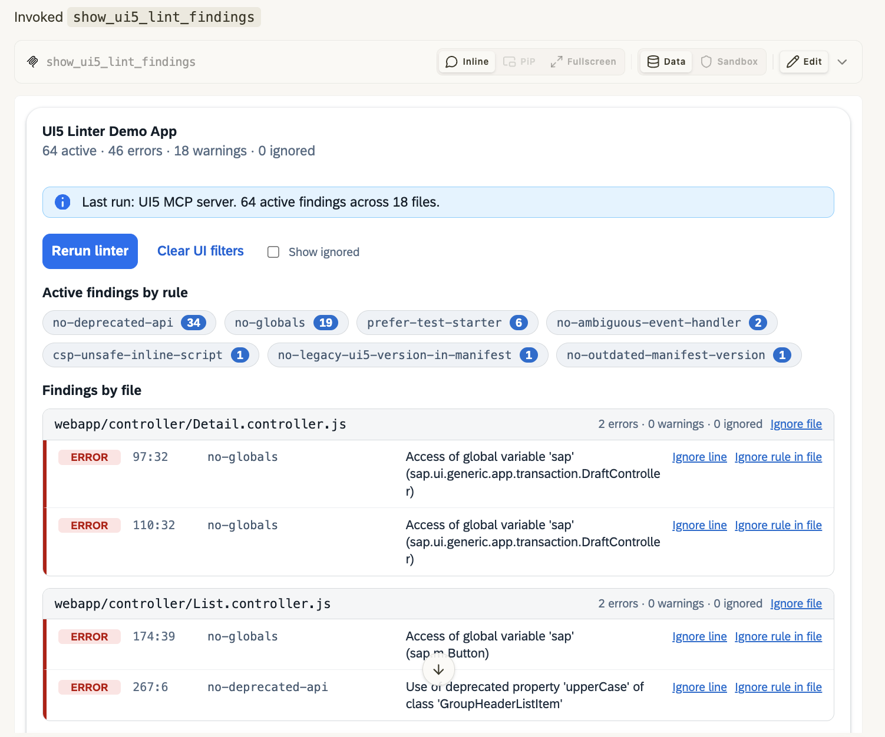

AI can appear in a user interface in several ways. It can add a focused feature such as summarization to a traditional application. It can sit next to the application as a copilot. Or the AI conversation itself can become the main interface.

That last case raises an interesting question: if the AI host owns the frame, how can an MCP server provide more than text and JSON?

[MCP Apps][mcp-apps-overview] provide an answer. They let an MCP tool return an interactive web interface that a compatible host renders inside the conversation. For our UI5con session, [Mike Zaschka](https://www.linkedin.com/in/mike-zaschka-7395949/) and I explored how this model fits SAP user interfaces and built five samples, starting with plain HTML and ending with an ARC-1 transport review.

This post focuses on the architecture and lessons from those samples. You can [read the final presentation][presentation] or follow the code in the [sample repository][repo].

## What MCP Apps add to MCP

A normal MCP tool already gives a model a structured way to call backend capabilities. For a small result, a text response is often the best interface. A dedicated UI becomes useful when people need to filter findings, inspect a hierarchy, compare options, or confirm an action with more context.

An MCP App combines a tool result with a web resource:

1. A tool declares a `ui://` resource URI in `_meta.ui.resourceUri`.
2. The model calls the tool through the host.
3. The host reads the referenced resource from the MCP server.
4. A compatible host renders the returned HTML in a sandboxed iframe.
5. The host passes the tool result to the app through the MCP Apps bridge.
6. The app can request supported host operations, including calls to tools on its MCP server.

In our samples, the model selects the tool but does not generate the interface. Each UI is prebuilt application code supplied by the MCP server. Communication between the iframe and host uses the MCP Apps protocol over a `postMessage` transport.

Host support still differs, so the [official client support matrix][client-matrix] is more reliable than a static list here.

## The minimum HTML sample

The updated presentation explains the server side in three parts: register a UI resource, link it from a tool, and return the tool result. The repository's [plain HTML time sample][minimum-sample] implements exactly that pattern with two tools and one UI resource.

### 1. Register the UI resource

The server registers the built HTML under a `ui://` URI. `RESOURCE_MIME_TYPE` from the MCP Apps server package resolves to the HTML profile expected by compatible hosts.

```ts
const resourceUri = "ui://html-time/index.html";

registerAppResource(
  server,
  "HTML Time Demo",
  resourceUri,
  {
    title: "HTML Time Demo",
    description: "A minimal MCP App."
  },
  async (uri) => readBuiltAppResource("00-html-time", uri)
);
```

The sample bundles the browser code and styles into one HTML file for convenient delivery. A single-file bundle is optional, not a protocol requirement. An app can use external assets when its resource metadata declares an appropriate content security policy.

### 2. Link the resource from a tool

The `show_time` tool points to that resource in its metadata:

```ts
registerAppTool(server, "show_time", {
  title: "Show Time",
  description: "Open the basic MCP Apps time demo.",
  inputSchema: {
    offsetHours: z.number().int().min(-24).max(24).optional()
  },
  _meta: {
    ui: { resourceUri }
  }
}, handler);
```

The URI must match the registered resource exactly. This association tells an MCP Apps host that the tool has a visual companion.

### 3. Return text and structured data

The tool calculates a timestamp and returns two representations of the outcome:

```ts
return {
  content: [{
    type: "text",
    text: `Current server time: ${isoTime}`
  }],
  structuredContent: {
    isoTime,
    offsetHours,
    formattedTime
  }
};
```

`content` gives the model and non-UI clients a concise fallback. `structuredContent` is the stable data contract the app renders without parsing prose. The complete server implementation is in [`register.ts`][minimum-server-source].

### Run the app inside the host

Inside the iframe, the app connects to the host and listens for the tool result:

```ts
const app = new App({
  name: "HTML Time Demo",
  version: "0.1.0"
});

app.addEventListener("toolresult", (result) => {
  renderTime(result.structuredContent as TimePayload);
});

await app.connect();
```

The interface shows the time and an **Add 1 hour** button. That button calls a second tool through the bridge:

```ts
const result = await app.callServerTool({
  name: "add_hour",
  arguments: {
    isoTime: currentIsoTime,
    hours: 1
  }
});

renderTime(result.structuredContent as TimePayload);
```

The host routes the request to the server and returns the result to the existing iframe. The app updates without asking the model to generate another interface. See the full browser code in [`main.ts`][minimum-app-source].

This small example captures the important separation of responsibilities:

- The model chooses the initial tool based on the user's request.
- The MCP server executes backend logic and returns text plus structured data.
- The host controls whether and how the UI is rendered.
- The app renders the data and handles local interaction.
- Further tool calls still travel through the host-controlled bridge.

That is the core concept. UI5 changes the presentation layer, not the MCP Apps lifecycle. It also explains why debugging has two layers: a successful tool call does not prove that the UI resource loaded, and a loaded iframe does not prove that its scripts passed the host's content security policy.

## When a tool result should become an app

MCP Apps are useful, but they should not turn every tool call into a miniature application. Text is still the fastest interface for a status, identifier, confirmation, or short explanation. A table in prose may also be enough when the user only needs to read it once.

I would add an app when at least one of these is true:

- The user needs to explore or filter a result without repeatedly calling the model.
- The structure is easier to understand visually, such as a transport hierarchy or findings grouped by file.
- The next action benefits from seeing context first, such as choosing a task after reviewing its objects.
- A long-running or multi-step workflow benefits from visible progress and guided decisions.
- The interaction has temporary presentation state that does not belong in the conversation.

The UI should stay focused on the result and its immediate actions. It should not recreate the host's chat controls or hide backend behavior behind ordinary-looking buttons. If an action writes data, changes source files, or releases a transport, its effect should be clear before the request reaches the server.

Because the tool still returns normal `content`, a host without MCP Apps support can show a useful text result. The interface enhances the tool contract instead of replacing it.

## Bringing UI5 into the iframe

An MCP App is a web application, so it can use plain JavaScript or frameworks such as React, Vue, Svelte, or UI5 technologies.

For focused SAP-oriented interfaces, [UI5 Web Components][ui5-web-components] are my preferred default. They provide SAP-styled, themeable and accessible controls while remaining based on web standards and usable with different frameworks. In the final sample, the app listens for the host's light or dark context and maps it to `sap_horizon` or `sap_horizon_dark`. An MCP App can use familiar controls without adopting the full SAPUI5 application model.

[UI Integration Cards][integration-cards] are attractive when the result is naturally a summary, list, or compact dashboard. Their declarative manifests reduce custom rendering code. Our card sample loads the Integration Cards runtime from `ui5.sap.com`, so its resource declares that domain in its content security policy. An allowlist cannot override a host's sandbox, however. The repository therefore uses portable Object and List Cards rather than an Analytical Card whose `sap.viz` runtime may require blocked execution features.

A full SAPUI5 application can also be served as an MCP App, but I would use it selectively. Fiori Elements' OData-driven page model, routing, and shell integration can be excessive inside a small conversation frame. That is a design tradeoff, not a protocol restriction.

This is not an SAP-specific extension to MCP. It is the normal MCP Apps model combined with UI5. It nevertheless fits the direction described by SAP's [AI-native North Star user experience layer][sap-north-star], where users express intent and the system brings relevant information and actions into context.

The distinction between MCP and MCP Apps matters here. [Joule Studio documents how to add MCP servers to a Joule agent][joule-mcp], using Streamable HTTP endpoints configured through SAP BTP destinations. That allows Joule agents to use server tools, but it does not by itself mean the host renders MCP App resources. At the time of writing, I could not verify documented Joule support for the MCP Apps extension in the official client matrix.

## From the minimum sample to SAP workflows

The [sample repository][repo] contains five steps and a repository-wide [learning guide][learning-guide]:

1. **[Plain HTML time][sample-00]:** Demonstrates the tool, resource, result, iframe, and app-triggered tool call with minimal code.
2. **[UI5 Web Components project overview][sample-01]:** Renders project metadata, libraries, and checks, synchronizes the host's light or dark theme, and requires no external CSP domains.
3. **[UI Integration Cards project overview][sample-02]:** Renders the same dataset as declarative Object and List Cards. Its external `ui5.sap.com` runtime is explicitly declared in the resource CSP.
4. **[UI5 lint findings][sample-03]:** Opens the UI first, then calls back through the bridge to run the official UI5 MCP server as a child client, with a local `ui5lint` fallback. Filtering stays local. Ignoring one line, one rule in a file, or a whole file invokes an explicit write tool, after which the app can rerun the linter.
5. **[ARC-1 transport review][sample-04]:** Provides separate list and detail tools for live, host-orchestrated ARC-1 data. Clearly labelled offline fixtures are included for rehearsals when ARC-1 or SAP is unavailable.



The ARC-1 example introduces an important boundary. The UI belongs to one MCP server, while ARC-1 is another. The app therefore does not secretly call an ARC-1 tool. When someone confirms a release in the UI, the app sends a message to the host asking the agent to continue the workflow. The host can then select the connected ARC-1 tool and apply its normal authorization and confirmation behavior.

My rule of thumb is simple:

- Use `callServerTool()` for a known tool exposed by the server that owns the app.
- Send a message to the host when the agent must coordinate another server or decide the next step.
- Keep consequential operations visible to the host's approval model.

## Host UX, state, and security

The host owns the frame around an MCP App, which creates a few UX constraints that are easy to miss:

- **Display mode:** an app may request `inline`, `fullscreen`, or picture-in-picture, but the host declares which modes it supports and returns the mode it actually selected.
- **Theme:** the host can provide a light or dark preference and optional style variables. The UI5 Web Components sample maps that preference to `sap_horizon` or `sap_horizon_dark` and reacts when it changes.
- **Size:** the host can provide fixed or maximum container dimensions. The SDK reports content-size changes automatically by default, but the interface should still be responsive within the space the host grants it.

An app-triggered `callServerTool()` can update the existing iframe, as the time sample demonstrates. A host may nevertheless recreate the iframe for a new UI-producing call or when its lifecycle requires it. Therefore, filters and selected rows can stay local, while important results belong in structured tool output or the backend. Durable changes, such as adding a linter ignore, belong in the project or backend. Refresh authoritative data after mutations instead of relying on iframe memory.

The iframe sandbox is also not a complete security model. The host controls bridge capabilities, while the server must still validate inputs and authorize tool calls. External scripts and network destinations need to be declared in the MCP App's UI content security policy. Backend writes should be explicit and should not be disguised as harmless UI interactions.

Our samples use Vite and `vite-plugin-singlefile` to produce one built `index.html` for each `ui://` resource. This simplifies delivery, although bundling UI5 Web Components increases the artifact size. The repository provides both stdio and Streamable HTTP launchers. These connect the MCP client and server; the app uses the separate iframe bridge.

## Try the minimum sample

The repository requires Node.js 22. The exact commands and client configuration live in the [minimum sample README][minimum-sample]. From the repository root:

```bash
npm ci
npm run build
npm run start:00
```

Connect an MCP Apps-compatible HTTP client to `http://127.0.0.1:3010/mcp`, then ask it to call `show_time`. The text result should remain useful even in a client that does not render the UI.

For a protocol-level check, start the aggregate server with `npm run start` and run `npm run test:mcpjam` in another terminal.

<!-- TODO before publication: add screenshots of the Web Components overview, Integration Cards comparison, and ARC-1 transport organizer. -->

## References

- [Final UI5con presentation][presentation]
- [UI5 MCP Apps sample repository][repo]
- [Step-by-step learning guide][learning-guide]
- [MCP Apps overview][mcp-apps-overview]
- [Build an MCP App][mcp-apps-build]
- [MCP Apps client support][client-matrix]
- [MCP Apps SDK and examples][ext-apps]
- [UI5 Web Components][ui5-web-components]
- [SAP AI-native North Star user experience layer][sap-north-star]
- [ARC-1][arc-1]

[repo]: https://github.com/marianfoo/UI5con_2026_MCPApps
[presentation]: https://github.com/marianfoo/UI5con_2026_MCPApps/blob/main/UI5con2026_MCPApps.pdf
[learning-guide]: https://github.com/marianfoo/UI5con_2026_MCPApps/blob/main/LEARNING.md
[minimum-sample]: https://github.com/marianfoo/UI5con_2026_MCPApps/tree/main/packages/00-html-time
[minimum-server-source]: https://github.com/marianfoo/UI5con_2026_MCPApps/blob/main/packages/00-html-time/src/register.ts
[minimum-app-source]: https://github.com/marianfoo/UI5con_2026_MCPApps/blob/main/packages/00-html-time/app/src/main.ts
[sample-00]: https://github.com/marianfoo/UI5con_2026_MCPApps/tree/main/packages/00-html-time
[sample-01]: https://github.com/marianfoo/UI5con_2026_MCPApps/tree/main/packages/01-ui5-webc-project-overview
[sample-02]: https://github.com/marianfoo/UI5con_2026_MCPApps/tree/main/packages/02-ui5-card-project-overview
[sample-03]: https://github.com/marianfoo/UI5con_2026_MCPApps/tree/main/packages/03-ui5-lint-findings
[sample-04]: https://github.com/marianfoo/UI5con_2026_MCPApps/tree/main/packages/04-arc1-transport
[mcp-apps-overview]: https://modelcontextprotocol.io/extensions/apps/overview
[mcp-apps-build]: https://modelcontextprotocol.io/extensions/apps/build
[client-matrix]: https://modelcontextprotocol.io/extensions/client-matrix
[ext-apps]: https://github.com/modelcontextprotocol/ext-apps
[ui5-web-components]: https://ui5.github.io/webcomponents/
[integration-cards]: https://ui5.sap.com/test-resources/sap/ui/integration/demokit/cardExplorer/index.html
[sap-north-star]: https://architecture.learning.sap.com/docs/ai-native-north-star-architecture/user-experience-layer
[joule-mcp]: https://help.sap.com/docs/joule-studio-classic/joule-studio-classic-edition/add-mcp-servers-to-your-joule-agent
[arc-1]: https://github.com/arc-mcp/arc-1
