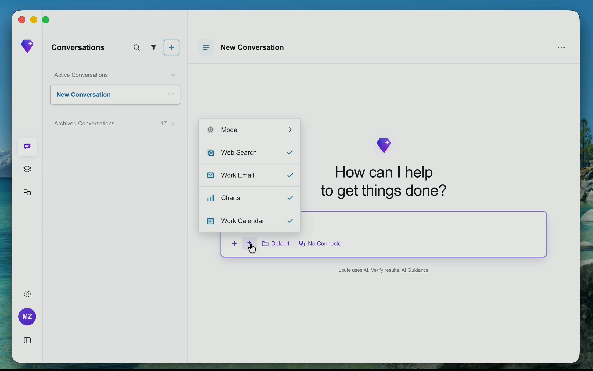
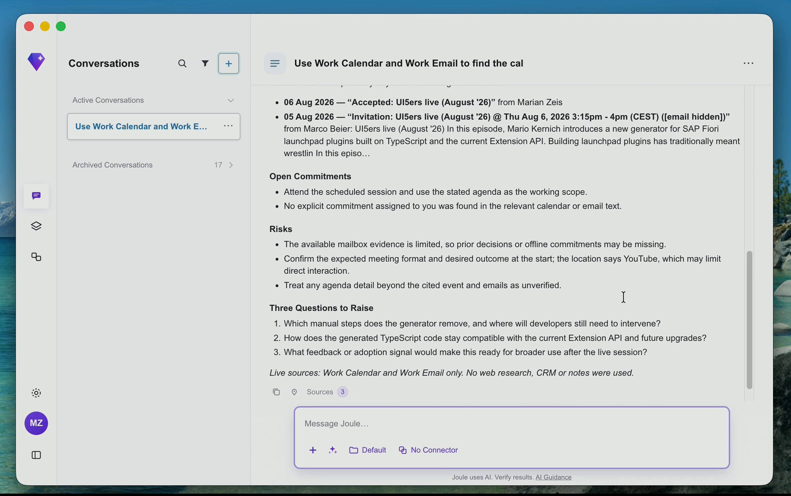
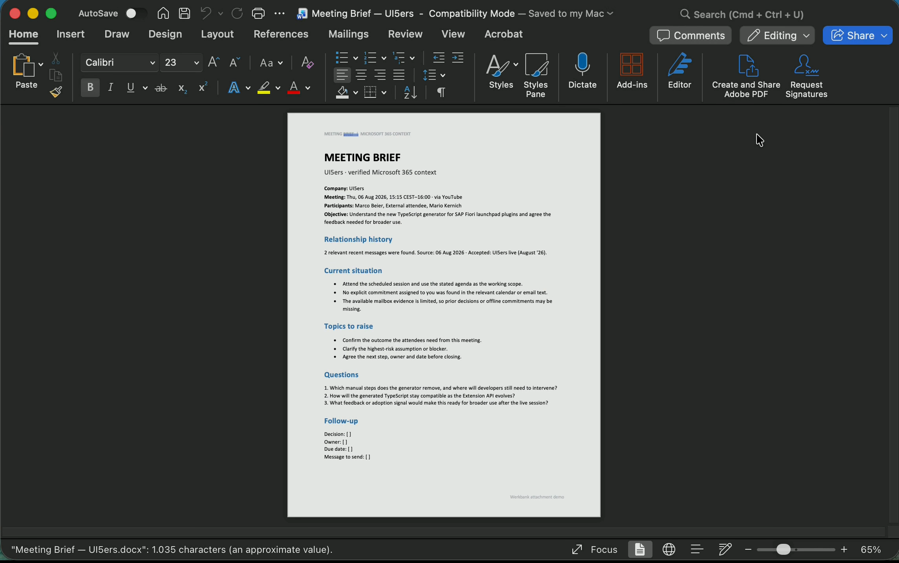
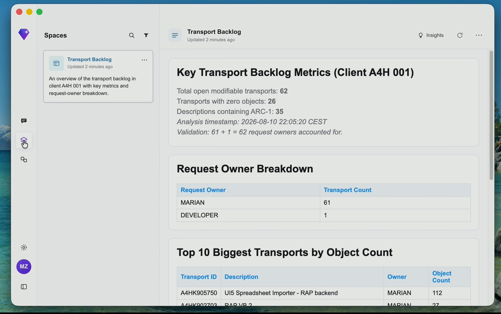
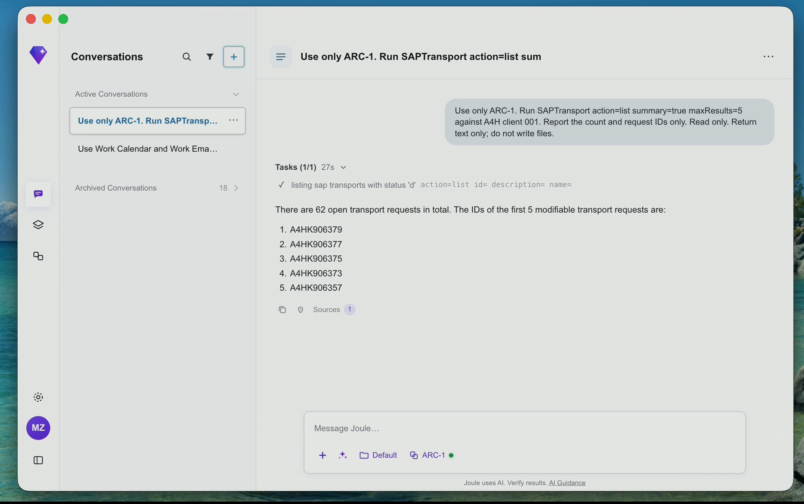
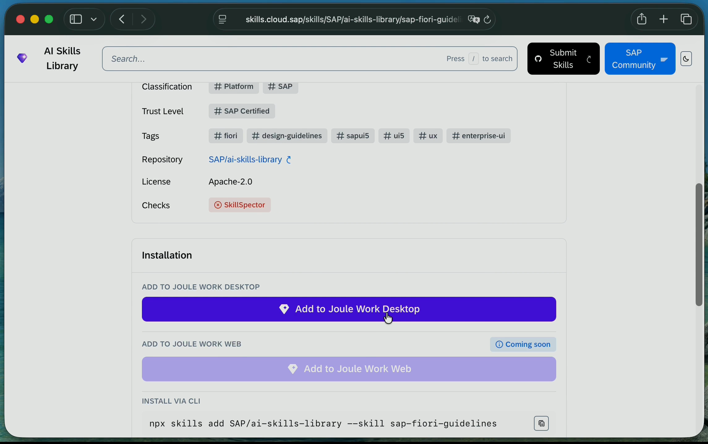
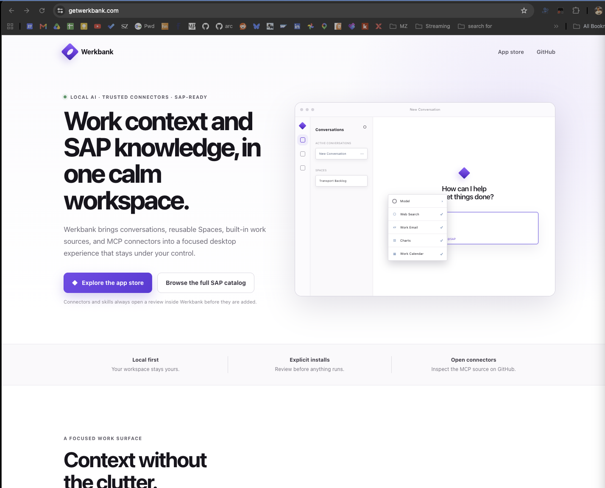
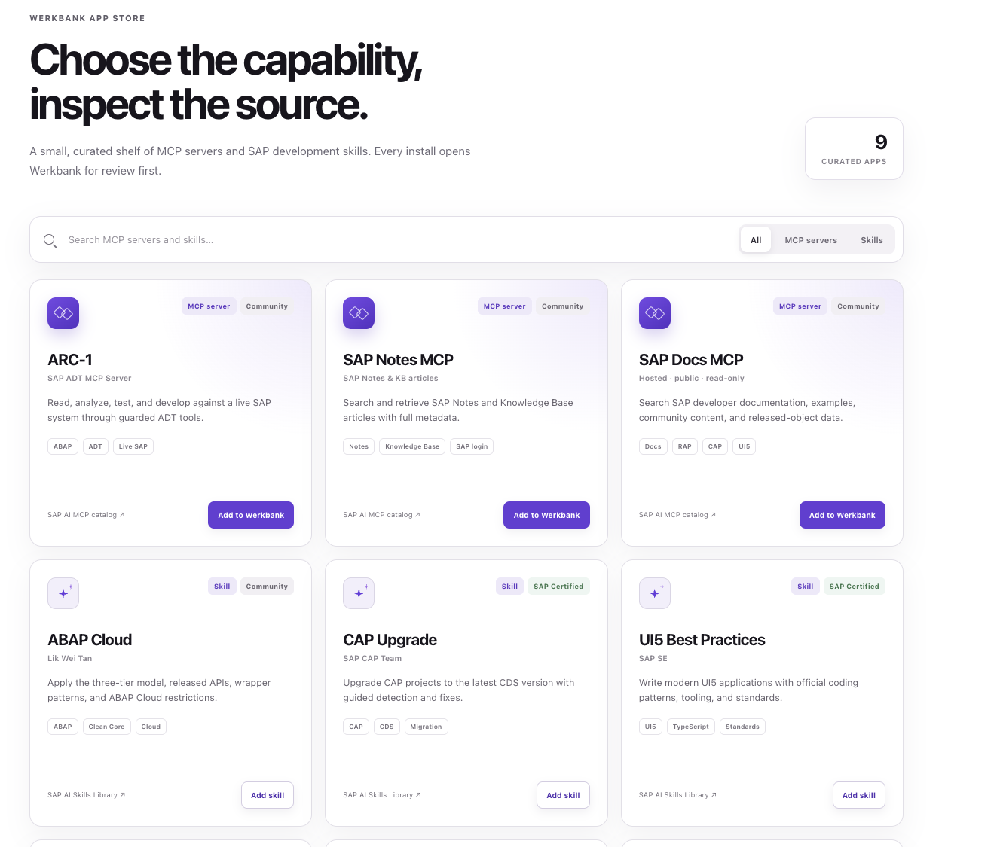
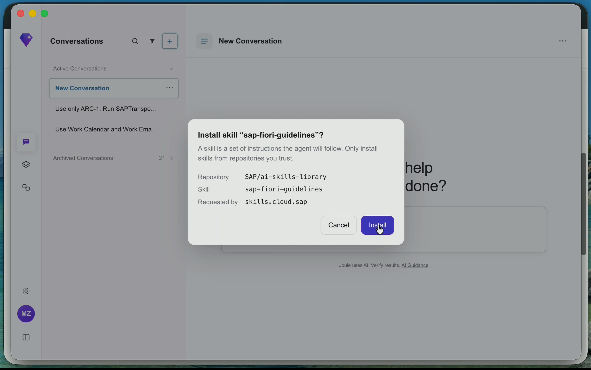

You have probably seen Joule Work Desktop on LinkedIn by now. [Sebastian Steinhaeuser](https://www.linkedin.com/posts/sebastian-steinhaeuser_prepare-me-for-my-meeting-with-thats-ugcPost-7490314981784154112-QCE4/) showed how it prepares him for a customer meeting. [Philipp Herzig](https://www.linkedin.com/posts/philipp-herzig_im-excited-to-present-the-new-sap-gui-ugcPost-7488584210123837440-TuTW/) called it the new SAP GUI, with a smile, and demonstrated a workflow across email, a spreadsheet, a Space, and PowerPoint.

Joule Work Desktop is now available to SAP employees after a test with more than 6,000 colleagues. Selected customers can also use it through the Early Adopter Care program on macOS and Windows.

The idea is simple: one desktop application that can combine local files, Microsoft 365, SAP knowledge, business systems, MCP connectors, and skills. That is much more interesting than another small Joule chat window inside one SAP application.

I already built similar setups with [LibreChat](/posts/2026-02-16-librechat-enterprise-gpt/) and [Microsoft Copilot Studio](/posts/2026-05-05-arc-1-copilot-studio/). A native application adds direct access to the files and applications people use every day.

Luckily, I was one of the few people who got access to the application and could test the currently available features. So here is my first hands-on experience with what I am allowed to show.

If you prefer to see the complete flow first, here is the [58-second demo video](joule-work-desktop-demo.mp4).

The application starts with Conversations. I can add files and select work sources or an external connector from the composer. Tool calls remain visible, and generated files open in their normal desktop application.

## Email and calendar integration

I asked the application to prepare me for a meeting. It found the calendar entry, read related email messages, and created a brief with logistics, open points, risks, and questions. The calendar and email steps remained visible, and the answer included source references. For me, this is more useful than a general inbox summary because the message becomes the start of a task.

## Local files, OneDrive, and real documents

I can attach Office documents, structured data, text, and images. Files synchronized through OneDrive are also available, so they can be combined with email, calendar, web research, or an external connector.

For the meeting-preparation example, I attached an existing Word template. The application filled the relevant sections and created a new document instead of giving me text to copy manually.

The files still need review, but reviewing a prepared document is often faster than starting with an empty one.

## Spaces are more useful than I expected

SAP calls the generated work areas Spaces. They are persistent views that can be reopened without finding the original conversation. The most useful one in my test was a transport backlog based on data from my SAP system. It shows open and empty transports, their owners, and the biggest requests by object count.

This does not replace a proper application or reporting solution. But not every temporary question needs a new Fiori application, and a Space is more useful than a long chat answer.

## Connecting the SAP system

The SAP system integration is what can make Joule Work Desktop more than a general desktop agent.

At the moment, the direct SAP business system integration available to me is for SAP S/4HANA Cloud Public Edition. I do not have such a system. My test system is SAP S/4HANA 2023 on-premise.

I therefore added [ARC-1](https://github.com/arc-mcp/arc-1), my open-source ADT MCP server. ARC-1 can run locally or as a remote MCP server with OAuth, for example on SAP BTP Cloud Foundry.

I could then read transports, inspect ABAP objects, analyze custom code, check ATC findings, or compare a specification with what actually exists in the system.

The connector still needs valid authentication, and SAP user authorizations still apply. I would start with a development system and read-only access.

## Connectors and one-click skills

Joule Work Desktop supports MCP connectors and skills, so SAP does not have to build every integration and workflow itself. The [SAP AI Skills Library](https://skills.cloud.sap/) contains reusable skills that can be imported into Joule Work Desktop with one click.

The skill page shows the repository, license, trust level, and checks before installation. The SAP Fiori Guidelines skill, for example, can be added through the **Add to Joule Work Desktop** button.

MCP servers provide tools, while skills describe how the agent should use them and what it should verify. This keeps the application extendable without adding every possible SAP feature to the desktop client.

The open questions are broader SAP system support, connector governance, and pricing. Anything about future announcements or TechEd is still only speculation.

## Something is strange

Anyone who already works with Joule Work Desktop may have noticed something by now.

Some details in my video and screenshots do not look exactly like the application SAP installed. The interface is very close, the workflows work, and the features are there, but a few things are just slightly different.

There is a simple reason for that.

I do not have access to Joule Work Desktop.

The screenshots and video in this post do not show an SAP application. They show an application I built myself.

After watching the public demos, I wanted to see how difficult it would be to rebuild the same core idea with open-source components. I spent roughly a day or two vibe coding it with Codex. The result is called [**Werkbank**](https://getwerkbank.com/).

Werkbank is the German word for workbench, a place where different tools come together to get work done.

The current interface follows the public Joule Work Desktop videos closely because I wanted to reproduce the workflows shown there. But there is no internal SAP code behind it, I had no access to a Joule Work Desktop build, and I have no additional product information beyond public posts and videos.

## What is actually inside Werkbank

Werkbank is a working MVP, not a static mock or a prerecorded animation. It can hold real streaming conversations, call tools, ask for permissions, and stop a running task. The agent behind it is [goose](https://github.com/aaif-goose/goose), an open-source AI agent hosted by the Agentic AI Foundation. Werkbank communicates with Goose through the Agent Client Protocol.

The implemented features currently include:

- Local active and archived conversations.
- Word, PowerPoint, text, CSV, JSON, and image attachments, including files synchronized through OneDrive.
- Generated Word and PowerPoint files that can be opened in the normal desktop application.
- Persistent Spaces stored as sandboxed HTML views.
- Live read-only Microsoft 365 email and calendar access.
- Session-scoped MCP connectors, remote MCP OAuth through Goose, and reusable skills selected with `/`.

The demo uses these features rather than special video fixtures. The meeting brief comes from live calendar and email calls, the Word output is a real file, ARC-1 reads my SAP system, and the transport Space is generated from those results. The shipment-defect workflow uses an attached synthetic CSV file and creates a real Space and PowerPoint presentation.

For SAP, Werkbank uses the same MCP servers I can use from Claude Desktop, Codex, VS Code, LibreChat, or Copilot Studio. ARC-1 connects to the ABAP system. Connector secrets are stored through the operating system's secure storage instead of being written into the normal configuration.

The project website is [getwerkbank.com](https://getwerkbank.com/), and the source is in the public [Werkbank repository](https://github.com/marianfoo/werkbank). Development currently targets macOS, and there is no signed installer yet.

## The Werkbank App Store

[getwerkbank.com](https://getwerkbank.com/#store) is not only a landing page. Its App Store already works with the desktop application, and I can use it to add both [MCP servers](https://getwerkbank.com/#store) and [skills](https://getwerkbank.com/#store) to Werkbank.

The small curated catalog currently contains nine entries: three MCP servers and six SAP development skills. I can search it, filter by type, inspect the original source, and then click **Add to Werkbank** or **Add skill**.

The website validates the request and opens the local application through a `werkbank://` link. Werkbank then shows the connector command and configuration fields, or the skill repository and name. Nothing is installed until I confirm it inside the desktop application. After that, a connector is restarted and becomes available to the conversation, while an installed skill appears in the `/` picker.

The same flow can be linked from any project README with an **Add to Werkbank** button. Here is the skill used in the video:

- [Add the SAP Fiori Guidelines skill to Werkbank](https://getwerkbank.com/install-skill/?repository=https%3A%2F%2Fgithub.com%2FSAP%2Fai-skills-library&name=sap-fiori-guidelines&title=SAP+Fiori+Guidelines)

To try it, clone the repository, run `npm install`, copy `.env.example` to `.env`, add the model configuration, and start it with `npm run dev`.

## What this little experiment shows

Werkbank is not a replacement for Joule Work Desktop. It is a small MVP built in roughly two days, with bugs and much narrower workflows. But it is already a usable desktop application: I can chat with it, attach files, connect tools, install skills, and return to earlier conversations and Spaces.

SAP also has to solve the difficult enterprise parts: identity, authorizations, data protection, auditing, deployment, updates, model governance, and reliable operation for many users and systems. A local MVP does not solve these problems just because the demo looks similar. With more time, I could add SSO, authentication against IAS, a release pipeline with signed builds, automatic updates, and more enterprise controls. That was not the main point of this experiment.

But the experiment still shows something useful. The core workflows SAP currently demonstrates are already possible with open-source components:

- Read email and calendar context.
- Work with local files and OneDrive-synchronized files.
- Analyze structured data.
- Create persistent dashboards.
- Generate real Word and PowerPoint files.
- Connect SAP documentation and SAP systems through MCP.
- Add reusable skills and new connectors.

Goose is only one possible base. LibreChat can provide a similar experience in the browser. Microsoft Copilot Studio can combine Microsoft 365 connectors and MCP servers. Claude Desktop can also work with local files, connectors, and skills. The individual building blocks already exist.

The real value of Joule Work Desktop will therefore not come only from having these features. It will come from how well SAP connects them to business context, SAP authorizations, supported applications, and real processes. It will also depend on how accessible it is. Are Signavio, LeanIX, or SAP S/4HANA Cloud Public Edition required? Can a customer use it with only on-premise systems? And what will it cost?

For now, I am impressed by the direction. I just could not test the real application yet, so I built the part I wanted to test myself.

**Disclosure:** Werkbank is an independent open-source project and is not affiliated with or endorsed by SAP. SAP, Joule, ABAP, SAP Fiori, SAP S/4HANA, and other SAP products and services mentioned herein are trademarks or registered trademarks of SAP SE or its affiliates in Germany and other countries.

## References and links

- [Joule Work product page](https://www.sap.com/products/artificial-intelligence/joule-work.html)
- [SAP Sapphire 2026 announcement](https://news.sap.com/2026/05/sap-sapphire-keynote-business-ai-platform-power-autonomous-enterprise/)
- [Philipp Herzig's Joule Work Desktop post](https://www.linkedin.com/posts/philipp-herzig_im-excited-to-present-the-new-sap-gui-ugcPost-7488584210123837440-TuTW/)
- [Sebastian Steinhaeuser's meeting-preparation post](https://www.linkedin.com/posts/sebastian-steinhaeuser_prepare-me-for-my-meeting-with-thats-ugcPost-7490314981784154112-QCE4/)
- [SAP Developer News: importing skills into Joule Work Desktop](https://www.linkedin.com/pulse/sap-developer-news-july-16th-2026-thomas-jung-socjf/)
- [SAP AI Skills Library](https://skills.cloud.sap/)
- [Werkbank website and App Store](https://getwerkbank.com/)
- [Werkbank source repository](https://github.com/marianfoo/werkbank)
- [goose](https://github.com/aaif-goose/goose)
- [ARC-1](https://github.com/arc-mcp/arc-1)
